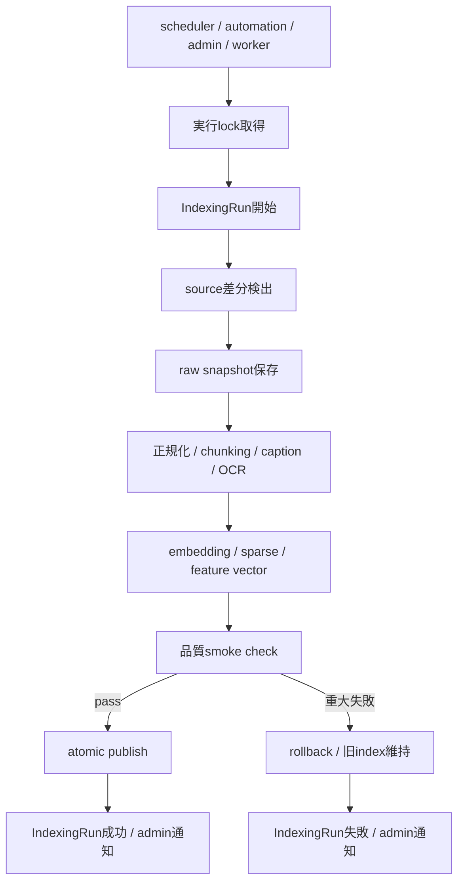

# 自動インデックス更新 詳細設計

## 1. 目的
自動インデックス更新は、1日ごと特定の時間にRAG関連インデックスを更新し、検索対象の新規・更新・削除・権限変更を検索結果へ反映する機能である。

本設計は `docs/design/kumc-agent.md` の「8. 自動インデックス更新」を上位仕様とする。詳細部分は現行実装の `usecases.indexing`、`features.indexing`、`features.ingestion`、`infra.connectors`、`infra.operations.repository.IndexingRun`、`apps.worker`、`features.automation`、`configs/main/scheduler.yaml` 周辺を参照して定義する。現行実装と `kumc-agent.md` が矛盾する場合は `kumc-agent.md` を優先する。

## 2. 対象範囲
対象機能は次の通り。

- 日次スケジュールによる自動起動
- 手動起動、worker起動、automation起動
- Google Drive、Discord、Hatena、X、Crafters Colony、Notion、Minecraft Wikiの差分取得
- 画像 caption / OCR / feature vector の更新
- `member_profiles` の更新
- Task / Event 正本由来の検索用index更新
- sourceごとのcursor、checksum、revision、ACL fingerprintによる差分検出
- raw snapshot保存、正規化、chunking、embedding、Sparse index、資料名index更新
- 削除済み・権限喪失データの検索除外
- `indexing_runs` への実行ログ保存
- 更新後の簡易品質確認
- 重大失敗時の直前indexへのrollback
- admin通知と外部連携payload整形

対象外は、ユーザー承認が必要なTask/Event候補の自動承認、サーバー管理操作、任意shell command実行である。

## 3. 実装方針
2026-04時点の実装は、自動更新の正本を `features.ingestion` が保存する `source_items`、`documents`、`chunks`、`sync_cursors` とし、公開indexは `AutoIndexUpdateUsecase` が1 run単位で構築・検査・publishする。

| 項目 | 実装方針 |
| --- | --- |
| 起動 | CLI `index update`、admin `sync/reindex`、worker `auto_index_update`、automation `auto_index_daily` は `AutoIndexUpdateUsecase` に集約する |
| スケジュール | `configs/main/scheduler.yaml` の `auto_index_enabled/time/weekdays/timezone` を正とし、automation default cronも同設定から生成する |
| source取得 | `IngestionService` がconnectorを統一入口として扱い、Drive、Discord、Hatena、X、Crafters Colony、Notion、Minecraft Wikiをbackfillまたはpollする |
| 差分検出 | `sync_cursors`、checksum、revision、ACL hash、`index_status` をsource item単位で永続化し、skip/update/delete/permission_lostを判定する |
| index構築 | 自動更新ではingestion repositoryのactive chunkをDense/Sparse構築入力の正本とする。raw/legacy chunk pipelineは互換・fallbackとして残す |
| 画像 | raw sourceから画像候補をscanし、caption/OCR/feature vectorをstaging snapshot配下の `image_search` indexへ構築する |
| member_profiles | Guild memberのfingerprint差分で必要なprofileだけ再生成し、退会・除外profileをinactiveとして検索除外する |
| Task/Event | workflow repositoryのTask/Event正本だけを `task_event` indexへ投影し、削除済みTaskとcanceled Eventは除外する |
| 削除・権限喪失 | `source_items/chunks.index_status` とFile fallbackの状態ログを検索index構築前に反映し、raw fileが残っていてもactive indexへ入れない |
| 品質確認 | Dense/Sparse artifact load、chunk急減、smoke query、禁止status混入、画像/member/task_event index loadを検査する |
| publish/rollback | staging成果物をpublishし、publish失敗時はprevious snapshotへrollbackして `metadata.rollback` に保存する |
| 通知 | 失敗・rollback時はadmin通知payloadを作り、operations repositoryの `ActionRun(action_type="indexing_notification")` として記録する |

実装では `src/kumc_agent/infra/legacy` を参照・依存しない。互換のために残る既存chunk pipelineは `src/kumc_agent/infra/indexing` の範囲で利用し、自動更新の公開可否は `features.indexing` と `features.ingestion` の状態で判断する。

## 4. 全体構成
自動更新は、スケジュール判定、差分収集、index構築、品質確認、公開の5段階で構成する。



## 5. 起動と実行制御
### 5.1 スケジュール
設定は現行の `configs/main/scheduler.yaml` と `RuntimeConfig.scheduler` を使う。

| 設定 | 説明 |
| --- | --- |
| `scheduler.auto_index_enabled` | 自動更新の有効/無効 |
| `scheduler.auto_index_time` | 実行時刻。`HH:MM` |
| `scheduler.auto_index_weekdays` | 実行曜日。Python `weekday()` と同じ `0=Mon` |
| `scheduler.auto_index_timezone` | `auto_index_time` を解釈するtimezone。既定は `Asia/Tokyo` |

`auto_index_time` は `auto_index_timezone` で解釈する。bot/api process内の長寿命loopではなく、workerまたは外部cronから `auto_index_daily` jobを起動する構成を基本とする。worker payloadに `trigger` と `scheduled_at` が含まれる場合はそれを尊重し、automation経路では `trigger="automation"` としてschedule gateを通す。

### 5.2 手動起動
手動起動は次を維持する。

- `kumc-agent index update`
- `kumc-agent admin --action sync`
- `kumc-agent admin --action reindex`
- `kumc-agent worker --job-type auto_index_update`

手動起動でも `indexing_runs` を作成し、`metadata.trigger` に `manual`、`admin`、`worker`、`automation` などを保存する。

### 5.3 排他制御
同時に複数のindex更新を走らせない。

- Postgres利用時はDB advisory lockまたは `indexing_runs` のrunning状態を使う。
- Redis利用時はTTL付きlockを使う。
- File fallback時は `data/index/.auto_index.lock` を使う。

既存のindex更新中に新しい自動更新が来た場合、既定ではskipし、`IndexingRun(status="skipped")` として理由を保存する。admin手動の強制実行だけがlock待機またはcancelを選べる。

## 6. データモデル
### 6.1 IndexingRun
主ログは現行の `domain.models.operations.IndexingRun` と `indexing_runs` tableを使う。

| フィールド | 説明 |
| --- | --- |
| `id` | run id。`auto-index:{timestamp}:{trigger}` など |
| `source_kind` | source別runの場合はsource名、全体runの場合は `all` |
| `status` | `running`, `succeeded`, `failed`, `skipped`, `rolled_back` |
| `seen` | 検査したsource item数 |
| `changed` | 新規・更新・権限変更として処理した件数 |
| `skipped` | checksum/revision一致で処理しなかった件数 |
| `deleted` | 削除または権限喪失として除外した件数 |
| `error` | 失敗理由の短い要約 |
| `metadata` | 差分内訳、再index対象、品質結果、snapshot id、rollback情報、trace id |

`metadata` に保存する主なkeyは次の通り。

| key | 説明 |
| --- | --- |
| `trigger` | `schedule`, `manual`, `worker`, `automation` |
| `source_results` | source別件数 |
| `changed_items` | 外部出力可能な範囲の再index対象ID |
| `stage_results` | raw、chunk、embedding、sparse、image、member、task_eventの結果 |
| `quality_check` | smoke check結果 |
| `index_snapshot_id` | 更新対象snapshot |
| `previous_snapshot_id` | rollback元 |
| `degraded` | 一部source失敗などで縮退成功したか |
| `notification` | admin通知の送信結果 |

大きな本文断片、検索context、secretを含む可能性がある値は `metadata` に保存しない。外部payloadへ出す場合もマスクする。

### 6.2 Source Item
差分検出には現行の `source_items`、`documents`、`chunks`、`sync_cursors` を使う。

| フィールド | 用途 |
| --- | --- |
| `source_kind` / `external_id` | source itemの安定識別 |
| `checksum` | 正規化本文またはraw本文の同一性判定 |
| `metadata.revision` | Drive revision、Notion last edited、Wiki revisionなど |
| `access_scope.source_acl_hash` | ACL変化の検出 |
| `index_status` | `active`, `deleted`, `permission_lost`, `quarantined` |
| `raw_object_key` | raw snapshot参照 |

同じsource versionからは同じdocument id、chunk id、embedding textが作られるように、ID生成は `source_kind`, `external_id`, `checksum`, `chunk_index`, `chunk_kind` から安定化する。

## 7. 対象source
### 7.1 本文RAG source
本文RAGの対象は次の通り。

| source | 現行の入口 | 差分キー |
| --- | --- | --- |
| Google Drive | `GoogleDriveLoader`, `LoaderBackedConnector("google_drive")` | file id、modified time、revision/checksum、ACL hash |
| Discord | `DiscordLoader`, `LoaderBackedConnector("discord")` | guild/channel/message id、timestamp/checksum、guild ACL |
| Hatena | `HatenaBlogLoader` | entry id、updated/created、checksum |
| X | `XPostsLoader` | post id、archive checksum |
| Crafters Colony | `CraftersColonyLoader` | article id、published/updated、checksum |
| Notion | `NotionLoader` | page id、last edited、checksum、ACL hash |
| Minecraft Wiki | `MinecraftWikiConnector` | page id/title、revision id、checksum |

### 7.2 画像
画像更新は本文RAG更新に連動する。画像ごとに `content_hash`、`source_item_id`、`image_index` を持ち、差分がある画像だけcaption、OCR、feature vectorを再作成する。

画像が削除された場合、対応するAssetの `metadata.index_status` を `deleted` にし、Dense/feature検索から除外する。

### 7.3 member_profiles
`member_profiles` はDiscord Guild member差分と関連RAG根拠差分を入力に更新する。

- Guild memberの追加、退会、role変更、display name変更を検出する。
- 関連するRAG chunkが更新された場合、影響するprofileを再生成対象に入れる。
- 退会または検索対象外になったprofileは `metadata.index_status=deleted` または `inactive` として検索除外する。

### 7.4 Task / Event 正本
Task / Event 正本はworkflow repositoryの正本データを検索用documentへ投影する。

- Task/Eventの作成、更新、削除、status変更を差分として扱う。
- 削除は物理削除ではなく論理削除を基本とし、検索indexから除外する。
- 自動抽出候補や承認待ち候補は正本ではないため、検索indexには入れない。

## 8. 差分検出
### 8.1 cursor
sourceごとのcursorは `sync_cursors` に保存する。cursorを持つsourceは `poll_changes(cursor)` を優先し、持たないsourceはbackfillとchecksum比較で差分検出する。

### 8.2 checksum / revision
処理前に既存 `source_items` のchecksum、revision、ACL hashを取得する。

- checksum一致、revision一致、ACL hash一致ならskip
- checksumまたはrevisionが変わったらchanged
- ACL hashだけが変わった場合もchangedとしてchunk metadataと検索indexを更新
- sourceから削除通知が来た場合はdeleted
- API権限喪失で内容取得できないが以前は取得できていた場合は `permission_lost`

### 8.3 再index対象
再index対象はsource item単位で管理する。

| 変更種別 | 再処理 |
| --- | --- |
| new | raw snapshot、normalize、chunk、embedding、sparse、関連feature index |
| updated | 同上 |
| deleted | source item/chunk/asset/profile/task/eventを検索除外し、index再公開 |
| permission_changed | access_scope、ACL entry、index metadata更新。必要ならembedding再作成 |
| permission_lost | raw本文を再利用せず、検索除外 |

## 9. 更新処理
### 9.1 raw snapshot
差分があるraw itemは `RawSnapshotStore` に保存する。S3設定がある場合はS3、ない場合は `data/object_storage` を使う。

保存するraw snapshotにはsecret検出前の本文が含まれ得るため、外部payloadへ直接出さない。

### 9.2 正規化とchunking
本文sourceは次の順で処理する。自動更新runのDense/Sparse構築入力はingestion repositoryに保存されたactive chunkを正本とする。

1. source固有loader/connectorでraw取得
2. `NormalizedDocument` へ変換
3. secret検出と `redaction_policy` / `index_status` 付与
4. `IngestionChunker` による正規化chunk作成
5. 互換pipelineでは第1 Recursive Chunk、第2 Recursive Chunk、Sparse用第2 Recursive Chunk、Summary Chunkを作成
6. 自動更新ではingestion repositoryのactive chunkを優先し、存在しない場合のみ互換pipeline出力へfallback

`index_status in deleted/quarantined/permission_lost` のchunkはDense/Sparse/回答コンテキストから除外する。

### 9.3 embedding / sparse index
Dense indexは第2 Recursive ChunkとSummary Chunkを対象に構築する。Sparse indexは通常BM25とステミング転置インデックスを作る。

通常更新では、最終的にDense indexへ入る `index_chunks` 単位で `chunk_id`、embedding text hash、provider、model、dimensionsを照合し、未変更chunkのembedding vectorを `data/cache/index_embeddings/` から再利用する。新規・本文変更・model変更・dimensions変更・cache欠損のchunkだけを `embed_documents()` に渡す。

`--full-rebuild` / admin `reindex` では既定でcacheをbypassし、全chunkを再埋め込みする。ACLのみの変更でembedding textが変わらない場合はvectorを再利用し、`dense_chunks.jsonl` のmetadataだけを更新する。

`FaissLikeIndex.build()` と `SudachiBM25Retriever.build()` は引き続き全体上書きであるため、公開artifactの `dense_vectors.npy`、`dense_vectors.faiss`、`dense_chunks.jsonl`、`bm25_tokens.json`、`bm25_chunks.jsonl` は毎run完全な状態でstagingに生成する。差分化するのはembedding計算であり、検索runtimeが読むartifact形式は変更しない。

staging/publishされる `dense_embedding_manifest.jsonl` には、chunkごとの `embedding_text_hash`、provider、model、dimensions、source参照、metadata hashを保存する。本文そのものはcacheにもmanifestにも保存しない。

### 9.4 atomic publish
更新中の成果物は `data/index/staging/{run_id}` に作成し、品質確認に通った後で `data/index` rootへpublishする。既存検索runtimeは `data/index` 直下の成果物を読むため、publish時に直前成果物を `data/index/previous/{snapshot_id}` へ退避し、`current.json` と `previous.json` にsnapshot情報を保存する。

publish中に失敗した場合は `previous` snapshotからroot成果物を復元し、`IndexingRun.metadata.rollback` に結果を保存する。

## 10. 品質確認
更新後に小規模なsmoke checkを実行する。

| チェック | 失敗時の扱い |
| --- | --- |
| Dense/Sparse indexがロードできる | 重大失敗 |
| chunk数が前回比で急減していない | 閾値超過は重大失敗 |
| 代表クエリで1件以上返る | 重大失敗またはdegraded |
| 権限外sourceが検索結果に混入しない | 重大失敗 |
| `index_status=deleted/quarantined/permission_lost` が返らない | 重大失敗 |
| 画像/member/task/event indexがロードできる | 対象feature有効時は重大失敗 |

重大失敗では新indexを公開しない。すでに公開済みの場合は直前snapshotへrollbackする。

## 11. rollback
公開済みindexはsnapshot IDを持つ。

- `current`: 現在公開中
- `previous`: 直前に成功したsnapshot
- `staging/{run_id}`: 更新中

rollbackは `current` pointerを `previous` へ戻す。rollback後、`IndexingRun.status` は `rolled_back` または `failed` とし、`metadata.rollback` に理由、対象snapshot、品質失敗内容を保存する。

raw snapshotやsource_itemsの更新が先に保存されている場合でも、検索indexは直前成功版を維持する。次回更新時に同じsource stateから再構築できるよう、source item状態とindex snapshot状態は分離する。

## 12. 通知とpayload
失敗時はadminへ通知する。通知先はDiscord admin DM、管理チャンネル、ログ、または将来のnotification repositoryを使う。

CLIや外部連携payloadのトップレベルは安定フィールドだけにする。

```json
{
  "status": "succeeded",
  "run_id": "...",
  "seen": 120,
  "changed": 8,
  "deleted": 1,
  "metadata": {
    "trigger": "schedule",
    "quality_check": {},
    "source_results": {}
  }
}
```

診断情報、差分詳細、品質結果、trace id、selected handler、degraded理由は `metadata` 配下に入れる。本文断片、検索context、secretを含む可能性がある値は除外またはマスクする。

## 13. 設定
パラメータは `configs/` 配下に置く。`.env` / `.env.example` にはAPIキーやtokenだけを置き、自動インデックス更新の閾値やスケジュール値は置かない。

追加候補:

| 設定 | 保存先 | 説明 |
| --- | --- | --- |
| `auto_index_timezone` | `configs/main/scheduler.yaml` | schedule判定timezone |
| `auto_index_max_runtime_minutes` | `configs/main/scheduler.yaml` | 1 runの上限 |
| `auto_index_lock_ttl_minutes` | `configs/main/scheduler.yaml` | lock TTL |
| `quality_min_chunk_ratio` | `configs/main/scheduler.yaml` | 前回比chunk数の下限 |
| `quality_smoke_queries` | `configs/main/scheduler.yaml` または `configs/main/index_quality.yaml` | 代表クエリ |
| `rollback_keep_snapshots` | `configs/main/scheduler.yaml` | 保存snapshot数 |

`.env` または `.env.example` のどちらか一方で項目を追加・削除する場合は、必ず他方にも反映する。

## 14. エラーハンドリング
source単位で失敗した場合は、他sourceの更新を継続できる。ただし、次の場合は重大失敗として公開を止める。

- index成果物がロード不能
- 全sourceのchunkが0になる
- 権限フィルタ違反
- 削除済み/隔離済みchunkが検索結果に出る
- embedding次元不一致
- atomic publish失敗

一部source失敗で旧indexを維持しつつ成功扱いにする場合は、`metadata.degraded=true` と失敗sourceを保存する。

## 15. テスト方針
pytestは未導入前提のため、既存方式に合わせて `unittest` で追加する。

優先して検証する項目は次の通り。

- scheduler設定の読み込みと実行可否判定
- lock取得中の二重起動skip
- checksum/revision/ACL hashによる差分判定
- deletionとpermission_lostの検索除外
- `IndexingRun` の保存内容
- stagingからcurrentへのatomic publish
- 品質smoke check失敗時のrollback
- CLI/worker/automation payloadで診断情報が `metadata` 配下に入ること
- `src/kumc_agent/infra/legacy` に依存しないこと
