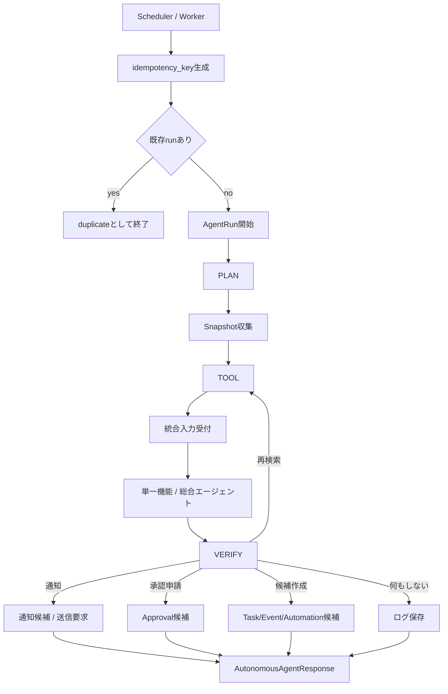

# 自律エージェント 詳細設計

## 1. 目的
自律エージェントは、定期的に現在のタスク、イベント、RAGデータ差分、サーバー運用状態を確認し、必要な提案、通知、承認申請、ログ記録を行う機能である。

本機能は利用者の入力を待たずに起動するが、副作用のある操作は自動実行しない。外部投稿、サーバー操作、タスク正本更新、イベント正本更新、オートメーション正本更新は、必ず承認待ち候補または承認申請として作成する。

本設計は `docs/design/kumc-agent.md` の「12. 自律エージェント」を上位仕様とする。詳細部分は現行実装の `domain.models.agentic.AgentRun`、`AgentStep`、`AgentBudget`、`infra.agentic.repository`、`domain.models.automation.AutomationRule`、`AutomationRun`、`features.automation.service.AutomationService`、`domain.models.workflow.WorkRequest`、`WorkResponse`、`features.workflow.service.WorkflowService`、`domain.models.audit.AuditEvent`、`configs/main/scheduler.yaml`、`configs/main/task_management.yaml` を参照する。現行実装と `kumc-agent.md` が矛盾する場合は `kumc-agent.md` を優先する。

## 2. 対象範囲
対象機能は次の通り。

- 1日にn回の定期起動
- 実行時刻、対象範囲、通知先、予算の設定化
- `idempotency_key` による二重実行防止
- 現在のタスク、イベント、当日のRAGデータ差分、サーバー運用確認事項の収集
- PLAN / TOOL / VERIFY の状態機械実行
- 必要に応じた統合入力受付へのクエリ送信
- 期限が近いタスク、直近イベント、未決事項、新規資料、サーバー運用確認事項の検出
- 提案、通知、承認申請、ログの生成
- タスク、イベント、オートメーション、サーバー操作の承認待ち候補作成
- trace、監査ログ、実行履歴の保存
- CLI、worker、scheduler、Discord通知向けpayload整形

対象外は、承認後の副作用実行、任意の外部投稿、サーバー操作の実行、タスク・イベント正本の直接更新、ユーザー入力に対する即時応答である。ユーザー入力の即時処理は統合入力受付または総合エージェントが担当する。

## 3. 現行実装との差分
現行実装には、Automation、Workflow、Agent trace、Audit logの土台がある。ただし、`kumc-agent.md` の自律エージェントそのものを表すサービスは未実装である。

| 項目 | 現行実装 | 本設計で必要な状態 |
| --- | --- | --- |
| 定期実行 | `AutomationService` に schedule rule と `AutomationRun` がある | 自律エージェント専用の定期runを作り、1日にn回の起動時刻を設定で管理する |
| 実行単位 | `AutomationRule` ごとの action plan | 自律エージェントrunごとにPLAN / TOOL / VERIFY stepを `AgentRun` / `AgentStep` として保存する |
| 二重実行防止 | `AutomationRun.idempotency_key` がある | 自律エージェントでも対象日、slot、scopeから安定 `idempotency_key` を作る |
| 状況収集 | Workflow repositoryにTask/Event/Candidate/Approvalがある | Snapshot collectorでタスク、イベント、承認待ち、RAG差分、サーバー確認事項を収集する |
| 判断 | Automationはrule actionを展開する | 自律エージェントPlannerが期限、直近イベント、未決事項、新規資料、サーバー確認事項を判定する |
| TOOL | Automationは一部allowlist actionを内部実行できる | 自律エージェントは統合入力受付または既存serviceを通し、外部副作用は承認候補に限定する |
| VERIFY | Automationはmode/riskでblocked判定する | 自律エージェントは「再検索」「何もしない」「通知」「許可申請」「候補作成」のいずれかを選ぶ |
| 出力 | AutomationResponse、WorkResponse | AutonomousAgentResponseを追加し、提案・通知・承認申請・ログだけを主結果として返す |
| 監査 | AutomationとWorkflowはAuditEventを残せる | 自律エージェントrun、判断理由、参照対象、候補ID、通知予定を監査ログに残す |
| 設定 | `configs/main/scheduler.yaml` と機能別configがある | `configs/main/autonomous_agent.yaml` を追加し、起動時刻や対象scopeを保存する |

実装では `src/kumc_agent/infra/legacy` を参照・依存しない。

## 4. 全体構成
自律エージェントは、schedulerまたはworkerから起動される定期runとして動作する。



主要コンポーネントは次の通り。

| 層 | 責務 | 主なファイル |
| --- | --- | --- |
| domain | request/response、snapshot、decision、notification、idempotency | `src/kumc_agent/domain/models/autonomous_agent.py` |
| feature | PLAN、TOOL、VERIFY、出力整形 | `src/kumc_agent/features/autonomous_agent/service.py` |
| collector | タスク、イベント、差分、承認待ち、サーバー状態の収集 | `src/kumc_agent/features/autonomous_agent/snapshot.py` |
| integration | 統合入力受付またはworkflow/agent serviceの呼び出し | `src/kumc_agent/features/autonomous_agent/integrated_input.py` |
| repository | run idempotencyと履歴保存 | `src/kumc_agent/infra/agentic/repository.py`, `src/kumc_agent/infra/automation/repository.py` |
| audit | 判断理由と結果の監査 | `src/kumc_agent/infra/audit/repository.py` |
| app context | feature、repository、scheduler設定の組み立て | `src/kumc_agent/apps/autonomous_agent.py` |
| config | 起動時刻、対象scope、通知先、budget | `configs/main/autonomous_agent.yaml` |
| frontend/worker | 手動dry-run、定期run、Discord通知連携 | `src/kumc_agent/cli.py`, `src/kumc_agent/apps/worker/app.py` |

## 5. 実行タイミング
### 5.1 起動方式
自律エージェントは1日にn回、自動で起動する。`schedule_times` は自動インデックス更新と同じく Automation default rule に展開し、`schedule_cron` trigger から worker の `job_type="autonomous_agent_run"` を呼び出す。CLI手動実行、worker手動実行、Automation/scheduler経由実行はいずれも同じ `AutonomousAgentService` を呼ぶ。

`enabled=false` の場合、Automation/schedule経由runは `blocked` として履歴と監査に記録し、PLAN/TOOLは実行しない。CLI手動runは検証用途として実行できる。

起動時刻は `.env` ではなく `configs/main/autonomous_agent.yaml` に保存する。トークン、APIキー、DB接続情報などを追加する場合だけ `.env` / `.env.example` を更新する。

設定例:

```yaml
autonomous_agent:
  enabled: true
  schedule_times: ["08:00", "13:00", "20:00"]
  timezone: "Asia/Tokyo"
  scopes: ["tasks", "events", "rag_delta", "server_ops"]
  notification_channel_id: ""
  dry_run: true
  lookahead_days:
    tasks: 2
    events: 7
  duplicate_suppression_hours: 24
  rag_delta_lookback_hours: 24
  access:
    system_user_id: "system"
    guild_id: ""
    role_ids: []
    is_admin: false
  planner:
    enabled: true
    provider: "gemini"
    gemini_model: ""
    openai_model: "gpt-5.2"
    prompt_name: "autonomous_agent_planner"
  verifier:
    enabled: true
    provider: "gemini"
    gemini_model: ""
    openai_model: "gpt-5.2"
    prompt_name: "autonomous_agent_verifier"
  budget:
    max_steps: 10
    max_search_calls: 6
    max_replans: 1
    max_cost_usd: 0.50
    max_latency_seconds: 120
```

### 5.2 idempotency_key
同じ対象に対する二重実行を避けるため、run開始前に `idempotency_key` を生成する。

形式は次を基本とする。

```text
autonomous-agent:{date}:{slot}:{scope_hash}
```

`date` は設定timezone上の日付、`slot` は `schedule_times` の時刻または手動trigger名、`scope_hash` は対象scope、guild、channel、lookahead設定のhashである。

run開始時に `AutomationRun(status="running")` を同じ `idempotency_key` で予約する。既存runが同じ `idempotency_key` で保存済みの場合、新しいPLAN/TOOLは実行せず、`status="duplicate"`、`metadata.duplicate=true` として応答する。Postgresでは `idempotency_key` unique constraintを使い、最終statusは同じ予約レコードを更新する。File fallbackでは同じidの追記で最新レコードを有効状態とする。

### 5.3 手動dry-run
運用確認のため、CLIまたはworkerから手動dry-runできる。dry-runでは通知送信や候補保存を行わず、作成予定の提案、通知、承認申請をpayloadに返す。

`AutonomousAgentRequest.dry_run` は三値で扱う。

| 値 | 意味 |
| --- | --- |
| `None` | `configs/main/autonomous_agent.yaml` の `dry_run` に従う |
| `true` | 強制dry-run。候補保存・通知要求を抑止する |
| `false` | 候補保存を許可する。ただし外部投稿、サーバー操作、正本更新は承認前に実行しない |

本番定期runでも初期値は `dry_run: true` とし、承認フローと通知先が確認できてから候補作成を有効化する。

## 6. PLAN
PLANでは、現在の状況を収集し、何を確認すべきかを決める。

### 6.1 Snapshot入力
PLANの入力snapshotには次を含める。

| 項目 | 内容 |
| --- | --- |
| `tasks` | 期限が近いTask、期限超過Task、blocked/doingの長期滞留Task |
| `task_candidates` | proposed状態のTaskCandidate、TaskChangeCandidate、approval batch |
| `events` | 直近n日のEvent、日時未定Event、関連Taskの不足 |
| `event_candidates` | proposed状態のEventCandidate、EventChangeCandidate、approval batch |
| `rag_delta` | 当日のRAGデータ差分、更新source、重要そうな新規資料 |
| `server_ops` | waiting_approvalのServerOperation、失敗/未確認の運用事項 |
| `automation` | waiting_approvalまたはblockedのAutomationRun、次回実行予定 |
| `recent_runs` | 直近の自律エージェントrunと同一対象の通知履歴 |

RAG差分の正データソースは ingestion repository の active chunks とする。`updated_at`、`source_updated_at`、`created_at`、`source_created_at`、`published_at`、`message_timestamp`、`indexed_at`、`ingested_at` などのmetadata時刻が `rag_delta_lookback_hours` 以内のsourceを差分として扱う。差分itemには `source_item_id`、`source_kind`、`external_id`、短いsummary、最大数件のcitationだけを入れる。

大きな本文断片や検索contextはsnapshotに直接保持しない。必要な場合はcitation id、source id、短い要約、取得条件だけを保持する。

### 6.2 PLAN出力
PLANの出力は `AgentStep(state="PLAN")` として保存する。payloadには次を含める。

| key | 説明 |
| --- | --- |
| `checks` | 実行する確認項目 |
| `required_queries` | 統合入力受付へ送る候補クエリ |
| `target_refs` | 参照したTask/Event/source/run id |
| `success_criteria` | VERIFYで満たすべき条件 |
| `risk` | `low` / `medium` / `high` / `critical` |
| `side_effect_boundary` | 常に `candidate_only` または `approval_required` |
| `notification_policy` | 通知先、通知条件、抑制条件 |
| `retry_policy` | 再検索上限、再計画上限 |

### 6.3 判定ルール
完全実装では、決定的ルールを安全な下限として残したうえで、専用LLM Plannerが複合状況からPLANを作る。Plannerは `snapshot`、recent runs、budget、scope、side effect boundaryを入力にし、JSON schemaで `checks`、`required_queries`、`target_refs`、`success_criteria`、`risk`、`notification_policy`、`retry_policy` を返す。LLM出力は必ずschema validation、risk/boundary正規化、決定的planとのmerge、fallbackを通す。

決定的guardは次のルールを満たす。

- 期限が `autonomous_agent.lookahead_days.tasks` 以内の未完了Taskがある場合、通知候補を作る。`task_management.due_soon_notice_days` は通常のTask通知機能用であり、自律エージェントの独立lookaheadを優先する。
- 期限超過Taskがある場合、担当者確認または完了確認の通知候補を作る。
- 直近n日のEventに未完了Taskがない場合、関連タスク候補作成クエリを作る。
- 日時または場所が未定の直近Eventがある場合、確認通知またはEvent変更候補作成クエリを作る。
- 当日のRAG差分にタスク・イベントらしい記述がある場合、統合入力受付へ抽出クエリを送る。
- waiting_approvalのServerOperationがある場合、承認依頼通知を作る。
- サーバー運用確認事項がある場合、実行ではなくdry-run候補または許可申請を作る。
- `duplicate_suppression_hours` 内の直近runで同じ対象に通知済みの場合、重複通知を抑制する。

## 7. TOOL
TOOLでは、PLANの結果に基づき、必要な確認を統合入力受付へ送る。

### 7.1 統合入力受付へのクエリ
`kumc-agent.md` に従い、自律エージェントは直接各機能へ自由にアクセスするのではなく、必要に応じて統合入力受付にクエリを送る。統合入力受付は通常のルーティングと同じ権限・安全性ルールで処理する。

自律エージェントからのクエリには、system actorの `AccessContext` を付与する。ただし、admin相当権限を無条件に与えない。対象チャンネル、guild、許可されたrole、実行scopeを設定から解決する。

クエリ例:

| 目的 | 統合入力受付へ送るクエリ例 | 期待出力 |
| --- | --- | --- |
| 直近イベントの準備確認 | `イベント {event_id} の準備タスク候補を過去資料を根拠に作成して` | TaskCandidate |
| RAG差分からイベント抽出 | `本日の資料差分から新しいイベント候補を抽出して` | EventCandidate |
| 期限通知文案 | `期限が近いタスク {task_id} の確認通知案を作って` | NotificationProposal |
| サーバー確認 | `Minecraftサーバーの未承認操作 {operation_id} の承認依頼文を作って` | ApprovalRequestProposal |

### 7.2 直接呼び出しを許可する内部service
統合入力受付が未実装または循環依存になる初期段階では、限定されたadapterを通じて既存serviceを呼んでよい。

| adapter | 呼び出し先 | 許可される結果 |
| --- | --- | --- |
| `workflow_query` | `WorkflowService.run()` | Task/Event候補、approval、検索結果 |
| `automation_query` | `AutomationService.dry_run()` | AutomationRun dry-runまたはwaiting_approval |
| `server_pending_query` | Minecraft repository/service | waiting_approval一覧、dry-run候補 |
| `retrieval_query` | Retrieval ask service | citations付き要約 |

この互換adapterは、外部副作用を持つ操作を呼び出してはならない。実装完了後は統合入力受付経由を標準経路にする。

### 7.3 TOOL step
TOOLの各呼び出しは `AgentStep(state="TOOL")` として保存する。

保存payloadには次を含める。

- `tool_name`
- `query` または `work_type`
- `target_refs`
- `access_summary`
- `status`
- `result_counts`
- `candidate_ids`
- `approval_ids`
- `warnings`
- `metadata.trace_id`

大きな本文、検索context、secretを含む可能性のある値は、step保存前に要約またはマスクする。

## 8. VERIFY
VERIFYでは、統合入力受付または内部adapterの結果をもとに、次のいずれかを選ぶ。

- 再度検索する
- 何もしない
- 特定チャンネルにメッセージを送る
- サーバー管理などの許可申請を作成する
- タスク・イベント・オートメーションの承認待ち候補を作成する

### 8.1 検証項目
VERIFYの検証項目は次の通り。

- PLANの成功条件を満たしているか
- 通知または承認申請の対象が重複していないか
- 通知先チャンネルが設定されているか
- 候補作成に必要な根拠citationがあるか
- 権限外情報が混ざっていないか
- secret、個人情報、大きなcontextが外部出力に混ざっていないか
- 正本更新、外部投稿、サーバー操作が実行済みになっていないか
- 再検索して改善できる不足か
- 予算内で再検索できるか

### 8.2 VERIFY出力
VERIFYの出力は `AgentStep(state="VERIFY")` として保存する。

| key | 説明 |
| --- | --- |
| `decision` | `retry_search` / `noop` / `notify` / `request_approval` / `create_candidates` |
| `satisfied` | 満たした条件 |
| `missing` | 不足している条件 |
| `conflicts` | 矛盾や重複 |
| `notification_proposals` | 送信候補。送信済みではない |
| `approval_requests` | 承認申請候補 |
| `candidate_refs` | 作成候補ID |
| `warnings` | 利用者に提示可能な警告 |
| `metadata` | 内部判断、score、trace id |

専用LLM Verifierはtool result、citation、権限、重複通知履歴、副作用契約を入力にし、JSON schemaで `decision`、`satisfied`、`missing`、`conflicts`、`warnings`、`metadata.reason` を返す。LLM出力は決定的Verifierの結果とmergeし、決定的Verifierが検出した副作用違反、secret、内部IP、招待URL、個人連絡先、citation不足はLLM判断で解除できない。

### 8.3 再検索
再検索は `AgentBudget.max_replans` 以内に限定する。TOOL呼び出しは `max_steps` と `max_search_calls` の両方で制限し、`max_latency_seconds` を超える前に追加TOOLを止める。elapsed、cost、search call数、replan countはrun metadataとAuditEventに残す。再検索しても改善が見込めない場合、`noop` または `insufficient_evidence` として終了する。

## 9. 出力
自律エージェントの出力は、提案・通知・承認申請・ログに限定する。

### 9.1 AutonomousAgentResponse
外部payloadのトップレベルには、利用者・連携先が主結果として扱う安定フィールドだけを置く。

| フィールド | 説明 |
| --- | --- |
| `text` | 短い結果概要 |
| `detail_markdown` | run summary、判断理由、対象一覧 |
| `proposals` | 提案一覧 |
| `notification_proposals` | 送信候補。送信済みではない |
| `approval_requests` | 承認申請候補 |
| `task_candidates` | 作成または参照したTaskCandidate |
| `event_candidates` | 作成または参照したEventCandidate |
| `automation_runs` | dry-runまたはwaiting_approvalのAutomationRun |
| `server_operations` | waiting_approvalまたはdry-run候補 |
| `warnings` | 利用者に提示可能な警告 |
| `metadata.run_id` | 外部payloadで参照するrun id |
| `metadata` | 診断情報、内部判断、trace id、idempotency情報 |

内部service返却型は `AgentRun` を持ってよいが、外部payloadでは `run` objectをトップレベルに置かず `metadata.run_id` / `metadata.trace_id` だけを出す。`routing_decision`、`selected_handler`、`policy_decision`、`trace_id`、`idempotency_key`、内部scoreはトップレベルに置かず `metadata` 配下に保持する。

### 9.2 通知
`kumc-agent.md` では「特定チャンネルにメッセージを送る」がVERIFYの選択肢に含まれる。一方で自律エージェントの制約として外部投稿は承認フローを通す必要がある。

この矛盾は `kumc-agent.md` 内の「外部投稿、サーバー操作、タスク/イベント正本更新は承認フローを通す」を優先し、初期実装では通知本文を `NotificationProposal` として作成する。実際のDiscord送信は、承認済みの通知候補または通知専用の低リスクallowlistが設定された場合のみ、別コンポーネントが行う。

### 9.3 ログ
自律エージェントは次のログを保存する。

- `AgentRun` / `AgentStep`: PLAN / TOOL / VERIFY のtrace
- `AutomationRun`: schedulerまたはautomation ruleから起動した記録
- `AuditEvent`: 判断、候補作成、通知候補作成、承認申請作成
- `ActionRun`: 将来、通知送信や承認済み内部actionを記録する場合の実行記録

## 10. データモデル
### 10.1 AutonomousAgentRequest
`AutonomousAgentRequest` は自律エージェントrunの入力である。

| フィールド | 説明 |
| --- | --- |
| `trigger` | `schedule` / `manual` / `automation` |
| `slot` | `08:00` などの起動slot |
| `scopes` | `tasks`, `events`, `rag_delta`, `server_ops`, `automation` |
| `dry_run` | `None` はconfigに従う、`true` は強制dry-run、`false` は候補保存許可 |
| `access` | system actorの `AccessContext` |
| `budget` | `AgentBudget` |
| `idempotency_key` | 指定がなければserviceが生成 |
| `metadata` | scheduler run id、config versionなど |

### 10.2 AutonomousAgentSnapshot
`AutonomousAgentSnapshot` はPLAN用の状況要約である。

| フィールド | 説明 |
| --- | --- |
| `captured_at` | snapshot作成時刻 |
| `tasks` | 対象Task要約 |
| `events` | 対象Event要約 |
| `task_candidates` | proposed候補要約 |
| `event_candidates` | proposed候補要約 |
| `rag_delta_refs` | 当日差分source id |
| `server_operation_refs` | pending operation id |
| `automation_run_refs` | pending/blocked run id |
| `recent_notification_refs` | 重複抑制用履歴 |
| `metadata` | 抽出条件、件数、trace id |

### 10.3 AutonomousDecision
`AutonomousDecision` はVERIFY後の判断である。

| フィールド | 説明 |
| --- | --- |
| `decision` | `retry_search` / `noop` / `notify` / `request_approval` / `create_candidates` |
| `reason` | 判断理由 |
| `target_refs` | 対象Task/Event/source/run id |
| `risk` | risk level |
| `confidence` | `low` / `medium` / `high` |
| `proposals` | 提案payload |
| `metadata` | 内部score、重複抑制、trace id |

## 11. 権限と安全性
自律エージェントはsystem actorとして動作するが、権限は設定で明示されたscopeに限定する。

- 統合入力受付へ渡す `AccessContext` にはguild、channel、roleを含める。
- admin専用情報にアクセスする場合は、設定で許可されたsystem roleだけを使う。
- 検索前filterと回答前filterは統合入力受付側の通常ルールに従う。
- `dry_run=false` でも、外部投稿、サーバー操作、タスク/イベント正本更新は実行しない。
- `read_only=false` のtoolを呼ぶ場合、出力は候補作成または承認申請に限定する。
- secret、招待URL、token、内部IP、個人連絡先、学籍番号などは出力前にマスクする。
- 大きなRAG contextや本文断片は外部payloadにもtraceにも保存しない。
- TOOL resultには `metadata.side_effects: none | candidate_or_approval_only | master_write | external_post | server_execute`、`master_write_count`、`external_delivery_count`、`server_execute_count` を必須化する。`master_write`、`external_post`、`server_execute` または各countの正値を検出した場合、VERIFYは `conflicts` に記録して自動実行結果を採用しない。

## 12. 設定
自律エージェントのパラメータは `configs/main/autonomous_agent.yaml` に保存する。

`.env` / `.env.example` に保存してよいのは、外部API token、DB URL、Discord tokenなどのsecretだけである。設定項目を追加する場合は `config/schema.py` と `config/load.py` の読み込みも更新する。

主な設定項目は次の通り。

| key | 説明 |
| --- | --- |
| `enabled` | 定期起動の有効/無効 |
| `schedule_times` | 1日の起動時刻一覧 |
| `timezone` | 日付とslot解決に使うtimezone |
| `scopes` | 対象scope |
| `notification_channel_id` | 通知候補の既定送信先 |
| `dry_run` | 候補保存や送信要求を抑止する |
| `lookahead_days.tasks` | タスク確認対象日数 |
| `lookahead_days.events` | イベント確認対象日数 |
| `duplicate_suppression_hours` | 同一対象への通知抑制時間 |
| `rag_delta_lookback_hours` | RAG差分として扱うingestion chunkの更新時間幅 |
| `access.system_user_id` | 自律エージェントのsystem actor user id |
| `access.guild_id` | 統合入力受付へ渡す既定guild |
| `access.role_ids` | system actorに付与するrole |
| `access.is_admin` | system actorをadmin扱いにするか。既定はfalse |
| `planner` | 専用LLM Plannerのprovider/model/prompt/retry設定 |
| `verifier` | 専用LLM Verifierのprovider/model/prompt/retry設定 |
| `budget` | `AgentBudget` 相当の上限 |

## 13. 監査・trace
自律エージェントrunでは、最低限次を記録する。

- run id
- idempotency key
- trigger、slot、scope
- PLANで参照した対象ID
- TOOLで呼んだクエリ、work type、result counts
- VERIFYのdecisionと判断理由
- 作成した候補ID、承認申請ID、通知候補ID
- duplicate / skipped / noop の理由
- elapsed、cost、search call数

監査ログには、利用者に説明できる粒度の判断理由だけを保存する。LLM prompt、検索context全文、secretを含む可能性のあるmetadataは保存前に除外またはマスクする。

## 14. エラーハンドリング
| ケース | 挙動 |
| --- | --- |
| 同一 `idempotency_key` のrunが存在 | duplicateとして終了し、既存run idをmetadataに入れる |
| 設定不備 | `failed` にせず `blocked` として終了し、必要な設定keyをwarningに出す |
| snapshot取得失敗 | 取得できたscopeだけで続行し、不足scopeをwarningに出す |
| 統合入力受付失敗 | TOOL resultを `failed` として保存し、VERIFYでnoopまたは低confidence提案にする |
| citation不足 | 候補作成しない。再検索可能なら再検索し、不可なら不足情報を記録する |
| 権限不足 | 対象scopeをskippedにし、権限不足を監査ログに残す |
| 予算超過 | 追加TOOLを止め、現時点の結果でVERIFYする |
| 通知先未設定 | 通知候補は作るが送信要求は作らずwarningを返す |

## 15. 評価
自律エージェントは、内部で使用した機能ごとに評価する。評価観点は次の通り。

- 期限が近いタスクを検出できるか
- 直近イベントの準備不足を検出できるか
- RAG差分から候補作成が必要な事項を検出できるか
- 重複通知を抑制できるか
- 候補作成時に根拠citationを保持できるか
- 承認前に正本更新や外部投稿を行わないか
- 権限外情報やsecretを出力しないか
- idempotencyにより二重実行を防げるか
- schedule slotからAutomationRuleが生成されるか
- 専用LLM Planner / Verifierのschema validation、決定的guard、fallbackが動くか
- worker/CLI payloadの診断情報がmetadata配下に収まるか
- forbidden side effect、citation不足、notification duplicate suppressionを検出できるか

評価基盤では `target="agentic"` または専用 `target="autonomous_agent"` を使い、tool単位の成否、安全性、承認境界を記録する。

## 16. 実装上の注意
- `features.agentic.service.AgenticSearchService` は現状古いAgentic Search実装であり、自律エージェントから直接依存しない。
- `AgentRun`、`AgentStep`、`AgentBudget`、`AgentTraceRepository` は汎用trace部品として再利用する。
- Automationの `auto_run` allowlistは内部action向けであり、自律エージェントの外部副作用許可として使わない。
- 通知本文の作成とDiscord送信は分離する。自律エージェントは原則 `NotificationProposal` までを作る。
- 統合入力受付が完成するまでは限定adapterを使えるが、実装計画上は統合入力受付経由へ移行する。
- `src/kumc_agent/infra/legacy` を参照しない。
