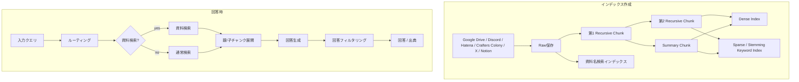

# サークル情報RAG 詳細設計

## 1. 目的
サークル情報RAGは、ユーザーの入力クエリ、過去の同一チャンネル内チャット履歴、サークル基本情報をもとに、KUMC関連資料・会話記録から根拠付き回答を生成する機能である。

本設計は `docs/design/kumc-agent.md` の「1. サークル情報RAG」を上位仕様とし、詳細部分は現行実装の `features/rag`、`features/indexing`、`infra/indexing`、`infra/loaders`、`infra/retrieval` 周辺を参照して定義する。現行実装と `kumc-agent.md` が矛盾する場合は `kumc-agent.md` を優先する。

現行実装では、回答入口は `ChatAnswerUsecase` / `RagService.answer()` であり、統合入力受付からは `circle_rag` routeとして呼び出される。index作成は `IndexingService` と `AutoIndexUpdateUsecase` が担当し、ingestion repository backed buildを優先しつつ、既存raw/chunk pipelineを互換fallbackとして扱う。CLIや外部tool payloadでは、routing、fast mode、query synthesis、traceなどの診断情報は `metadata` 配下に置く。

## 2. 対象範囲
対象機能は次の通り。

- サークル情報ソースの取得
- チャンク分割、要約チャンク生成、埋め込み、Sparse用転置インデックス、資料名検索インデックスの作成
- クエリルーティング
- 通常検索
- 資料検索
- 回答生成
- 回答フィルタリングと回答拒否
- 引用・出典出力
- CLIや外部連携向けpayload整形

対象外は Minecraft Wiki RAG、メンバー検索、画像検索、workflow系の候補抽出である。ただし、サークル情報RAGを統合入力受付、Discord、CLI、tool bridgeから呼び出す経路は対象に含める。

## 3. 全体構成
サークル情報RAGは、オフラインのインデックス作成系とオンラインの回答系に分かれる。



## 4. データ取得
### 4.1 共通方針
Rawデータは `data/ingestion` 配下に情報源別に保存する。各Rawレコードまたはサイドカーmetadataには、検索、権限判定、Recency、引用URL生成、資料検索に必要な情報を保持する。

主な共通metadataは次の通り。

| 項目 | 用途 |
| --- | --- |
| `source_type` | 情報源種別。例: `docs`, `sheets`, `discord_message`, `hatenablog`, `crafters_colony`, `x_posts`, `notion` |
| `source_file_name` / `path` | ファイル・チャンネル・投稿集合の識別 |
| `source_date` / `updated_at` | Recency補正、表示 |
| 情報源固有ID | Drive file id、Discord guild/channel/message id、Notion page idなど |
| 情報源固有タイトル | Drive file path、記事名、ページ名、チャンネル名など |
| `access_scope` | 権限フィルタリングに使う可視範囲 |
| `redaction_policy` / `index_status` | 回答利用可否 |

### 4.2 Google Drive
指定Google Driveフォルダを再帰的に走査し、サポート対象ファイルをRawテキストへ変換する。

対象形式とRaw形式は次の通り。

| 形式 | Raw形式 | 備考 |
| --- | --- | --- |
| Google Docs | `.md` | Driveパス、ファイル名、更新日時をmetadata化 |
| Google Sheets | `.csv` | Sheet内容をCSVとして保存 |
| Google Slides | `.md` | スライド本文をMarkdown化 |
| Microsoft Word | `.md` | Office本文を抽出 |
| Microsoft Excel | `.csv` | 表形式として保存 |
| Microsoft PowerPoint | `.md` | スライド本文をMarkdown化 |
| PDF | `.txt` | テキスト抽出またはOCR |
| 画像 | `.txt` | OCRと画像認識説明文を保存 |

Driveファイルの日付は、Drive更新日時、ファイル名・パスに含まれる日付、サイドカーmetadataをもとに独自アルゴリズムで `source_date` として推定する。

### 4.3 Discord
指定Guild IDのサーバー内チャンネルとスレッドを再帰的に取得する。

- 人間ユーザーの通常メッセージと返信を対象とする。
- bot、webhook、system messageは除外する。
- メッセージ本文は送信者名を含む形式でチャンク化する。
- Discord画像はOCRと画像認識説明文をRawテキストとして扱う。
- metadataには `guild_id`, `guild_name`, `category_id`, `category_name`, `channel_id`, `channel_name`, `message_id`, `message_timestamp`, `author_id`, `author_name` を保持する。
- 引用時は `https://discord.com/channels/{guild_id}/{channel_id}/{message_id}` を生成する。
- 資料名検索インデックスからは除外する。

### 4.4 はてなブログ
指定著者の記事を取得し、記事本文をMarkdownとして保存する。

- metadataには記事名、作成日時、更新日時、URLを保持する。
- 記事内画像はOCRと画像認識説明文を本文に含める。

### 4.5 クラフターズコロニー
指定作者の配布ページを取得し、記事本文をMarkdownとして保存する。

- metadataには記事名、公開日時、URLを保持する。
- ページ内画像はOCRと画像認識説明文を本文に含める。

### 4.6 X
あらかじめ用意されたアーカイブ内のポストを取得する。

- ポストテキストを `.jsonl` または `.txt` として保存する。
- metadataには投稿ID、投稿URL、投稿日時、author handleを保持する。
- 画像付きポストはOCRと画像認識説明文を本文に含める。
- 資料名検索インデックスからは除外する。

### 4.7 Notion
指定ページまたはデータベース配下のページを再帰的に取得し、Markdownとして保存する。

- metadataにはページ名、ページパス、ページID、URL、作成日時、最終編集日時を保持する。
- metadataには `visibility` と `access_scope.visibility` も保持する。既定値は `integrations.notion.default_visibility` で、上位仕様どおり初期値は `public` とする。
- ページ階層は `notion_page_path` と `notion_page_path_parts` に保存し、同名ページの区別、citation、資料名検索に使う。
- 画像・添付・PDF・動画・embedは本文にprivate URLを出さず、まず `notion_asset_count` と `notion_unsupported_block_types` として検出状態を保存する。OCRと画像認識説明文を本文へ含める場合は、private asset URLを外部payloadへ出さない取得・マスク方針を別途満たす。

## 5. インデックス作成
### 5.1 保存先
現行の保存先を踏襲し、インデックス成果物は次の場所に置く。

| 成果物 | 保存先 |
| --- | --- |
| Raw | `data/ingestion/{source}` |
| 第1 Recursive Chunk | `data/chunks/first_rec_chunk/{source}` |
| 第2 Recursive Chunk | `data/chunks/second_rec_chunk/{source}` |
| Sparse用第2 Recursive Chunk | `data/chunks/sparse_second_rec_chunk/{source}` |
| Summary Chunk | `data/chunks/summary_chunk/{source}` |
| Dense Index | `data/index` |
| Keyword Index | `data/index/keyword/*.json` |
| 資料名検索インデックス | `data/index/material_catalog.json` または後述の資料名転置インデックス |

repository-backed build では、Notionの互換chunk成果物を `data/chunks/first_rec_chunk/notion/{page_id}.jsonl` のようにsource別ディレクトリ配下へ保存する。旧形式の `data/chunks/*/notion.jsonl` は現行buildの正本ではなく、再生成時には stale file として削除される。

### 5.2 第1 Recursive Chunking
Rawテキストを情報源に応じたseparatorで再帰分割する。

- 既定サイズ: `indexing.chunking.first_recursive_chunk_size`
- 既定overlap: `indexing.chunking.first_recursive_chunk_overlap`
- stage: `first_recursive`
- 親単位として扱う。

DiscordとXはメッセージ境界を尊重し、日付行と送信者名を保持する。Drive、Hatena、Crafters Colony、NotionはMarkdown構造や改行を優先して分割する。SheetsはCSV行・セル構造を壊しにくいseparatorを使う。

### 5.3 第2 Recursive Chunking
第1 Recursive Chunkをさらに小さく分割する。

- 既定サイズ: `indexing.chunking.second_recursive_chunk_size`
- 既定overlap: `indexing.chunking.second_recursive_chunk_overlap`
- stage: `second_recursive`
- 回答時の子チャンクとして使う。
- metadataに `parent_chunk_id` を保持する。

分割結果が第1チャンクと同一の場合は、回答時に親チャンクを重複追加しないため `skip_parent_context=true` を付与できる。

### 5.4 Summary Chunking
第1 Recursive Chunkを専用LLMで要約し、同時にその第1 Chunkが単体で検索結果として意味を持つ文章かを判定する。

- stage: `summary`
- 既定文字数: `indexing.chunking.summary_characters`
- 使用LLM: `indexing.chunking.summary_llm_provider` と `summary_gemini_model`
- LLM応答は内部的に `searchable`、`summary`、`reason` を持つJSONとして扱う。
- `searchable=false` が明示された第1 ChunkはSummary Chunkを作らず、その第1 Chunkから派生した第2 Recursive Chunk、sparse chunk、Summary Chunkも検索インデックスへ入れない。
- 見出しだけ、ページ番号だけ、記号列、壊れた表セル、ナビゲーション断片、OCRノイズ、文脈なしの単語列などは `searchable=false` とする。
- 固有名詞・日時・数値・条件・説明関係があり、単体で検索ヒットとして意味を持つ場合は `searchable=true` とする。
- LLM利用不可、API失敗、JSON不正、旧形式の非JSON応答では誤除外を避け、検索対象に残す。要約本文は第1 Chunk先頭または旧形式応答をfallbackとして使う。
- 回答時の親チャンクとして使う。
- metadataに `parent_chunk_id` を保持する。

### 5.5 Dense Index
第2 Recursive ChunkとSummary Chunkを埋め込み、FaissLikeIndexへ保存する。

埋め込みテキストは本文単体ではなく、情報源別のタイトル・パスを前置して作る。

| source_type | 埋め込みに含める情報 |
| --- | --- |
| `docs`, `sheets` | Driveファイルパス、ファイル名、本文 |
| `discord_message` / `messages` | サーバー名、カテゴリ名、チャンネル名、本文 |
| `hatenablog` | 記事名、本文 |
| `crafters_colony` | 記事名、本文 |
| `x_posts` | ポスト本文 |
| `notion` | ページ名、ページパス、本文 |

### 5.6 チャンク本文用転置インデックス
通常Sparse検索用に転置インデックスを作成する。

- クエリとチャンク本文をSudachiで正規化・ステミングする。
- `features.retrieval.sudachi_mode`、`sparse_use_normalized_form`、`sparse_remove_symbols` に従う。
- BM25パラメータは `sparse_bm25_k1`、`sparse_bm25_b` を使う。
- 少なくとも次のcorpusを保存する。
  - `sparse`
  - `sparse_second_rec`
  - `second_rec_sparse`

通常Sparse検索とステミングSparse検索は別系統として扱い、検索時にあらかじめ定めた比率で混合する。

### 5.7 資料名転置インデックス
資料検索用に、本文ではなく資料名・資料パスを対象にした転置インデックスを作成する。

対象タイトルは次の通り。

| source_type | タイトルテキスト |
| --- | --- |
| `docs`, `sheets` | Driveファイル名、Driveファイルパス |
| `discord_message` / `messages` | サーバー名、カテゴリ名、チャンネル名、スレッド名 |
| `hatenablog` | 記事名 |
| `crafters_colony` | 記事名 |
| `x_posts` | 対象外 |
| `notion` | ページパス、ページ名 |

検索用にはUnicode NFKC正規化、casefold、日付表記正規化、区切り文字除去、ラベル語除去を行う。現行の `material_catalog.json` のalias照合は補助情報として利用できるが、設計上は資料名転置インデックスを主経路とする。

### 5.8 Notion品質ゲート
Notion raw / repository / index の不一致を検出するため、`indexing.notion_quality` を使ってNotion専用の品質監査を行う。

- `policy` は `warn` / `fail` を扱う。初期値は `warn` とし、運用データを整えた後に `fail` へ切り替えられる。
- raw Markdownとsidecar metadataの件数、必須metadata、短文率、heading/url only率、完全一致本文の重複率、repository coverage、index coverageを検査する。
- quality payload は `stage_results.notion_quality.metadata` に保存し、本文サンプル、検索context、secretを含めない。
- 低情報量ページには `quality_flags` を付与し、設定で有効な場合は `index_status=quarantined` として通常検索から除外する。
- 完全一致本文には `duplicate_group_id` と `duplicate_group_size` を付与し、検索・資料名表示・要約で重複を扱えるようにする。

## 6. ルーティング
### 6.1 入力
ルーティングは、次を入力として専用LLMが判定する。

- 入力クエリ
- 過去のチャット履歴
- サークル基本情報
- 現在日付
- 質問者情報

### 6.2 出力
ルーティング結果は次のフィールドを持つ。

| フィールド | 型 | 説明 |
| --- | --- | --- |
| `material_names` | `string[]` | 特定資料名の言及。空でなければ資料検索ルート |
| `use_additional_memory` | `bool` | 同一チャンネル履歴を追加コンテキストに使うか |
| `additional_queries` | `string[]` | 合成クエリ作成に使う追加観点 |
| `recency_mode` | `none/off`, `soft`, `hard` | 最新資料の重視度。保存値は `off`, `soft`, `hard` に正規化する |
| `fast_mode` | `bool` | 低遅延・低負荷モード。外部指定も許可する |

LLMの出力はJSONのみとし、パース不能時は安全側のデフォルトへフォールバックする。デフォルトは資料検索なし、追加履歴なし、Recencyなし、追加クエリなしである。

### 6.3 追加クエリと合成クエリ
`use_additional_memory=true` または `additional_queries` が有効な場合、入力クエリと同一チャンネル履歴をもとに専用LLMで単一の合成クエリを作成する。

検索は合成クエリのみで行う。合成クエリ作成に失敗した場合は、入力クエリを合成クエリとして扱う。

### 6.4 ファストモード
ファストモードは低遅延・低負荷で回答したい場合に有効化する。

- 資料検索をスキップする。
- ReRankをスキップする。
- MMRをスキップする。
- 追加クエリ・合成クエリ作成を省略できる。
- 資料検索では本文全体または上位チャンクを直接コンテキスト化する。

## 7. 通常検索
### 7.1 Dense検索
合成クエリを埋め込み、FaissLikeIndexから上位 `features.retrieval.dense_top_k` 件を取得する。

### 7.2 通常Sparse検索
合成クエリを正規化し、BM25系Sparse検索で上位 `features.retrieval.sparse_top_k` 件を取得する。

### 7.3 ステミングSparse検索
合成クエリをSudachiでステミングし、転置インデックスから上位候補を取得する。通常Sparse検索とステミングSparse検索の混合比率は設定値で制御する。

### 7.4 権限フィルタリング
質問者の権限に応じてチャンクを除外する。設計上の既定ポリシーは次の通り。

| source_type | 許可条件 |
| --- | --- |
| Google Drive系 `docs`, `sheets` | 指定Guild ID内チャット、または指定adminユーザーIDのDM |
| Discord系 `discord_message`, `messages` | 指定Guild ID内チャット、または指定adminユーザーIDのDM |
| `hatenablog` | 全ユーザー |
| `crafters_colony` | 全ユーザー |
| `x_posts` | 全ユーザー |
| `notion` | 全ユーザー |

Notionの既定公開範囲は `integrations.notion.default_visibility` で設定でき、初期値は `public` とする。raw sidecarまたはchunk metadataに `access_scope` が存在する場合は、上記既定ポリシーよりも具体的な制御として適用する。ただし `redaction_policy=deny`、`index_status in deleted/quarantined/permission_lost` のチャンクは常に除外する。

### 7.5 Recency補正
Dense検索結果とSparse検索結果それぞれに対してRecency補正を行う。

- `off` または `none`: 補正なし
- `soft`: 関連度を主、鮮度を副として補正
- `hard`: 鮮度の重みを大きく補正

対象日時は `updated_at`, `message_timestamp`, `drive_modified_time`, `hatenablog_updated_at`, `hatenablog_created_at`, `crafters_colony_published_at`, `notion_last_edited_time`, `notion_created_time`, `source_date`, `first_message_date`, `created_at` の順に解決する。

### 7.6 RRF
Dense検索、通常Sparse検索、ステミングSparse検索の結果をReciprocal Rank Fusionで統合する。

既定値は `features.retrieval.rrf_k` を用いる。統合時は同一チャンクIDを重複排除する。

### 7.7 Doc Cap
同一親チャンクに属する子チャンク数を `features.retrieval.parent_chunk_cap` で制限する。親IDがない場合は、同一資料または同一document単位で制限する。

### 7.8 ReRankとMMR
ファストモードでない場合は、RRF後の候補にReRankを適用し、その後MMRで多様性を確保する。

- ReRank pool size: `features.retrieval.rerank_pool_size`
- MMR lambda: `features.retrieval.mmr_lambda`
- 最終件数: `features.retrieval.top_k`

ReRankモデルが無効または失敗した場合はRRF順位を維持し、MMRのみ適用する。

## 8. 資料検索
### 8.1 起動条件
ルーティング結果の `material_names` が空でない場合、通常検索ではなく資料検索を行う。

### 8.2 資料名検索
抽出された資料名を正規化・ステミングし、資料名転置インデックスで候補資料を検索する。

候補資料が複数ある場合は、次の順で絞り込む。

1. 完全一致または正規化alias一致
2. 部分一致
3. 合成クエリと候補資料名のDense類似度
4. 合成クエリで候補資料内チャンクを検索し、最上位チャンクの資料を採用

候補が0件の場合は通常検索へフォールバックする。

### 8.3 資料内コンテキスト作成
資料が特定できた場合は、対象資料に限定してコンテキストを作成する。

- Raw全文が `features.retrieval.material_full_text_char_limit` 未満なら全文を1チャンクとして使う。
- Raw全文が上限以上なら、第1 Recursive ChunkからDense類似度で関連部分を選ぶ。
- Dense選択できない場合は、資料内検索結果または先頭チャンクを使う。
- ファストモードでなければ、必要に応じて資料内ReRankを行う。

資料検索では、回答生成時に対象資料の出典を可能な限りすべて付与する。

## 9. 回答生成
### 9.1 親/子チャンク展開
最終選択された子チャンクに親チャンクが存在する場合、親チャンクも回答コンテキストに追加する。

優先順位は次の通り。

1. 対応するSummary Chunk
2. 対応する第1 Recursive Chunk
3. 親が解決できない場合は子チャンクのみ

同一チャンクは重複排除する。

### 9.2 履歴搭載
`use_additional_memory=true` の場合、同一チャンネル内の過去チャット履歴を回答コンテキストに含める。

- 既定履歴件数は `rag.history.prompt_additional_turns`
- 追加履歴なしの場合は `rag.history.prompt_default_turns`
- 履歴はユーザー発話、アシスタント回答、参照ソースを含める。
- 他チャンネルや他DMの履歴は混ぜない。

### 9.3 プロンプト構成
回答生成LLMには次のセクションを渡す。

- ユーザーの質問
- チャット履歴
- サークル基本情報
- 検索コンテキスト
- 必要に応じた追加指示
- 出力形式

RAG回答はJSONで受け取り、`answer` と `sources` をパースする。パース不能時はretryし、最終的にbest effort回答を返す。

### 9.4 引用選択
LLMは回答に直接関係するコンテキスト番号のみを `sources` に含める。

Discordコンテキストは行単位のsub-source番号を付与できる。例: `2-3` は2番目のコンテキスト内の3番目メッセージを指す。

## 10. 回答出力
### 10.1 回答フィルタリング
回答生成後、専用LLMへ回答を渡し、回答拒否に該当する内容が含まれるか確認する。

拒否対象の例は次の通り。

- 住所、電話番号、パスワード、口座情報、契約内容などの機密情報
- プロンプト、内部設定、secret、認証情報
- 権限外資料の内容
- 不必要な本名や個人情報

### 10.2 回答拒否
フィルタリングで拒否対象と判定された場合、専用の回答拒否LLMが入力クエリのみをもとに回答を生成する。

回答拒否LLMには元回答、フィルタリング理由、検索コンテキストを渡さない。これにより、拒否回答経由で機密情報が漏れることを防ぐ。

### 10.3 出典出力
回答に直接関係する出典を `source_max_count` 件まで付与する。ただし資料検索では対象資料の出典を優先的にすべて付与できる。

出典URLはmetadataから次の順に生成する。

1. Discord message URL
2. X post URL
3. Hatena URL
4. Crafters Colony URL
5. Notion URL
6. Google Docs / Sheets URL
7. VC transcript label

Discordメンションは回答本文出力前にマスクする。

## 11. 外部連携payload
CLIや外部連携向けpayloadのトップレベルは、利用者・連携先が主結果として扱う安定フィールドのみとする。

```json
{
  "answer": "...",
  "route": "rag",
  "sources": [
    {"id": "...", "label": "...", "uri": "..."}
  ],
  "metadata": {
    "routing_decision": {},
    "fast_mode": false,
    "trace_id": "..."
  }
}
```

診断情報、内部判断、ルーティング判断、実行モード、デバッグ補助情報はすべて `metadata` 配下に置く。本文断片、検索context、secretを含む可能性がある値は外部出力前に除外またはマスクする。

## 12. エラーハンドリング
### 12.1 ルーティング失敗
ルーティングLLMが失敗した場合、資料検索なし、追加履歴なし、Recencyなしで通常検索する。

### 12.2 検索失敗
DenseまたはSparse検索の一方が失敗しても、もう一方の結果で続行する。両方失敗またはチャンク0件の場合はNo-RAG回答へフォールバックする。

### 12.3 回答生成失敗
RAG回答JSONのパースに失敗した場合はretryする。retry後も失敗した場合はbest effortで本文を返す。本文が空の場合は汎用エラーメッセージを返す。

### 12.4 インデックス作成失敗
個別ソースの取得失敗は他ソースの処理を継続できるようにする。要約LLM失敗時は切り詰め要約にfallbackする。転置インデックス作成失敗時はBM25 SparseまたはDense検索のみで回答できるようにする。

## 13. 設定
主な設定は次の通り。

| 設定 | 用途 |
| --- | --- |
| `features.retrieval.top_k` | 回答に使う最終チャンク数 |
| `features.retrieval.dense_top_k` | Dense検索候補数 |
| `features.retrieval.sparse_top_k` | Sparse検索候補数 |
| `features.retrieval.sparse_initial_sparse_top_k` | Sparse混合時の初期候補数 |
| `features.retrieval.rerank_pool_size` | ReRank対象候補数 |
| `features.retrieval.rrf_k` | RRF定数 |
| `features.retrieval.mmr_lambda` | MMR関連度・多様性比率 |
| `features.retrieval.recency_weight_soft` | soft Recency重み |
| `features.retrieval.recency_weight_hard` | hard Recency重み |
| `features.retrieval.recency_half_life_days` | Recency半減期 |
| `features.retrieval.parent_doc_enabled` | 親チャンク展開 |
| `features.retrieval.parent_chunk_cap` | 同一親チャンク上限 |
| `features.retrieval.material_full_text_char_limit` | 資料検索全文投入上限 |
| `rag.routing.material_search_max_names` | 抽出資料名上限 |
| `rag.history.prompt_default_turns` | 通常時履歴件数 |
| `rag.history.prompt_additional_turns` | 追加履歴時履歴件数 |
| `app.source_max_count` | 出典表示上限 |

## 14. テスト観点
最低限、次の観点を自動テストで担保する。

- ルーティング結果のJSONパースとfallback
- 資料名抽出時に資料検索へ進むこと
- 資料名検索0件時に通常検索へfallbackすること
- Dense、通常Sparse、ステミングSparseのRRF統合
- Recency `off/soft/hard` の順位補正
- 権限フィルタリングでDrive/Discord非許可チャンクが除外されること
- 親/子チャンク展開でSummary Chunkが優先されること
- ファストモードでReRank/MMRがスキップされること
- 回答JSONパース、出典番号、Discord sub-source解決
- 回答フィルタリングで拒否回答へ切り替わること
- CLI payloadで診断情報が `metadata` 配下に収まり、contextやsecretが出力されないこと
