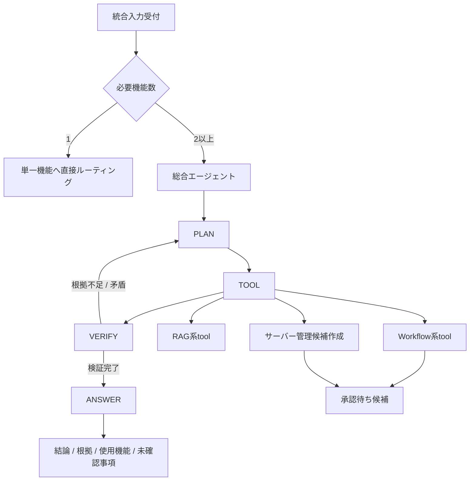

# 総合エージェント 詳細設計

## 1. 目的
総合エージェントは、単一機能では解決できない入力を受け取り、複数機能を組み合わせて計画、実行、検証、回答を行う機能である。

本機能は、検索・候補作成・承認申請を統合する。タスク、イベント、サーバー操作など副作用が必要な依頼については、直接実行せず、承認待ち候補として出力する。

本設計は `docs/design/kumc-agent.md` の「10. 総合エージェント」を上位仕様とする。詳細部分は現行実装の `domain.models.agentic.AgentRun`、`AgentStep`、`AgentBudget`、`features.agentic.tools.ToolSchemaRegistry`、`infra.agentic.repository`、`features.workflow.service.WorkflowService`、`domain.models.workflow.WorkResponse`、`infrastructure/migrations/005_agentic_runs_announcements.sql` を参照する。現行の `AgenticSearchService`、`AgenticSearchRequest`、`AgenticSearchResponse`、Agentic Search専用のCLI/HTTP/Discord起動経路は削除対象とし、新たにComprehensiveAgentのコードとして作り直す。現行実装と `kumc-agent.md` が矛盾する場合は `kumc-agent.md` を優先する。

## 2. 対象範囲
対象機能は次の通り。

- 複数機能が必要な入力の受付
- PLAN / TOOL / VERIFY の状態機械実行
- 入力クエリの分解、必要機能、検索条件、成功条件の決定
- サークル情報RAG、Minecraft Wiki RAG、メンバー検索、画像検索、タスク管理、イベント管理、サーバー管理候補作成のtool実行
- 副作用操作の承認待ち候補作成
- 根拠、候補、実行結果の検証
- 根拠不足や矛盾時の再計画
- 予算、step数、検索回数、コスト、latencyの制限
- trace保存、監査、評価連携
- CLI、Discord、HTTP、統合入力受付向けpayload整形

対象外は、単一機能だけで完結する通常RAG回答、承認後の副作用実行、自律エージェントの定期起動である。単一機能で解決できる場合は、総合エージェントを経由せず、その機能へ直接ルーティングする。

## 3. 現行実装との差分
現行実装は、深い検索向けの `AgenticSearchService` を持つ。これは状態機械、budget、trace保存の土台であるが、`kumc-agent.md` の総合エージェント仕様には未到達であり、本設計では互換維持せず削除する。

| 項目 | 現行実装 | 本設計で必要な状態 |
| --- | --- | --- |
| コード構成 | `AgenticSearchService`、`AgenticSearchRequest`、`AgenticSearchResponse` が検索専用に存在する | AgenticSearch関連コードを削除し、`ComprehensiveAgentService`、`ComprehensiveAgentRequest`、`ComprehensiveAgentResponse` を新設する |
| 呼び出し条件 | CLI/HTTP/Discordの `depth=deep` でAgentic Searchを起動 | 2つ以上の機能が必要な入力を総合エージェントへ昇格する。深掘り検索が必要な場合もComprehensiveAgentのread-only計画として扱う |
| 状態 | `PLAN`、`SEARCH`、`READ`、`VERIFY`、`ANSWER` | 上位仕様は `PLAN`、`TOOL`、`VERIFY`。検索と読込は `TOOL` stepに統合し、`SEARCH` / `READ` stateは廃止する |
| tool | RAG検索、context読込、検証のみ | RAG、Minecraft Wiki RAG、メンバー検索、画像検索、タスク管理、イベント管理、サーバー管理候補作成、承認待ち候補作成を使える |
| 計画 | クエリ分割、根拠・関連資料・未決事項の検索を追加 | 必要機能、検索条件、成功条件、副作用境界、再試行条件を明示する |
| 副作用 | 未対応 | 副作用のある操作は候補作成または承認申請までに限定する |
| 検証 | citationsとnotesの有無を決定的に確認 | 機能別結果、根拠、候補、矛盾、未確認事項を検証し、最大n回まで再計画する |
| 回答 | Agentic Searchの検索結果文 | 結論、根拠、使用した機能、未確認事項、承認待ち候補を含める |
| trace | `agent_runs`、`agent_steps` に保存 | テーブルは再利用しつつ、ComprehensiveAgentのtool call単位の入力、出力、権限、候補ID、承認ID、検証結果を保存する |
| payload | CLI深掘り結果に `agent_run_id` を返す | 診断情報は `metadata` 配下に入れ、主結果だけをトップレベルに置く |
| 入口 | `depth=deep` とOpenClaw経路が併存 | 統合入力受付の分類結果に基づき、総合エージェントへ渡す。Agentic Search専用入口は廃止する |

実装では `src/kumc_agent/infra/legacy` を参照・依存しない。

## 4. 全体構成
総合エージェントは、統合入力受付から渡された複合依頼を、状態機械として処理する。



主要コンポーネントは次の通り。

| 層 | 責務 | 現行の主なファイル |
| --- | --- | --- |
| domain | 実行予算、run、step、tool schema、request/response | `src/kumc_agent/domain/models/agentic.py` |
| feature | PLAN、tool呼び出し、VERIFY、回答生成 | `src/kumc_agent/features/agentic/comprehensive.py` |
| tool registry | 使用可能toolのschema登録 | `src/kumc_agent/features/agentic/tools.py` |
| workflow連携 | タスク、イベント、メンバー、画像、サーバー管理候補 | `src/kumc_agent/features/workflow/service.py` |
| repository | run/step trace保存 | `src/kumc_agent/infra/agentic/repository.py` |
| DB migration | `agent_runs`、`agent_steps` | `infrastructure/migrations/005_agentic_runs_announcements.sql` |
| app context | retrieval、foundation、agentic repositoryの組み立て | `src/kumc_agent/apps/agentic.py` |
| frontend | CLI、HTTP、Discordの起動経路 | `src/kumc_agent/cli.py`, `src/kumc_agent/frontends/http/app.py`, `src/kumc_agent/frontends/discord/app.py` |

## 5. 呼び出し条件
総合エージェントは、次の機能のうち2つ以上が必要な場合に呼び出す。

- サークル情報RAG
- Minecraft Wiki RAG
- メンバー検索
- 画像検索
- タスク管理
- イベント管理
- サーバー管理

例:

| 入力例 | 必要機能 | ルーティング |
| --- | --- | --- |
| 「次の新歓に向けて、過去資料を根拠にタスク候補を作って」 | サークル情報RAG、タスク管理 | 総合エージェント |
| 「このイベントに合いそうな担当候補を探して、担当タスク候補も作って」 | イベント管理、メンバー検索、タスク管理 | 総合エージェント |
| 「Minecraftの仕様を確認して、サーバー再起動が必要なら候補を作って」 | Minecraft Wiki RAG、サーバー管理候補作成 | 総合エージェント |
| 「部内資料から画像を探して、告知文の素材候補にして」 | サークル情報RAG、画像検索、文書/告知候補 | 総合エージェント |
| 「KUMCの活動時間は？」 | サークル情報RAG | 直接RAG |
| 「レッドストーンの使い方は？」 | Minecraft Wiki RAG | 直接Minecraft Wiki RAG |

統合入力受付の分類結果には、intent、source_filters、risk、freshness要否、属性フィルタ、必要機能を含める。診断情報やルーティング判断はトップレベルではなく `metadata` 配下に保持する。

## 6. 状態機械
### 6.1 PLAN
PLANでは、入力を分解し、必要機能、tool呼び出し順、検索条件、成功条件、予算を決定する。

PLANの出力は `AgentStep(state="PLAN")` として保存する。出力payloadには次を含める。

| key | 説明 |
| --- | --- |
| `tasks` | 分解された小タスク |
| `required_tools` | 呼び出すtool名 |
| `tool_sequence` | 実行順。独立toolは将来parallel実行可能にする |
| `success_criteria` | VERIFYで満たすべき条件 |
| `side_effect_boundary` | `read_only`、`candidate_only`、`approval_required` の区分 |
| `retry_policy` | 再計画の最大回数、再検索条件 |
| `answer_requirements` | 最終回答に含める要素 |

現行の `_plan()` はクエリ分割と追加検索語生成のみを行う。総合エージェントでは、専用Plannerが機能単位の計画を返す。LLMを使う場合でも、出力はJSON schema validationを通す。

### 6.2 TOOL
TOOLでは、PLANで選ばれた機能をtool adapter経由で呼び出す。

検索系toolは実行できる。副作用のある操作は、候補作成または承認申請までに限定する。承認前に `Task`、`Event`、サーバー操作の正本変更、外部送信、ファイル変更、shell実行を行ってはならない。

TOOLの各呼び出しは `AgentStep(state="TOOL")` として保存する。現行実装の `SEARCH` と `READ` stateは削除し、検索とcontext読込は `TOOL` の `metadata.tool_name=circle_rag_search`、`read_context` などで表現する。

### 6.3 VERIFY
VERIFYでは、取得した根拠、候補、実行結果が成功条件を満たすか検証する。

検証項目は次の通り。

- 必須根拠が存在するか
- 引用可能なcitationがあるか
- 権限外情報が混ざっていないか
- tool間の結果が矛盾していないか
- タスク、イベント、サーバー操作候補が承認前に正本変更していないか
- 未確認事項を明示できるか
- 予算内で再計画可能か

根拠不足や矛盾がある場合は、最大 `max_replans` 回まで PLAN または TOOL に戻る。最大回数を超えた場合は、低confidenceで不足情報を明示して終了する。

### 6.4 ANSWER
`kumc-agent.md` の状態は PLAN / TOOL / VERIFY であるが、trace可読性のため、最終整形を `ANSWER` stepとして保存してよい。これはComprehensiveAgent専用のstepであり、AgenticSearch互換のためではない。

ANSWERでは、結論、根拠、使用した機能、未確認事項、承認待ち候補を出力する。候補作成がある場合は、候補IDと承認が必要であることを示し、実行済みと誤解される表現を避ける。

## 7. Tool設計
### 7.1 ToolSchema
toolは `ToolSchema` として登録する。

| フィールド | 説明 |
| --- | --- |
| `name` | tool名 |
| `description` | toolの用途 |
| `input_schema` | JSON schema相当の入力定義 |
| `output_schema` | JSON schema相当の出力定義 |
| `read_only` | 副作用がない場合は `true` |

現行 `ToolSchemaRegistry` は `search_documents`、`read_chunks`、`compare_evidence`、`search_tasks`、`search_events` を持つ。総合エージェントでは、次のtoolを標準登録する。

| tool名 | 対応機能 | read_only | 出力 |
| --- | --- | --- | --- |
| `circle_rag_search` | サークル情報RAG | yes | 回答抜粋、citations、confidence |
| `minecraft_wiki_rag_search` | Minecraft Wiki RAG | yes | 回答抜粋、citations、confidence |
| `member_search` | メンバー検索 | yes | メンバー候補、理由、根拠 |
| `image_search` | 画像検索 | yes | 画像候補、説明、出典 |
| `task_candidate_create` | タスク管理 | no | `TaskCandidate` または `TaskChangeCandidate` |
| `task_search` | タスク管理 | yes | `Task`、`TaskCandidate` |
| `event_candidate_create` | イベント管理 | no | `EventCandidate` または `EventChangeCandidate` |
| `event_search` | イベント管理 | yes | `Event`、関連タスク、候補 |
| `server_operation_candidate_create` | サーバー管理候補作成 | no | `ServerOperation` dry-run候補 |
| `approval_candidate_create` | 承認待ち候補作成 | no | 承認target、candidate id、理由 |

`read_only=false` のtoolであっても、総合エージェントから実行できる副作用は「候補作成」または「承認申請作成」に限定する。

### 7.2 Tool Adapter
tool adapterは、既存サービスを薄く包む。

| tool | 主な呼び出し先 |
| --- | --- |
| `circle_rag_search` | `retrieval.ask.ask(RetrievalQuery(...))` |
| `minecraft_wiki_rag_search` | Minecraft Wiki向けsource filterまたは専用RAG service |
| `member_search` | `WorkflowService.run(WorkRequest(work_type="member_search"))` または `MemberSearchService` |
| `image_search` | `WorkflowService.run(WorkRequest(work_type="image_search"))` または `ImageSearchService` |
| `task_candidate_create` | `WorkflowService.run(WorkRequest(work_type="task_extract" / "task_add" / "task_update" / "task_delete"))` |
| `event_candidate_create` | `WorkflowService.run(WorkRequest(work_type="event_extract" / "event_add" / "event_update" / "event_delete"))` |
| `server_operation_candidate_create` | `WorkflowService.run(WorkRequest(work_type="mc_request"))` |

adapterは `AccessContext` を必ず渡す。検索前filterと回答前filterは各機能側の設計に従う。

### 7.3 Tool出力の正規化
tool出力は、総合エージェント内部で `AgentToolResult` 相当の正規化payloadへ変換する。

| key | 説明 |
| --- | --- |
| `tool_name` | 実行tool名 |
| `status` | `succeeded`、`needs_approval`、`insufficient_input`、`failed` |
| `text` | 短い要約 |
| `citations` | 引用可能な根拠 |
| `candidates` | 作成候補IDと概要 |
| `warnings` | 利用者に示せる警告 |
| `metadata` | trace id、内部score、抽出条件、tool固有診断 |

大きな本文断片、検索context、secretを含む可能性がある値は、外部出力前に除外またはマスクする。

## 8. データモデル
### 8.1 AgentBudget
`AgentBudget` は実行制限である。

| フィールド | 説明 |
| --- | --- |
| `max_steps` | 最大step数 |
| `max_search_calls` | 検索toolの最大呼び出し回数 |
| `max_read_chunks` | 最終回答に使う最大citation/chunk数 |
| `max_cost_usd` | 推定コスト上限 |
| `max_latency_seconds` | 実行時間上限 |
| `allow_write_tools` | 候補作成toolを許可するか |
| `require_citations` | 引用根拠を必須にするか |

`allow_write_tools=False` の場合、候補作成toolも実行せず、作成予定だけを回答する。統合入力受付から副作用が必要と判定された場合は、原則 `allow_write_tools=True` かつ候補作成に限定する。

### 8.2 AgentRun
`AgentRun` は総合エージェントの1実行を表す。

| フィールド | 説明 |
| --- | --- |
| `id` | run id |
| `query` | 入力クエリ |
| `status` | `running`、`succeeded`、`insufficient_evidence`、`needs_approval`、`failed` |
| `access` | `AccessContext` |
| `budget` | `AgentBudget` |
| `steps` | `AgentStep` の列 |
| `citations` | 最終回答で使うcitation |
| `answer` | 最終回答 |
| `confidence` | `low`、`medium`、`high` |
| `metadata` | route、tool summary、cost、elapsed、replan countなど |

### 8.3 AgentStep
`AgentStep` は状態機械のstepを表す。

| フィールド | 説明 |
| --- | --- |
| `id` | step id |
| `run_id` | AgentRun id |
| `state` | `PLAN`、`TOOL`、`VERIFY`、`ANSWER` |
| `input` | step入力payload |
| `output` | step出力payload |
| `status` | `succeeded`、`needs_more_evidence`、`needs_approval`、`failed` |
| `cost_usd` | 推定コスト |
| `created_at` | 作成日時 |

`input` と `output` にはsecret、巨大context、権限外本文を保存しない。必要な場合は短い要約、citation id、candidate id、hashだけを保存する。

### 8.4 ComprehensiveAgentRequest / Response
現行の `AgenticSearchRequest` と `AgenticSearchResponse` は検索専用であり、総合エージェント実装時に削除する。代わりに `ComprehensiveAgentRequest` と `ComprehensiveAgentResponse` を追加する。

`ComprehensiveAgentResponse` のトップレベルには、利用者が主結果として扱う安定フィールドだけを置く。

- `text`
- `detail_markdown`
- `citations`
- `confidence`
- `task_candidates`
- `event_candidates`
- `server_operations`
- `assets`
- `member_profiles`
- `warnings`
- `metadata`

ルーティング判断、selected tool、replan回数、trace id、内部scoreは `metadata` 配下に入れる。

## 9. 保存先
### 9.1 production
productionではPostgresを優先する。

| テーブル | 内容 |
| --- | --- |
| `agent_runs` | run単位の入力、状態、最終回答、metadata |
| `agent_steps` | state/tool単位のtrace |

現行indexは次の通り。

- `idx_agent_runs_status_created_at(status, created_at desc)`
- `idx_agent_steps_run_state(run_id, state, created_at)`

toolが作成した候補は、それぞれの正本repositoryに保存する。

- `task_candidates`
- `task_change_candidates`
- `event_candidates`
- `event_change_candidates`
- `server_operations`
- `approval_records`

### 9.2 ローカル・テスト
Postgres未設定時は `FileAgentTraceRepository` を使う。保存先は `data/agentic/agent_runs.jsonl` と `data/agentic/agent_steps.jsonl` である。

JSONL repositoryはappend-only方式で、同一IDの最新レコードを読み戻すAPIは現行では持たない。実装時は、trace参照、再実行、評価用途に必要なread APIを追加する。

## 10. 権限と安全性
### 10.1 AccessContext
総合エージェントは、すべてのtoolに `AccessContext` を渡す。

| フィールド | 用途 |
| --- | --- |
| `user_id` | 候補作成者、承認対象、admin判定 |
| `guild_id` | Discord guild範囲の権限確認 |
| `role_ids` | 管理・承認権限 |
| `is_admin` | サーバー管理、承認操作、admin限定情報 |

総合エージェント自体が権限を緩和してはならない。各toolは検索前filterと回答前filterを実施し、総合エージェントは最終回答前に権限外情報が混ざっていないかVERIFYで確認する。

### 10.2 副作用境界
副作用の扱いは次の区分にする。

| 区分 | 説明 | 総合エージェントで可能な動作 |
| --- | --- | --- |
| `read_only` | 検索、一覧、根拠確認 | 実行可能 |
| `candidate_only` | タスク/イベント/サーバー操作候補作成 | 実行可能。ただし正本変更は禁止 |
| `approval_required` | 承認後に副作用が起きる操作 | 承認待ち候補の作成まで |
| `disabled` | 設定またはriskにより禁止 | 実行せず理由を回答 |

LLMや総合エージェントが任意shell command、任意SQL、外部送信payloadを生成して実行してはならない。

### 10.3 Secretと巨大context
次の情報は、最終回答、CLI/HTTP payload、Discord表示、traceに直接含めない。

- API key、token、password、secret
- 内部IP、ネットワークキー、PIN、解錠手順
- 大きなRAG context全文
- 権限外の本文断片
- 個人情報として不要な連絡先、学籍番号など

必要な場合は、source id、citation id、短いマスク済み引用、hash、件数だけを保存する。

## 11. 回答出力
最終回答には次を含める。

- 結論
- 根拠
- 使用した機能
- 未確認事項
- 承認待ち候補

回答例の構造:

```text
結論:
...

根拠:
- ...

使用した機能:
- サークル情報RAG
- タスク管理

承認待ち候補:
- TaskCandidate: ...

未確認事項:
- ...
```

Discordでは長い `detail_markdown` やtraceはattachmentまたはephemeral詳細に逃がす。通常チャンネルへsecretや権限外情報を出さない。

## 12. 統合入力受付との関係
統合入力受付は、入力本文、source指定、mode指定、depth指定、ユーザー権限情報を受け取り、分類結果に基づいてルーティングする。

現行実装では、`EntryQueryRouter` が `direct_rag` と `openclaw` の2値を判定し、複雑質問をOpenClawへ渡している。またCLI/HTTP/Discordの `depth=deep` は `AgenticSearchService` を起動する。総合エージェント実装では、Agentic Search専用起動経路を削除し、複合依頼および深掘り検索は `comprehensive_agent` routeへ統一する。

本設計では、統合入力受付の分類結果を次のように拡張する。

| key | 説明 |
| --- | --- |
| `route` | `circle_rag`、`minecraft_wiki_rag`、`member_search`、`image_search`、`task_management`、`event_management`、`server_management`、`comprehensive_agent` |
| `required_features` | 必要機能の一覧 |
| `risk` | `low`、`medium`、`high`、`critical` |
| `source_filters` | 検索対象source |
| `attribute_filters` | Minecraft属性、メンバー条件、日時条件など |
| `metadata` | モデル、理由、raw payload、fallback理由 |

`required_features` が2つ以上の場合は `comprehensive_agent` に昇格する。副作用を含む場合は、直接実行せず承認フローへ渡す。

## 13. 評価と監視
総合エージェントは、内部で使用した機能ごとに評価する。

評価項目は次の通り。

- ルーティング精度: 複数機能が必要な入力だけ昇格できるか
- PLAN精度: 必要toolと成功条件を正しく選べるか
- Tool実行: 各toolの入力schemaと権限を守れるか
- VERIFY精度: 根拠不足、矛盾、副作用境界違反を検出できるか
- 回答品質: 結論、根拠、使用機能、未確認事項が含まれるか
- 安全性: 承認前に副作用を実行しないか
- payload方針: 診断情報が `metadata` 配下にあるか

監視では、`agent_runs` と `agent_steps` から次を集計する。

- 実行数
- 成功率
- `insufficient_evidence` 率
- `needs_approval` 率
- tool別失敗率
- 平均step数
- 平均latency
- 推定コスト
- 再計画回数

## 14. AgenticSearch削除方針
現行の `AgenticSearchService.search()` は、`depth=deep` の検索経路として維持しない。総合エージェント導入時にAgenticSearch関連コードを削除し、ComprehensiveAgentへ置き換える。

削除対象は次の通り。

- `AgenticSearchService`
- `AgenticSearchRequest`
- `AgenticSearchResponse`
- Agentic Search専用の `SEARCH` / `READ` state
- CLI、HTTP、DiscordのAgentic Search専用起動分岐
- Agentic Search前提のテスト、fixture、payload期待値

再利用してよいものは、総合エージェントの概念に合う汎用部品に限る。

- `AgentRun`
- `AgentStep`
- `AgentBudget`
- `ToolSchema`
- `AgentTraceRepository`
- `agent_runs`
- `agent_steps`

ただし、名称やpayloadがAgentic Search専用の意味を持つ場合は、ComprehensiveAgent向けに改名・再定義する。`depth=deep` は互換経路として残さず、必要であれば統合入力受付が `comprehensive_agent` routeを選ぶための入力ヒントとして扱う。
