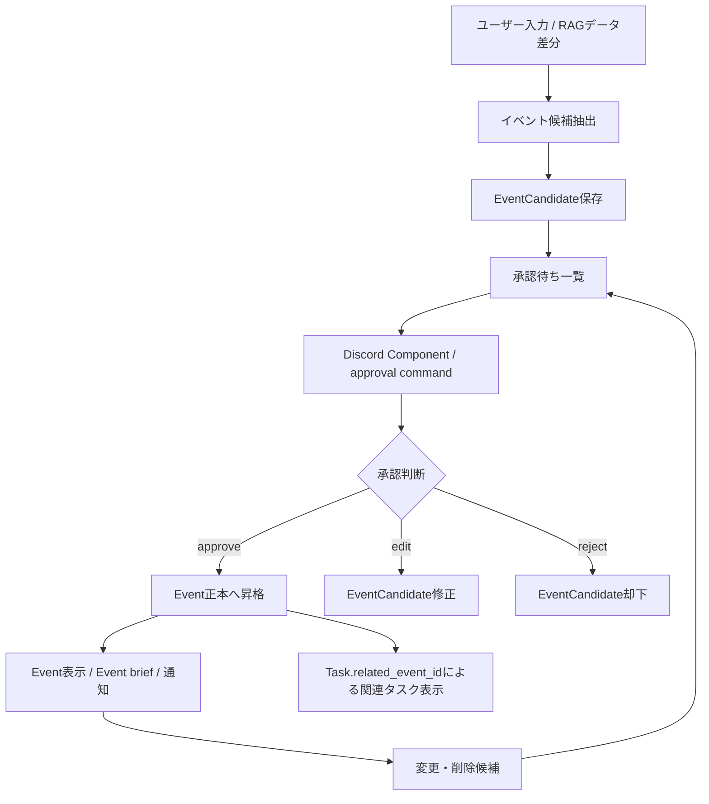

# イベント管理 詳細設計

## 1. 目的
イベント管理は、ユーザー入力またはRAGデータ差分からイベント候補を抽出し、承認後にイベント正本へ登録する機能である。

本機能では、イベントらしい記述をすぐに正本化せず、`EventCandidate` として保存する。正本である `Event` は、adminの承認後にのみ作成・更新・削除される。

本設計は `docs/design/kumc-agent.md` の「7. イベント管理」を上位仕様とする。詳細部分は現行実装の `domain.models.workflow.EventCandidate`、`Event`、`Task`、`ApprovalRecord`、`features.workflow.service.WorkflowService`、`infra.workflow.repository`、`infrastructure/migrations/004_workflow_events_tasks_approvals.sql`、`infrastructure/migrations/008_workflow_event_schedule_candidates.sql` を参照する。現行実装と `kumc-agent.md` が矛盾する場合は `kumc-agent.md` を優先する。

## 2. 対象範囲
対象機能は次の通り。

- イベント候補の自動抽出
- イベント候補の手動登録
- イベント候補の承認、修正、却下
- 承認後のイベント正本登録
- イベント正本の表示、絞り込み、要約
- イベント正本の変更、削除の承認フロー
- 関連タスクの紐付けと表示
- イベント事前通知、当日通知、完了確認
- Discord Componentによるまとめ承認
- CLI、Discord、HTTP、workflow向けpayload整形
- 監査ログ、承認履歴、workflow run記録

対象外は、外部カレンダーを正本にする設計、外部カレンダー双方向同期、会計・参加者募集・出欠管理の詳細である。`ScheduleEvent` はイベントに紐づく個別予定を表す補助正本であり、本設計の主対象は `Event` とする。

## 3. 現行実装との差分
現行実装は、手動入力から `EventCandidate` を作成し、承認後に `Event` へ昇格する最小経路を持つ。

| 項目 | 現行実装 | 本設計で必要な状態 |
| --- | --- | --- |
| 候補抽出 | `event_add` がラベルと日付のルールベース抽出で `EventCandidate` を作成する | RAGデータ差分・自動登録は専用LLMが抽出し、重複検出と変更・削除検出も行う |
| 手動登録 | `event_add` はtitle未抽出時に先頭行または `Untitled event` を使う | 必要情報を抽出できない場合は候補保存前にユーザーへ質問する |
| 正本登録 | `/approval --type event approve` で `EventCandidate` を `Event` に昇格する | Discord Componentを含む承認UIから昇格できる |
| 候補修正 | `/approval --type event edit` でtitle、summary、place、starts_atを修正できる | 自然言語修正をComponentから受け付け、変更前後の差分を明示する |
| 却下 | `/approval --type event reject` で `status=rejected` にする | まとめ承認時も却下理由を保存する |
| 表示 | `event_list` は全Eventを表示し、`event_brief` は関連タスクとRAG抜粋を表示する | 日時、場所、状態、関連タスクで絞り込める |
| 変更・削除 | 正本Eventの変更・削除候補は未実装 | 正本変更前に候補作成と承認を通す |
| 通知 | イベント通知と完了確認は未実装 | n日前通知、当日通知、完了確認、`done` 反映を行う |
| 権限 | event系操作にadmin限定チェックが未徹底 | イベント管理はadmin限定にする |
| 保存先 | JSONL repositoryとPostgres repositoryがある | production正本は内部DBとし、JSONLはローカル・テスト用に限定する |
| 承認UI | slash command中心。Taskだけ簡易Componentがある | Event用Discord Componentで承認、修正、却下を選択できる |

`src/kumc_agent/infra/legacy` は参照・依存しない。

## 4. 全体構成
イベント管理は、候補作成、承認、正本操作、通知に分かれる。



主要コンポーネントは次の通り。

| 層 | 責務 | 現行の主なファイル |
| --- | --- | --- |
| domain | `EventCandidate`, `Event`, `Task`, `ApprovalRecord`, `WorkRequest`, `WorkResponse` | `src/kumc_agent/domain/models/workflow.py` |
| feature | work type dispatch、候補抽出、承認、正本化、整形 | `src/kumc_agent/features/workflow/service.py` |
| repository | EventCandidate、Event、ApprovalRecordの保存・取得 | `src/kumc_agent/infra/workflow/repository.py` |
| DB migration | 正本・候補・承認履歴テーブル定義 | `infrastructure/migrations/004_workflow_events_tasks_approvals.sql`, `infrastructure/migrations/008_workflow_event_schedule_candidates.sql` |
| CLI | `work`、`approval` command | `src/kumc_agent/cli.py` |
| Discord | `/work`、`/approval` slash command | `src/kumc_agent/frontends/discord/app.py` |
| HTTP | `/work`、`/approval` endpoint | `src/kumc_agent/frontends/http/app.py` |

## 5. データモデル
### 5.1 EventCandidate
`EventCandidate` は、正本登録前の候補である。

| フィールド | 型 | 説明 |
| --- | --- | --- |
| `id` | `str` | 安定ID。抽出元、title、日時、場所などからhash生成する |
| `title` | `str` | イベント名 |
| `summary` | `str | None` | 概要、元記述、補足 |
| `starts_at` | `datetime | None` | 開始日時 |
| `ends_at` | `datetime | None` | 終了日時 |
| `place` | `str | None` | 場所 |
| `related_source_ids` | `tuple[str, ...]` | 抽出元source id |
| `evidence` | `tuple[Citation, ...]` | RAGや議事録由来の根拠 |
| `confidence` | `str` | `low` / `medium` / `high` |
| `status` | `str` | `proposed` / `approved` / `merged` / `rejected` |
| `created_by` | `str` | `agent` または `user` |
| `metadata` | `dict` | 抽出器、承認batch、重複候補、変更種別、trace idなど |
| `created_at` / `updated_at` | `datetime | None` | 作成・更新日時 |

候補の `status=merged` は、承認済みで `Event` 正本へ昇格済みであることを表す。`kumc-agent.md` ではイベント状態として `proposed` が定義されているが、正本登録前の `proposed` は `EventCandidate.status` で表現する。

### 5.2 Event
`Event` は内部DBを正本とする。

| フィールド | 型 | 説明 |
| --- | --- | --- |
| `id` | `str` | 正本ID。原則 `event:{candidate_id}` のhash |
| `title` | `str` | イベント名 |
| `summary` | `str | None` | 概要 |
| `starts_at` | `datetime | None` | 開始日時 |
| `ends_at` | `datetime | None` | 終了日時 |
| `place` | `str | None` | 場所 |
| `status` | `str` | `planning` / `announced` / `done` / `canceled` を基本とする |
| `related_source_ids` | `tuple[str, ...]` | 根拠source id |
| `metadata` | `dict` | 承認者、通知状態、変更理由、外部連携IDなど |
| `created_at` / `updated_at` | `datetime | None` | 作成・更新日時 |

`kumc-agent.md` の基本状態は `proposed / planning / announced / done / canceled` である。正本 `Event` は承認後に作成されるため、`proposed` は原則 `EventCandidate` の状態として扱う。将来、正本テーブルに `proposed` を持たせる場合も、承認前候補と正本の境界を崩してはならない。

### 5.3 関連タスク
`kumc-agent.md` ではEventに関連タスクを含める。現行実装では `Event` 側に `related_task_ids` はなく、`Task.related_event_id` から逆引きする。

初期実装では次の方針を採る。

- `Event` 正本には関連タスクを重複保持しない。
- 表示時、通知時、brief作成時に `Task.related_event_id == Event.id` で関連タスクを取得する。
- payload表示上は `related_tasks` または `tasks` として安定出力する。
- 将来、検索性能や外部連携上必要になった場合のみ `Event.metadata.related_task_ids` または別テーブルでmaterializeする。

### 5.4 EventChangeCandidate
現行実装には正本Eventの変更・削除候補モデルがない。本設計では次のいずれかで表現する。

- `EventChangeCandidate` を新設する。
- 汎用 `WorkflowCandidate(candidate_type="event_change")` に専用schemaを持たせる。

保持する項目は次の通り。

| フィールド | 説明 |
| --- | --- |
| `id` | 変更候補ID |
| `event_id` | 対象Event ID |
| `operation` | `update` / `delete` |
| `before` | 変更前payload |
| `after` | 変更後payload。削除時はstatusを `canceled` にする |
| `reason` | 変更理由 |
| `evidence` | 変更根拠 |
| `confidence` | 確信度 |
| `status` | `proposed` / `approved` / `merged` / `rejected` |
| `metadata` | 抽出器、重複候補、承認batch、trace idなど |

削除は物理削除ではなく、原則 `Event.status="canceled"` への論理削除とする。履歴、承認、通知状態、関連タスクとの参照は保持する。

### 5.5 ApprovalRecord
`ApprovalRecord` は、候補や正本変更に対する承認履歴である。

| フィールド | 型 | 説明 |
| --- | --- | --- |
| `id` | `str` | 承認履歴ID |
| `target_type` | `str` | `event` |
| `target_id` | `str` | 候補IDまたは正本変更候補ID |
| `action` | `str` | `show` / `edit` / `approve` / `reject` など |
| `actor_id` | `str` | 操作者user id |
| `comment` | `str` | 承認・修正・却下コメント |
| `before` | `dict` | 操作前payload |
| `after` | `dict` | 操作後payload |
| `evidence` | `tuple[Citation, ...]` | 操作根拠 |
| `created_at` | `datetime | None` | 記録日時 |

### 5.6 payload方針
CLIや外部連携向けpayloadのトップレベルには、利用者・連携先が主結果として扱う安定フィールドのみを置く。診断情報、内部判断、ルーティング判断、実行モード、trace id、重複検出スコア、承認batch情報は `metadata` 配下に入れる。

大きな本文断片、検索context、secretを含む可能性があるmetadataは、出力前に除外またはマスクする。

## 6. 保存先
### 6.1 production
productionでは内部DBを正本とする。現行DDLでは次のテーブルを使う。

- `events`
- `event_candidates`
- `tasks`
- `approval_records`
- `schedule_events`
- `schedule_candidates`

主なindexは次の通り。

- `idx_events_starts_at(starts_at)`
- `idx_event_candidates_status(status, created_at desc)`
- `idx_approval_records_target(target_type, target_id, created_at desc)`

日時、場所、状態、関連タスクで絞り込むため、実装時には次のindex追加を検討する。

- `events(status, starts_at)`
- `tasks(related_event_id, status)`
- `event_candidates(status, starts_at)`

### 6.2 ローカル・テスト
Postgres未設定時や単体テストでは `FileWorkflowRepository` を利用する。保存先は `events.jsonl`、`event_candidates.jsonl`、`tasks.jsonl`、`approval_records.jsonl` などのJSONLである。

JSONL repositoryは最新レコードをID単位で復元するappend-only方式で、監査やテスト再現性を優先する。production正本としては扱わない。

## 7. イベント自動登録
### 7.1 入力
自動登録は、次の入力を対象にする。

- サークル情報RAGのインデックス更新差分
- Discordメッセージ差分
- Google Drive / NotionなどRAGデータ差分
- 議事録下書き
- 統合入力受付または自律エージェントの出力

現行実装ではイベント自動登録は未実装である。`event_add` は手動登録相当の入力を処理する。

### 7.2 抽出
イベント自動登録の抽出は専用LLMが行う。差分を専用LLMに渡し、イベントらしい記述を `EventCandidate` として抽出する。

抽出時に最低限行う処理は次の通り。

- イベント名の抽出
- 概要の抽出
- 開始日時、終了日時の抽出
- 場所の抽出
- 関連タスク候補または関連タスク条件の推定
- 根拠 `Citation` の付与
- 既存候補・既存Eventとの重複検出
- 既存Eventに対する変更・削除情報の検出
- confidence算出

専用LLMが利用できない、schema検証に失敗する、または根拠不足の場合は、自動登録候補を作成せず、`metadata.degraded=true` と理由を記録して承認依頼には載せない。

### 7.3 候補保存
抽出した候補は `EventCandidate(status="proposed", created_by="agent")` として保存する。承認されるまで `events` には登録しない。

重複が疑われる場合は候補を捨てず、`metadata.duplicate_candidates` に類似候補ID、類似Event ID、理由、スコアを保存する。承認UIでは重複警告を表示する。

変更・削除が疑われる場合は、新規登録候補ではなく `EventChangeCandidate` または `WorkflowCandidate(candidate_type="event_change")` として保存する。

### 7.4 まとめ承認
自動抽出された候補は、正本に登録する前に、設定された `n` 日ごとにDiscord上でまとめて承認を求める。

まとめ承認batchには次を含める。

- batch id
- 対象期間
- 候補一覧
- 候補ごとの根拠
- 重複警告
- 変更・削除候補の差分
- 日時未定または場所未定の警告
- approve / edit / reject の操作

`n` 日の値や通知先チャンネルは `.env` ではなく `configs` 配下に保存する。トークンやAPIキーを追加する場合だけ `.env` / `.env.example` を更新する。

## 8. イベント手動登録
手動登録は `event_add` で受け付ける。

入力例:

```text
イベント: 新歓会 日時: 2026-05-05 14:00 場所: 部室
```

手動登録では、入力からイベント名、日時、場所、概要を抽出する。登録に必要な情報を抽出できなかった場合は、候補を保存する前にユーザーへ質問し、不足情報を補完してから `EventCandidate` を作成する。

必須情報は、少なくとも `title` と `starts_at` とする。`place` と `summary` は任意にできるが、ユーザーの入力が場所や日時を指定しているように見えるにもかかわらず解釈できない場合は質問する。

現行実装では、title未抽出時に先頭行または `Untitled event` を使い、候補を作成する。`kumc-agent.md` に従い、必要情報を抽出できない場合は候補保存前に質問する実装へ変更する。

手動登録の候補は、即時承認UIを返してもよいが、承認前に `Event` を作成してはならない。

## 9. イベント変更・削除
### 9.1 自動変更・削除
イベント自動登録の検出と同時に、既存Eventの変更や削除に関する情報を抽出する。

検出対象は次の通り。

- 日時変更
- 場所変更
- 概要変更
- 状態変更
- 中止、延期、完了
- 関連タスクの追加・解除

正本を変更する前に、n日ごとにDiscord上でまとめて承認を求める。承認前に `events` を更新してはならない。

### 9.2 手動変更・削除
ユーザーから自然言語で変更・削除依頼を受け取る。

入力例:

```text
新歓会の場所を第2会議室に変更
```

専用LLMまたは変更抽出器が対象Event、変更内容、変更前後の差分、理由を抽出する。対象Eventが一意に決まらない場合、または変更内容が不明確な場合は、変更候補を保存する前にユーザーへ質問する。

正本を変更する前に承認を得る。削除は原則として `status="canceled"` への論理削除にする。

## 10. 承認
### 10.1 承認操作
承認操作は次の通り。

- `list`: 承認待ち候補を表示する。
- `show`: 候補、正本、承認履歴、根拠を表示する。
- `edit`: 候補を修正する。
- `approve`: 候補を正本へ昇格する、または変更候補を正本へ反映する。
- `reject`: 候補を却下する。

承認後の新規登録では、`EventCandidate.status` を `merged` にし、`Event.metadata.source_candidate_id` に候補IDを保存する。

### 10.2 Discord Component
承認申請をDiscordに送信する際は、Componentを用いる。

Componentでは次を扱う。

- approve
- reject
- edit
- show evidence
- duplicate details
- diff details

修正する場合は、modalまたはfollow-upで具体的な内容を自然言語で受け付ける。Component custom idには `target_type=event`、`target_id`、`action`、`batch_id`、nonceだけを含め、長文、secret、根拠本文を含めない。

Component操作時もAccessPolicyを再確認する。表示済みのボタンを押した時点で候補がすでに `merged` または `rejected` の場合は、最新状態を表示して操作を拒否する。

### 10.3 transaction
Postgres repositoryでは、`Event` 作成、`EventCandidate.status` 更新、`ApprovalRecord` 保存を同一transactionで行う。二重承認を防ぐため、承認対象statusの再確認をtransaction内で行う。

JSONL repositoryではappend-only方式を維持しつつ、二重承認を検出して同じEventが重複作成されないようにする。

## 11. イベント表示
ユーザーから自然言語でイベント表示依頼を受け取る。

表示時の処理は次の通り。

1. 権限を確認する。
2. 自然言語instructionから日時範囲、場所、状態、関連タスク条件を抽出する。
3. `repository.list_events()` に検索条件を渡す。
4. 関連タスクは `Task.related_event_id` で取得する。
5. LLMが条件に合うイベントを要約して回答する。
6. 抽出条件、limit、内部判断は `metadata` 配下に入れる。

現行実装では `event_list` は全Eventを表示し、`event_brief` は指定Eventまたは先頭Eventについて未完了タスクとRAG抜粋を表示する。今後は日時、場所、状態、関連タスクで絞り込めるようにrepository queryとプロンプトを拡張する。

表示形式の基本例:

```text
Event ID / title / starts_at / ends_at / place / status / related open tasks
```

## 12. イベント通知
イベント通知はDiscordの特定チャンネルへ送信する。

通知種別は次の通り。

- 予備通知: イベントの `n` 日前
- 当日通知: イベント当日
- 完了確認: 当日の通知内で完了したか選択させる

通知対象は、`status in planning/announced` かつ `starts_at` が設定されているEventである。`canceled` と `done` は通知対象外にする。

通知済み状態は `Event.metadata.notifications` に保存する。通知keyは `before:{n}`、`day_of:{YYYY-MM-DD}`、`completion:{YYYY-MM-DD}` のように安定化し、同じ通知を重複送信しない。

完了確認で完了が選択された場合は、承認またはadmin操作として `status="done"` に変更し、`done_by`、`done_comment`、通知message idをmetadataへ保存する。

## 13. 権限管理
イベント管理はadminに設定されているユーザーに限定する。

対象操作は次の通り。

- `event_add`
- `event_list`
- `event_brief`
- `event_update`
- `event_delete`
- `event_notify`
- `approval --type event` の `list` / `show` / `edit` / `approve` / `reject`
- Discord Componentのevent系操作

それ以外のユーザーが登録・変更・削除しようとした場合は拒否文を表示する。権限外の応答では、候補数、Event ID、類似候補、根拠sourceなど、存在確認につながる情報を返さない。

admin user idやrole idは `configs` 配下で管理する。トークンやAPIキーを追加する場合のみ `.env` / `.env.example` の両方を更新する。

## 14. 外部連携とpayload
CLI、HTTP、Discord、workflow runでは、主結果と診断情報を分離する。

トップレベルに置ける主結果は次の通り。

- `event_candidates`
- `events`
- `tasks`
- `approvals`
- `warnings`

次の情報は `metadata` 配下に置く。

- `routing_decision`
- `selected_handler`
- `trace_id`
- `extraction_model`
- `prompt_version`
- `degraded`
- `duplicate_candidates`
- `batch_id`
- `notification_count`
- `query_filters`

大きな本文断片、検索context、secretを含む可能性がある値は、CLI出力や外部連携前に除外・マスクする。

## 15. 評価・テスト
イベント管理では、日時、場所、状態、変更差分、承認フローを評価する。

主要評価観点は次の通り。

- イベント名、概要、日時、場所を正しく抽出できる。
- 曖昧な手動登録で候補保存前に質問できる。
- RAG差分からイベント候補を抽出できる。
- イベントではない告知、雑談、タスク単体を誤登録しない。
- 既存Eventとの重複を検出できる。
- 変更・削除候補で変更前後の差分を表示できる。
- 承認前にEvent正本へ入らない。
- 承認後だけEvent正本へ昇格する。
- 権限外ユーザーに候補数や存在情報を返さない。
- n日前通知、当日通知、完了確認が重複なく動作する。
- payloadの診断情報が `metadata` 配下に入る。

テストは既存の `unittest` ベースを前提にする。pytest導入を前提にしない。

## 16. 実装上の注意
- `src/kumc_agent/infra/legacy` は参照・依存しない。
- 自動抽出のfallbackとしてルールベース抽出だけで候補作成してはならない。LLM失敗時は診断情報を残して候補作成を止める。
- 手動登録の補助としてルールベース抽出を使う場合でも、必須情報が不足しているときは候補保存前に質問する。
- EventとScheduleEventを混同しない。Eventはイベント正本、ScheduleEventはイベントや運用に紐づく個別予定である。
- 関連タスクは初期実装では `Task.related_event_id` を正とし、Event側に重複保持しない。
- 削除は物理削除ではなく `canceled` への論理削除を基本にする。
- 通知先チャンネル、承認間隔、通知n日前などのパラメータは `configs` 配下に保存する。

## 17. 今後の変更可能性
将来的に、イベント自動登録・変更・削除を承認なしで実行できるようにする。その場合もrisk policyとfeature flagで切り替えられる設計にする。

外部カレンダー連携を追加する場合も、内部DBの `events` を正本とし、外部カレンダーIDや同期状態は `Event.metadata` または別テーブルに保持する。外部カレンダーの変更を正本へ即時反映する場合も、risk policyで承認要否を切り替える。
