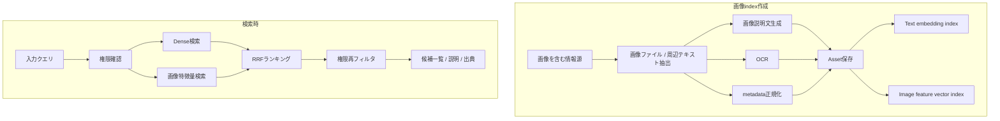

# 画像検索 詳細設計

## 1. 目的
画像検索は、入力クエリを受け取り、サークル関連情報源から関連画像の候補を返す機能である。

本機能は画像の「検索候補」を提示するだけであり、外部公開・転載・再利用の可否は判定しない。画像利用申請、承認、権利確認ワークフローは本設計に含めない。

本設計は `docs/design/kumc-agent.md` の「4. 画像検索」を上位仕様とし、詳細部分は現行実装の `domain.models.operations.Asset`、`infra.operations.repository`、`features.workflow.service.image_search`、`domain.models.workflow.WorkResponse` 周辺を参照して定義する。現行実装と `kumc-agent.md` が矛盾する場合は `kumc-agent.md` を優先する。

## 2. 対象範囲
対象機能は次の通り。

- 画像を含む情報源からの画像ファイルと周辺テキスト取得
- 画像説明文生成
- OCR
- 出典URL、投稿日時、投稿媒体、アクセス範囲などのメタデータ保存
- 画像説明文、OCR結果、周辺テキスト、投稿媒体のDense index作成
- 画像特徴量vectorの保存と類似画像検索
- Dense検索と画像特徴量検索のRRFランキング
- サークル情報RAGと同じ投稿媒体区分に基づく権限フィルタリング
- 画像候補一覧、画像説明、出典の回答出力
- CLI、Discord、HTTP、workflow向けpayload整形

対象外は次の通り。

- 画像利用申請
- 外部公開・再利用の承認
- 著作権、肖像権、ライセンスの最終判定
- 画像生成
- 画像編集

## 3. 現行実装との差分
現行実装には、画像検索の最小限の土台だけが存在する。

| 項目 | 現行実装 | 本設計で必要な状態 |
| --- | --- | --- |
| ドメインモデル | `Asset` に `source_kind`, `source_item_id`, `title`, `description`, `uri`, `media_type`, `captured_at`, `access_scope`, `rights_status`, `contains_people`, `metadata` がある | `caption`, `ocr_text`, `surrounding_text`, `feature_vector_ref`, `source_url`, `source_label`, `source_created_at`, `indexed_at` などを保持できる |
| Repository | JSONL/Postgresへ保存し、`title`, `description`, `source_kind`, `uri` の単純部分一致で検索する | 権限フィルタ、Dense index検索、画像特徴量検索、RRF結果を扱う |
| workflow | `image_search` が `operations.list_assets(query=...)` を呼ぶ | 専用 `ImageSearchService` を呼び、候補、説明、出典、検索metadataを返す |
| データ取得 | 画像検索専用pipelineは未実装 | サークル情報RAGのデータ取得と共通化し、画像ファイルと周辺テキストを抽出する |
| caption/OCR | Google Drive PDF OCRなど一部処理はあるが、画像検索Asset化は未整備 | 情報源ごとに画像説明文とOCR結果を分けて保存する |
| index | 未実装 | FaissLikeIndexと画像特徴量vector indexを作成する |
| 権限 | Repository検索時の権限フィルタは未実装 | 投稿媒体区分ごとにサークル情報RAGと同じ権限設定で検索前・回答前に除外する |
| 利用申請 | 旧実装に `image_usage_request` があった | 削除する。画像検索は候補提示のみを返す |

`src/kumc_agent/infra/legacy` は参照・依存しない。

## 4. 全体構成
画像検索は、オフラインの画像index作成系とオンラインの検索系に分かれる。



## 5. データモデル
### 5.1 Asset
保存対象の主データは `Asset` とする。現行モデルを拡張し、次のフィールドまたは `metadata` key を扱えるようにする。

| フィールド | 型 | 説明 |
| --- | --- | --- |
| `id` | `str` | 安定ID。原則 `asset:{source_kind}:{source_item_id}:{image_index}` のhash |
| `source_kind` | `str` | `discord`, `google_drive`, `x`, `hatena`, `crafters_colony` など |
| `source_item_id` | `str` | message id、file id、post id、article idなど |
| `title` | `str` | 表示用タイトル。ファイル名、投稿タイトル、記事名など |
| `description` | `str` | 画像説明文。OCRとは分ける |
| `uri` | `str` | 内部参照URIまたは権限内で表示可能な出典URL |
| `media_type` | `str` | `image` を基本とし、必要に応じて `image/png` などをmetadataに持つ |
| `captured_at` | `datetime` | 投稿日時。サークル情報RAGと同じ日付決定方法を使う |
| `access_scope` | `dict` | 検索前・回答前フィルタ用の可視範囲 |
| `rights_status` | `str` | 互換のため保持するが、検索結果の利用可否判定には使わない |
| `contains_people` | `bool` | 互換のため保持するが、検索結果の利用可否判定には使わない |
| `metadata` | `dict` | OCR結果、周辺テキスト、投稿媒体、caption model、OCR model、feature vector参照、trace idなど |
| `created_at` / `updated_at` | `datetime` | 作成・更新日時 |

既存payloadを拡張する場合は、利用者・連携先が主結果として扱う安定フィールドだけをトップレベルに置く。診断情報、内部判断、検索スコア、実行モード、trace idは `metadata` 配下に入れる。大きなOCR全文、周辺テキスト、secretを含む可能性がある値は外部出力前に除外またはマスクする。

### 5.2 metadata
`metadata` の主なkeyは次の通り。

| key | 説明 |
| --- | --- |
| `ocr_text` | OCR結果。保存時は必要最小限、外部出力時は長さ制限とマスクを行う |
| `surrounding_text` | 投稿本文、ファイル周辺テキスト、記事本文抜粋など |
| `source_url` | 出典URL |
| `source_label` | チャンネル名、Driveパス、記事名などの表示用ラベル |
| `source_created_at` | 元投稿・元ファイルの日時 |
| `image_index` | 同一source item内の画像順序 |
| `caption_model` | 画像説明文生成モデル名 |
| `ocr_model` | OCRモデル名 |
| `feature_vector_ref` | 画像特徴量vectorの保存先参照 |
| `content_hash` | 画像bytesまたは正規化画像のhash |
| `source_fingerprint` | 差分検出用fingerprint |
| `index_version` | 画像検索index schema version |

### 5.3 AccessScope
`access_scope` は、サークル情報RAGの権限設定と同じ区分で判定する。

| source_kind | 権限 |
| --- | --- |
| `google_drive` | 指定Guild内チャットおよび指定admin user idのDMでのみ許可 |
| `discord` | 指定Guild内チャットおよび指定admin user idのDMでのみ許可 |
| `hatena` | すべてのユーザーを許可 |
| `crafters_colony` | すべてのユーザーを許可 |
| `x` | すべてのユーザーを許可 |

検索前filterと回答前filterの両方で権限を確認する。権限がない画像は候補数、類似候補、OCR断片、出典ラベルを返さない。

## 6. インデックス作成
### 6.1 データ取得
画像を含む情報源から画像ファイルと周辺テキストを取得する。この取得はサークル情報RAGのデータ取得と共通である。

対象は次の通り。

- Discord添付画像
- Google Drive上の画像・スクリーンショット
- X投稿画像
- はてなブログ記事画像
- クラフターズコロニー投稿画像

Notion画像は `kumc-agent.md` の画像検索対象に明記されていないため、本設計ではサークル情報RAGの本文処理対象に留める。将来追加する場合は `source_kind=notion` の権限設定を先に定義する。

### 6.2 周辺テキスト
画像ごとに検索補助用の周辺テキストを保持する。

| source_kind | 周辺テキスト |
| --- | --- |
| `discord` | メッセージ本文、送信者表示名、チャンネル名、スレッド名 |
| `google_drive` | ファイル名、Driveパス、近接テキスト、Slide/Docs内の画像前後テキスト |
| `x` | 投稿本文、投稿日時 |
| `hatena` | 記事名、見出し、画像前後の本文 |
| `crafters_colony` | 投稿名、説明文、画像前後の本文 |

大きな本文は保存時に切り詰め、全文は検索index用の内部成果物に限定する。

### 6.3 画像説明文生成
画像認識モデルを使用して画像の説明文を生成する。

説明文には次を含める。

- 写っている主対象
- 画面・資料・スクリーンショットの場合の概要
- イベント、制作物、Minecraftワールドなどの推定カテゴリ
- 検索に有用な視覚特徴

説明文にはOCR結果を混ぜず、`description` または `metadata.caption` に保存する。生成失敗時は周辺テキストだけでAssetを作成し、`metadata.caption_status=fallback` を付与する。

### 6.4 OCR
画像内の文字をOCRで読み取る。

OCR結果は画像説明文とは分けて `metadata.ocr_text` に保存する。検索indexには投入するが、外部payloadでは長さ制限とsecretマスクを行う。OCR失敗時は空文字にし、`metadata.ocr_status=failed` と失敗種別を保存する。

### 6.5 メタデータ保存
Asset保存時に、出典URL、投稿日時、投稿媒体、投稿内画像順序、content hash、権限scopeを保存する。

同一画像は `content_hash` と `source_item_id` で重複排除する。同じ画像が複数媒体に存在する場合は、原則としてsourceごとに別Assetとして保存し、重複関係を `metadata.duplicate_group_id` に記録する。

### 6.6 埋め込み作成
画像説明文、OCR結果、周辺テキスト、投稿媒体を埋め込み、FaissLikeIndexに保存する。

埋め込み用テキスト例:

```text
タイトル: {title}
投稿媒体: {source_kind}
出典: {source_label}
画像説明: {description}
OCR: {ocr_text}
周辺テキスト: {surrounding_text}
```

secret、招待URL、個人情報、権限外の本文断片はindex投入前に除外またはマスクする。

### 6.7 画像特徴量vector
画像特徴量vectorを作成し、Asset IDと紐づけて保存する。

保存先はFaissLikeIndexまたは専用vector storeとする。`Asset.metadata.feature_vector_ref` にはvectorそのものではなく保存先参照を入れる。vector作成に失敗した場合はDense検索のみで継続し、`metadata.feature_status=failed` を保存する。

## 7. 検索
### 7.1 入力
検索入力は次を受け取る。

| 項目 | 説明 |
| --- | --- |
| `query` | 入力クエリ |
| `access_context` | user id、guild id、role ids、admin判定 |
| `limit` | 最大候補数 |
| `source_filter` | 任意の投稿媒体filter |
| `metadata` | trace idなどの診断情報 |

### 7.2 権限確認
検索前にAccessContextを確認し、検索対象sourceを決定する。

権限が一部sourceに限られる場合は、許可sourceだけで検索する。権限外sourceの候補が存在するかどうかは返さない。

### 7.3 Dense検索
入力クエリを埋め込み、画像説明文、OCR結果、周辺テキスト、投稿媒体を対象にDense検索を行う。

Dense検索結果には次を保持する。

- `asset_id`
- `rank`
- `score`
- `matched_fields`

検索スコア、rank、matched_fieldsは外部payloadのトップレベルへ出さず、必要な場合は `metadata.search_results` 配下に入れる。

### 7.4 画像特徴量検索
入力がテキストのみの場合、クエリから画像特徴量vectorを直接作れないため、実装初期はDense検索上位候補のfeature vectorを起点に類似画像を広げる。

将来、画像入力を受け取れるようになった場合は、入力画像からfeature vectorを作成して類似画像検索を行う。

画像特徴量検索が利用できない場合はDense検索だけで継続し、`metadata.degraded=true` と `metadata.degraded_reason=image_feature_unavailable` を付与する。

### 7.5 RRF
Dense検索と画像特徴量検索の結果をRRFでランキングする。

同一Assetは統合し、sourceの重複や同一画像の重複は必要に応じて `duplicate_group_id` 単位で制限する。RRF後に `limit` 件へ切り詰める。

### 7.6 権限フィルタリング
RRF後、回答前に再度AccessScopeを確認する。

回答に含める説明文、OCR抜粋、出典URLは、Asset本体と同じ権限で閲覧可能なものだけにする。閲覧不可metadataは除外する。

## 8. 回答出力
回答は画像候補一覧、画像説明、出典を返す。

出力例:

```markdown
# Image Search
- `asset-1` 新歓ポスター
  - 説明: 新歓告知用のポスター画像
  - 出典: Drive / 広報/2026新歓
```

`WorkResponse` では主結果として `assets` を返す。`text` は件数などの短い要約、`detail_markdown` は候補一覧と説明にする。

payload方針:

- トップレベル: `text`, `detail_markdown`, `assets`
- `assets` のトップレベル: Assetの安定フィールド
- 診断情報: `metadata`
- 検索スコア、rank、trace id、degraded理由: `metadata`
- 大きなOCR全文、周辺テキスト、secretを含む可能性がある値: 外部出力前に除外またはマスク

画像検索結果は候補提示であり、外部公開・再利用可能な素材とはみなさない。ただし、本機能は利用申請フローを提供しない。

## 9. エラー・フォールバック
### 9.1 repository未設定
現行実装と同様、operations repositoryが未設定の場合は画像検索を実行せず、設定不足を返す。

### 9.2 画像説明文生成失敗
caption生成に失敗した場合は、OCR結果と周辺テキストだけでAssetを保存する。

### 9.3 OCR失敗
OCR失敗時は画像説明文と周辺テキストだけで検索可能にする。

### 9.4 Dense index未構築
Dense index未構築時は、暫定的にRepositoryのキーワード検索へfallbackする。fallback時は `metadata.degraded=true` を付与する。

### 9.5 画像特徴量index未構築
画像特徴量検索をスキップし、Dense検索のみで結果を返す。

## 10. 設定
設定値は `configs/` 配下に置く。.env / .env.exampleにはトークンやAPIキー以外のパラメータを追加しない。

候補:

| 設定 | 説明 |
| --- | --- |
| `features.image_search.enabled` | 画像検索有効化 |
| `features.image_search.limit` | 返却候補数 |
| `features.image_search.dense_top_k` | Dense検索候補数 |
| `features.image_search.feature_top_k` | 画像特徴量検索候補数 |
| `features.image_search.rrf_k` | RRF定数 |
| `features.image_search.ocr_text_char_limit` | 外部出力時のOCR最大文字数 |
| `features.image_search.surrounding_text_char_limit` | 保存・出力用周辺テキスト最大文字数 |
| `features.image_search.caption_model` | 画像説明文生成モデル |
| `features.image_search.ocr_model` | OCRモデル |
| `features.image_search.feature_model` | 画像特徴量モデル |

## 11. 評価
画像検索では、次を評価する。

- クエリに対応する画像候補が返ること
- 画像説明文が検索に寄与すること
- OCR文字列で検索できること
- 画像特徴量検索で類似画像を補えること
- 権限外sourceの候補や存在有無が漏れないこと
- 出典URL、投稿日時、投稿媒体が返ること
- 検索結果が再利用可否を断定しないこと

## 12. 今後の変更可能性
将来的に画像入力による類似画像検索、Notion画像対応、画像重複クラスタ表示を追加できるようにする。

外部公開・再利用に関する承認フローは本機能の対象外であり、追加する場合は別機能として設計する。
