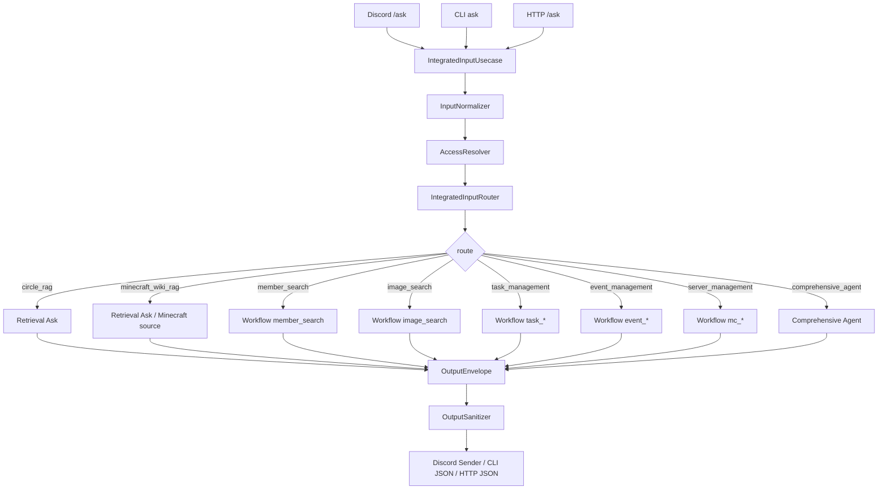

# 統合入力受付 詳細設計

## 1. 目的
統合入力受付は、Discordから届くすべてのユーザー入力を一箇所で受け付け、入力意図、権限、検索対象、実行リスクを判定したうえで、適切な機能へルーティングする機能である。

本機能は、各機能がDiscordへ直接送信する経路を持たないようにし、Discordへの最終送信、長文添付、エラー表示、権限不足表示を統合入力受付に集約する。

本設計は `docs/design/kumc-agent.md` の「11. 統合入力受付」を上位仕様とする。詳細部分は現行実装の `usecases.chat.entry.ChatEntryUsecase`、`features.rag.components.entry_routing.EntryQueryRouter`、`domain.models.entry_routing.EntryRoutingDecision`、`domain.models.retrieval.AccessContext`、`domain.models.retrieval.RetrievalQuery`、`domain.models.workflow.WorkRequest`、`domain.models.workflow.WorkResponse`、`frontends.discord.app`、`frontends.http.app`、`cli.py` を参照する。現行実装と `kumc-agent.md` が矛盾する場合は `kumc-agent.md` を優先する。

## 2. 対象範囲
対象機能は次の通り。

- Discord統合コマンドからの質問、依頼、管理操作の受付
- 本文、source指定、mode指定、depth指定、ユーザー権限情報の正規化
- 専用LLMまたは決定的fallbackによる入力意図分類
- intent、source_filters、risk、freshness要否、属性フィルタ、必要機能の抽出
- ルーティング前のGuild、role、admin設定の解決
- サークル情報RAG、Minecraft Wiki RAG、メンバー検索、画像検索、タスク管理、イベント管理、サーバー管理、総合エージェントへのルーティング
- 副作用を含む依頼の承認フロー連携
- ルーティング先の出力をDiscordへ送信する最終出力制御
- CLI、HTTP向けの同等payload出力
- 診断情報、ルーティング判断、trace idを `metadata` 配下へ格納するpayload整形
- 入出力のsecret、巨大context、権限外情報の除外またはマスク

対象外は、各ルーティング先の内部実装、承認後の副作用実行、自律エージェントの定期起動である。ただし、統合入力受付は副作用候補や承認待ち候補を受け取り、利用者へ提示する。

## 3. 現行実装との差分
現行実装では統合入力受付の責務が複数箇所に分散している。

| 項目 | 現行実装 | 本設計で必要な状態 |
| --- | --- | --- |
| Discord入口 | `/ask`、`/work`、`/approval` が個別に各serviceを呼ぶ | Discordの通常入力は統合入力受付が受け、route結果に応じて各機能へ委譲する |
| 分類 | `EntryQueryRouter` が `direct_rag` / `openclaw` の2値を返す | intent、必要機能、risk、freshness、source_filters、attribute_filtersを返す |
| ルーティング先 | CLI/HTTP/Discordで `source == member`、`depth == deep` などを個別判定 | 統一された `IntegratedRoute` によって8系統へ分岐する |
| 総合エージェント昇格 | `depth=deep` で既存Agentic Searchを起動 | 複数機能が必要な入力は総合エージェントへ昇格する |
| 権限 | `AccessContext` は各入口で作る | 統合入力受付で必ず解決し、全ルーティング先へ渡す |
| Discord送信 | 各command handlerが直接 `followup.send` する | ルーティング先はresponseを返すだけにし、Discord送信は統合入力受付に限定する |
| payload | CLI/HTTPごとにpayload整形が重複 | 安定フィールドをトップレベル、診断情報を `metadata` に統一する |
| sanitization | CLI/HTTPに類似処理が重複 | 共通sanitizerでsecret、巨大context、raw promptを除外する |
| fallback | OpenClaw失敗時にlocal RAGへfallback | 分類失敗時は副作用を直接実行せず、read-only routeまたは確認質問へfallbackする |

実装では `src/kumc_agent/infra/legacy` を参照・依存しない。

## 4. 全体構成
統合入力受付は、frontendと各機能serviceの間に置くusecaseである。

主要コンポーネントは次の通り。

| 層 | 責務 | 現行の主なファイル |
| --- | --- | --- |
| domain | 入力request、分類結果、route、出力envelope | `domain.models.entry_routing`, `domain.models.answer`, `domain.models.retrieval`, `domain.models.workflow` |
| usecase | 入力正規化、分類、権限解決、route実行、出力整形 | `usecases.chat.entry.ChatEntryUsecase` |
| router | LLM分類、schema validation、fallback | `features.rag.components.entry_routing.EntryQueryRouter` |
| retrieval | サークル情報RAG、Minecraft Wiki RAG | `apps.retrieval`, `domain.models.retrieval.RetrievalQuery` |
| workflow | メンバー、画像、タスク、イベント、サーバー管理 | `features.workflow.service.WorkflowService` |
| agentic | 複数機能が必要な依頼の昇格先 | `apps.agentic`, `features.agentic.service.AgenticSearchService` |
| frontend | Discord送信、CLI JSON、HTTP JSON | `frontends.discord.app`, `frontends.http.app`, `cli.py` |

## 5. 入力受付
統合入力受付は、次の正規化済みrequestを受け取る。

| フィールド | 説明 |
| --- | --- |
| `text` | ユーザー入力本文 |
| `source` | 明示された検索対象。未指定は `all` |
| `mode` | `answer`、`search_only`、`fast`、`careful` |
| `depth` | `light`、`normal`、`deep` |
| `history_scope` | 会話履歴の範囲。Discordではguild/channel/thread相当 |
| `user_id` | Discord user idまたは外部caller id |
| `guild_id` | Discord guild id |
| `role_ids` | Discord role id列 |
| `is_admin` | admin判定結果。入力値をそのまま信頼せずresolverで決定する |
| `frontend` | `discord`、`cli`、`http` |
| `metadata` | request id、interaction idなど内部診断情報 |

現行の `ChatEntryRequest.query`、`RetrievalQuery.source_filter`、`RetrievalQuery.mode`、`RetrievalQuery.depth`、`AccessContext` を統合した形とする。

本文が空の場合はrouteを実行せず、空または入力不足responseを返す。副作用を含む可能性があるのに必要情報が不足している場合は、候補作成や承認申請を行わず、確認質問を返す。

## 6. 権限解決
統合入力受付はルーティング前に `AccessContext` を構築する。

| フィールド | 解決方法 |
| --- | --- |
| `user_id` | Discord `interaction.user.id`、CLI/HTTP payload |
| `guild_id` | Discord `interaction.guild_id`、CLI/HTTP payload |
| `role_ids` | Discord member roles、CLI/HTTP payload |
| `is_admin` | `maintenance_command_author_ids` とGuild allow listに基づき判定 |

権限確認は次の2段階で行う。

- ルーティング前: 管理操作、サーバー管理、承認操作など、入口時点で拒否できる操作を判定する。
- 検索前filter / 回答前filter: RAG、メンバー検索、画像検索など各機能側のACLを必ず通す。

統合入力受付は `AccessContext` を全ルーティング先に渡す。route先で別の権限文脈を作り直してはならない。

## 7. 分類設計
分類器は `IntegratedInputRouter` として実装する。現行 `EntryQueryRouter` のLLM呼び出し、JSON抽出、retry、fallbackの構造を引き継ぐが、出力schemaを拡張する。

### 7.1 分類出力
分類結果は次の形にする。

| フィールド | 説明 |
| --- | --- |
| `route` | 最終ルーティング先 |
| `intent` | `question`、`search`、`create_candidate`、`update_candidate`、`approval`、`admin_operation`、`compose` など |
| `required_features` | 必要機能の配列 |
| `source_filters` | RAG source filter。例: `drive`、`discord`、`minecraft_wiki` |
| `attribute_filters` | メンバー属性、日付、status、担当者などの抽出条件 |
| `risk` | `read_only`、`candidate_only`、`approval_required`、`admin_only` |
| `freshness_required` | 最新状態の確認が必要か |
| `needs_clarification` | 実行前質問が必要か |
| `clarification_question` | 確認質問 |
| `reason` | 判定理由 |
| `metadata` | model、raw分類出力、fallback理由、confidence、trace id |

`route` の値は次を標準とする。

| route | ルーティング先 |
| --- | --- |
| `circle_rag` | サークル情報RAG |
| `minecraft_wiki_rag` | Minecraft Wiki RAG |
| `member_search` | メンバー検索 |
| `image_search` | 画像検索 |
| `task_management` | タスク管理 |
| `event_management` | イベント管理 |
| `server_management` | サーバー管理 |
| `comprehensive_agent` | 総合エージェント |
| `clarify` | 確認質問 |
| `deny` | 権限不足または安全上の拒否 |

診断情報やルーティング判断は、外部payloadのトップレベルではなく必ず `metadata` 配下に置く。`route` は統合入力受付の内部制御には使うが、外部payloadでは必要最小限にする。

### 7.2 ルーティング規則
LLM分類結果に加えて、次の決定的規則を適用する。

- `required_features` が2つ以上の場合は `comprehensive_agent` へ昇格する。
- `source == minecraft_wiki` の明示指定がある場合は、分類が曖昧でも `minecraft_wiki_rag` を優先する。
- `source == member` の明示指定がある場合は、分類が曖昧でも `member_search` を優先する。
- `source == image` の明示指定がある場合は、分類が曖昧でも `image_search` を優先する。
- `source == task` またはタスク作成・更新・完了・削除の意図が明確な場合は `task_management` とする。
- `source == event` またはイベント作成・更新・通知の意図が明確な場合は `event_management` とする。
- サーバー状態確認、起動、停止、再起動、バックアップなどは `server_management` とする。
- 副作用がある依頼は、route先で直接実行せず、候補作成または承認待ちに限定する。
- 分類失敗時は `risk=read_only` としてRAG fallbackまたは確認質問にする。副作用候補は作らない。

## 8. ルーティング先
### 8.1 サークル情報RAG
`RetrievalQuery(text=text, source_filter=source_filter, mode=mode, depth=depth, access=access)` を `retrieval.ask.ask()` へ渡す。

`source_filter` が `all`、`drive`、`discord`、`notion`、`hatena`、`x`、`crafters_colony` の場合に使う。回答前filterとcitation整形はRAG側の責務とする。

### 8.2 Minecraft Wiki RAG
`source_filter="minecraft_wiki"` としてRAGへ渡す。Minecraft Wiki専用serviceが追加された場合も、統合入力受付から見た出力契約は `AskResponse` 相当に揃える。

Minecraftサーバー操作の依頼とMinecraft Wikiの知識照会が同時に必要な場合は、総合エージェントへ昇格する。

### 8.3 メンバー検索
`WorkflowService.run(WorkRequest(work_type="member_search", instruction=text, access=access))` へ委譲する。

出力は `WorkResponse.member_profiles` を主結果として扱う。内部score、検索語、raw profile生成ログは `metadata` 配下に入れ、外部出力前にマスクする。

### 8.4 画像検索
`WorkflowService.run(WorkRequest(work_type="image_search", instruction=text, access=access))` へ委譲する。

出力は `WorkResponse.assets` を主結果として扱う。`downloaded_image_path`、`original_image_ref`、長いOCR全文、周辺本文は外部payloadから除外または短縮する。

### 8.5 タスク管理
タスク管理routeでは、分類されたintentに応じて `WorkRequest.work_type` を選ぶ。

| intent | work_type |
| --- | --- |
| タスク抽出 | `task_extract` |
| タスク追加候補 | `task_add` |
| タスク一覧 | `task_list` |
| タスク完了候補 | `task_done` |
| タスク更新候補 | `task_update` |
| タスク削除候補 | `task_delete` |
| 期限通知候補 | `task_notify_due` |
| 承認batch作成 | `task_batch_approval` |

副作用境界はタスク管理側の設計に従う。統合入力受付は、承認前に正本変更が起きたかどうかをresponseの主結果とstatusで確認し、最終出力では候補と実行済みを明確に区別する。

### 8.6 イベント管理
イベント管理routeでは、分類されたintentに応じて `WorkRequest.work_type` を選ぶ。

| intent | work_type |
| --- | --- |
| イベント抽出 | `event_extract` |
| イベント追加候補 | `event_add` |
| イベント一覧 | `event_list` |
| イベント概要 | `event_brief` |
| イベント更新候補 | `event_update` |
| イベント削除候補 | `event_delete` |
| イベント通知候補 | `event_notify` |
| 承認batch作成 | `event_batch_approval` |
| イベント完了候補 | `event_complete` |
| 日程候補追加 | `schedule_add` |
| 日程一覧 | `schedule_list` |

日時や場所が不足する場合は、候補作成前に確認質問を返す。freshnessが必要な依頼では、現行のイベント一覧または関連scheduleを確認してから回答する。

### 8.7 サーバー管理
サーバー状態確認は `mc_status`、操作依頼は `mc_request` へ委譲する。

サーバー操作は副作用が大きいため、統合入力受付は `risk=approval_required` として扱う。承認前にサーバー操作を直接実行してはならない。出力は `server_operations` を候補として提示する。

### 8.8 総合エージェント
`required_features` が2つ以上、または単一機能では成功条件を満たせない場合は総合エージェントへ渡す。

総合エージェントには、本文、分類結果、AccessContext、source_filters、attribute_filters、risk、depthを渡す。副作用のある依頼は `candidate_only` または `approval_required` として扱い、直接実行を許可しない。

## 9. 出力設計
統合入力受付は、ルーティング先の結果を `IntegratedInputResponse` に正規化する。

| フィールド | 説明 |
| --- | --- |
| `text` | Discord本文またはCLI/HTTPの主回答 |
| `detail_markdown` | 長文詳細。Discordではattachment候補 |
| `citations` | 引用根拠 |
| `confidence` | `high`、`medium`、`low` |
| `task_candidates` | タスク候補 |
| `task_change_candidates` | タスク変更候補 |
| `event_candidates` | イベント候補 |
| `event_change_candidates` | イベント変更候補 |
| `assets` | 画像検索結果 |
| `member_profiles` | メンバー検索結果 |
| `server_operations` | サーバー操作候補 |
| `approvals` | 承認記録または承認対象 |
| `warnings` | 利用者に表示可能な警告 |
| `metadata` | route、intent、trace id、分類model、fallback、内部診断 |

トップレベルには利用者・連携先が主結果として扱う安定フィールドのみを置く。`routing_decision`、`selected_handler`、`policy_decision`、`trace_id`、`fast_mode` などは `metadata` 配下に置く。

Discord出力では、`text` が長すぎる場合や `detail_markdown` が本文より長い場合はMarkdown attachmentにする。Discord送信機能は統合入力受付のDiscord adapterだけが持つ。

## 10. Sanitization
統合入力受付は外部出力前に共通sanitizerを適用する。

除外または短縮する値は次の通り。

- `contexts`
- `context`
- `llm_prompt`
- `raw`
- `secret`
- API key、token、password、secretらしき文字列
- 画像の `downloaded_image_path`
- `original_image_ref`
- 長いOCR本文
- 長い検索context
- 権限外情報

trace保存用metadataも無制限には保存しない。大きな本文断片、検索context、secretを含む可能性がある値は保存前または外部出力前に除外・マスクする。

## 11. 失敗時の挙動
| 状況 | 挙動 |
| --- | --- |
| 空入力 | routeを実行せず空responseまたは入力不足message |
| 分類LLM失敗 | read-only RAG fallbackまたは確認質問。副作用候補は作らない |
| 分類schema不正 | retry後にfallback。raw出力は `metadata` に短縮保存 |
| 権限不足 | `deny` routeとして権限不足を返す |
| ルーティング先例外 | route名とtrace idをmetadataに残し、利用者には短い失敗message |
| 根拠不足 | 低confidenceで不足情報を明示 |
| 副作用境界違反 | 出力を停止し、warningと監査ログを残す |
| Discord送信失敗 | ログに残し、可能ならephemeral followupまたはattachmentなしで再送する |

## 12. 監査・trace
統合入力受付は次を記録する。

- request id
- frontend
- user_id、guild_id、role数、admin判定
- 分類route、intent、required_features、risk
- 実行したhandler
- route先のtrace idまたはrun id
- latency
- warnings
- fallback有無

監査ログやtraceに保存する値も、secretと巨大contextを除外する。ユーザー入力本文を保存する場合は、長さ制限とsecretマスクを適用する。

## 13. テスト方針
pytestは未導入の前提で、既存のunittest方式に合わせる。

| テスト | 内容 |
| --- | --- |
| router parse | 拡張schemaをparseできる |
| router fallback | LLM失敗時に副作用routeへ行かない |
| access | Discord/CLI/HTTPから同じAccessContextが作られる |
| route direct | 単一RAG、Minecraft Wiki、member、imageが正しいserviceへ委譲される |
| route workflow | task/event/serverのwork_type選択が正しい |
| comprehensive escalation | required_featuresが2つ以上で総合エージェントへ昇格する |
| payload | 診断情報が `metadata` 配下に入る |
| sanitizer | raw prompt、context、secret、画像local pathが外部payloadに出ない |
| Discord output | 送信処理が統合入力受付adapterに集約される |
| regression | 既存 `ChatEntryUsecase`、CLI `ask`、HTTP `/ask`、Discord `/ask` の互換経路が壊れない |

## 14. 移行方針
初期実装では既存の `ChatEntryUsecase`、`EntryQueryRouter`、CLI/HTTP/Discordの `/ask` は互換経路として残す。

段階的に次を行う。

1. 新しいdomain modelと `IntegratedInputUsecase` を追加する。
2. 現行 `EntryQueryRouter` を拡張または新routerへ置き換える。
3. CLI/HTTPの `/ask` を統合入力受付経由にする。
4. Discord `/ask` を統合入力受付経由にする。
5. `/work` と `/approval` は明示的な管理・承認操作として残しつつ、通常依頼は統合入力受付へ寄せる。
6. 各route先からDiscord送信責務を取り除き、response返却のみにする。
7. 既存 `direct_rag` / `openclaw` の2値分類は後方互換adapterとして扱う。
