# メンバー検索 詳細設計

## 1. 目的
メンバー検索は、入力クエリを受け取り、条件に合うKUMCメンバー候補を提示する機能である。

本機能は担当者を確定しない。回答は、本人確認または運営確認が必要な候補提示として扱う。個人の能力、参加意思、担当可否を断定せず、根拠に基づく「候補」と「該当理由」を返す。

本設計は `docs/design/kumc-agent.md` の「3. メンバー検索」を上位仕様とし、詳細部分は現行実装の `domain.models.operations.MemberProfile`、`infra.operations.repository`、`features.workflow.service.member_search`、`domain.models.workflow.WorkResponse` 周辺を参照して定義する。現行実装と `kumc-agent.md` が矛盾する場合は `kumc-agent.md` を優先する。

## 2. 対象範囲
対象機能は次の通り。

- Discord Guildからのメンバー情報取得
- サークル情報RAGによるメンバー別情報収集
- LLMによるメンバープロフィール生成
- プロフィール、根拠、AccessScopeの保存
- Dense index、通常Sparse検索、ステミングSparse検索用インデックスの作成
- 入力クエリからの検索条件抽出
- 権限確認と権限フィルタリング
- メンバープロフィールのハイブリッド検索、RRFランキング
- 候補と該当理由の回答生成
- CLI、Discord、HTTP、workflow向けpayload整形

対象外は、候補者への連絡、担当確定、タスク正本への担当者登録である。担当者登録が必要な場合は、メンバー検索結果を根拠に `member_assignment` などの承認待ち候補を別機能で作成する。

## 3. 現行実装同期状況
現行実装では、メンバー検索はプロフィール作成、index作成、検索を分けて実装されている。自動インデックス更新または管理操作で `MemberProfileBuildService.rebuild_guild()` を実行し、検索時は `WorkflowService.member_search()` または統合入力受付の `member_search` routeから `MemberSearchService.search()` を呼ぶ。

| 項目 | 現行実装 |
| --- | --- |
| ドメインモデル | `MemberProfile` は `display_name`, `discord_user_id`, `roles`, `skills`, `interests`, `past_assignments`, `evidence`, `access_scope`, `metadata` を保持する |
| Repository | `OperationsRepository` がMemberProfileをJSONL/PostgreSQLへ保存し、`list_member_profiles()` / `save_member_profile()` / fallback検索を提供する |
| workflow | `WorkflowService.member_search()` は専用serviceがある場合は `MemberSearchService` を呼び、未設定時は権限確認後にrepository検索へdegraded fallbackする |
| 権限 | `MemberSearchConfig.allowed_guild_ids` と `admin_user_ids` を使い、指定Guild内またはadmin DMだけ許可する。profile個別の `access_scope` も適用する |
| プロフィール生成 | `DiscordMemberDirectoryConnector` からmember recordを取得し、`AskServiceEvidenceSource` でRAG根拠を集め、`MemberProfileGenerator` がLLMまたはfallback profileを生成する |
| index | `MemberProfileIndexService` が通常Sparse、ステミングSparse、FaissLikeIndexを `data/index/member_profiles` またはstaging release配下に作る |
| 検索 | mention、role、表示名、除外条件を `MemberSearchConditions` に抽出し、Dense/Sparse/RRFと条件boostで候補を並べる |
| 回答生成 | LLM回答が使えない場合もテンプレートで候補理由、ロール、スキル、担当履歴、根拠を返す。担当可否は断定せず、本人または運営確認が必要と明記する |
| 自動更新 | `AutoIndexUpdateUsecase` は `member_profiles` sourceまたはfull rebuild時にguild単位で再生成し、退会・除外profileをinactiveにする |

`src/kumc_agent/infra/legacy` は参照・依存しない。

## 4. 全体構成
メンバー検索は、オフラインのプロフィール作成系とオンラインの検索系に分かれる。

```mermaid
flowchart TD
  subgraph Build["プロフィール作成"]
    D["Discord Guild members"] --> N["Discord member正規化"]
    N --> R["サークル情報RAGで根拠収集"]
    R --> P["プロフィール生成LLM"]
    P --> S["member_profiles保存"]
    S --> E["Dense / Sparse / Stemming index作成"]
  end

  subgraph Search["検索時"]
    Q["入力クエリ"] --> A["権限確認"]
    A --> C["検索条件抽出"]
    C --> F["候補フィルタリング"]
    F --> H["Hybrid検索"]
    H --> X["RRFランキング"]
    X --> G["候補回答生成"]
    G --> O["候補 / 理由 / 根拠"]
  end
```



## 5. データモデル
### 5.1 MemberProfile
保存対象の主データは `MemberProfile` とする。現行モデルを拡張し、次のフィールドを扱えるようにする。

| フィールド | 型 | 説明 |
| --- | --- | --- |
| `id` | `str` | 安定ID。原則 `member_profile:{guild_id}:{discord_user_id}` のhash |
| `display_name` | `str` | Discord表示名。外部氏名は保存しない |
| `discord_user_id` | `str` | Discord user id |
| `roles` | `tuple[str, ...]` | 検索対象にしてよいロール名またはrole id |
| `skills` | `tuple[str, ...]` | 根拠付きで推定されたスキル |
| `interests` | `tuple[str, ...]` | 根拠付きで推定された興味分野 |
| `past_assignments` | `tuple[str, ...]` | 過去担当・関与履歴 |
| `evidence` | `tuple[dict, ...]` | RAG検索で取得した根拠。引用可能な範囲だけ保持 |
| `access_scope` | `dict` | 検索前フィルタ用の可視範囲 |
| `metadata` | `dict` | 診断情報、生成モデル、profile_version、source_fingerprintなど |
| `created_at` / `updated_at` | `datetime` | 作成・更新日時 |

既存payload拡張時は、利用者・連携先が主結果として扱う安定フィールドだけをトップレベルに置く。診断情報、ルーティング判断、検索スコア、生成モデル、trace idは `metadata` 配下に入れる。

### 5.2 Evidence
`evidence` は、候補理由を説明できる最小限の根拠だけを保持する。

| フィールド | 説明 |
| --- | --- |
| `source_type` | `discord_message`, `docs`, `notion` など |
| `source_item_id` | 元資料IDまたはmessage id |
| `chunk_id` | RAG chunk id |
| `label` | 表示用ラベル |
| `url` | 権限内で表示可能なURL |
| `quote` | 短い引用または要約。個人情報・secretはマスク済み |
| `access_scope` | 根拠単位の可視範囲 |
| `score` | 収集時の参考スコア。外部payloadでは `metadata` 配下または除外 |

### 5.3 AccessScope
`access_scope` は、検索前と回答前の両方で使う。

| フィールド | 説明 |
| --- | --- |
| `guild_ids` | 閲覧を許可するDiscord guild id |
| `admin_only` | admin DMのみ許可するか |
| `allowed_user_ids` | 特定user idだけに許可する場合の一覧 |
| `source_scopes` | 根拠ごとのsource可視条件 |
| `redaction_policy` | 回答時にマスクすべき項目 |

指定Guild内チャットおよび指定admin user idのDM以外では、メンバー検索を実行しない。権限がない場合は、対象情報の有無を明かさず拒否する。

## 6. プロフィール作成
### 6.1 Discordメンバー取得
指定Guild IDのDiscordサーバーからメンバー情報を取得する。

取得する主な項目は次の通り。

- user id
- display name
- usernameは必要な場合のみmetadataへ保存
- role id、role name
- botかどうか
- joined_at、guild id

bot、退会済みユーザー、検索対象外roleを持つユーザーはプロフィール作成対象から除外できる。除外理由は `metadata.exclusion_reason` に記録する。

### 6.2 サークル情報RAGによる情報収集
各メンバーについて、サークル情報RAGから活動内容、得意分野、過去の担当、興味分野に関する根拠を収集する。

検索クエリの例は次の通り。

- 表示名
- Discord mention形式
- user id
- 表示名 + ロール名
- 表示名 + `担当`
- 表示名 + `制作` / `運営` / `開発` / `イベント`

RAG検索対象は、オンライン検索時に質問者が閲覧できる情報源へ制限できるよう、根拠単位で `access_scope` を保持する。プロフィール生成時に広い権限で収集した情報であっても、検索時に質問者が閲覧できない根拠は候補理由に使わない。

### 6.3 プロフィール生成
取得したDiscord情報とRAG根拠をもとに、専用LLMがプロフィールを生成する。

生成時の制約は次の通り。

- 根拠がないスキル、興味、担当履歴を作らない。
- 氏名、住所、電話番号、メールアドレス、学籍番号、口座情報、secret、内部IP、招待URLなどは保存しない。
- Discord表示名以外の実名らしき情報はマスクする。
- 能力や参加意思を断定しない。
- `skills`, `interests`, `past_assignments` は短い名詞句に正規化する。
- 根拠不足の項目は空配列にする。
- 生成結果には `confidence` 相当の診断情報を `metadata` に保存する。

LLM失敗時は、Discord情報だけで低情報量プロフィールを作成し、`metadata.profile_status=fallback` を付与する。

### 6.4 保存
プロフィールは `member_profiles` に保存する。

現行の保存先は次の通り。

- Postgres有効時: `member_profiles` table
- Postgres未設定時: `data/operations/member_profiles.jsonl` 相当のJSONL

同一 `discord_user_id` のプロフィールは更新として扱う。削除・退会・権限変更は自動インデックス更新で反映する。

### 6.5 埋め込み用テキスト
Dense indexとSparse indexには、保存フィールドから検索用テキストを組み立てて投入する。

例:

```text
表示名: {display_name}
ロール: {roles}
スキル: {skills}
興味分野: {interests}
過去担当: {past_assignments}
根拠要約: {evidence summaries}
```

Discord user idは完全一致フィルタの対象であり、Dense embeddingの主要本文には含めない。ただし、管理者がuser idで直接検索できるよう、Sparse検索用または条件フィルタ用には保持する。

## 7. インデックス作成
### 7.1 Dense index
作成したプロフィールを埋め込み、FaissLikeIndexに保存する。

Dense検索の対象は `profile_text` とし、表示名、ロール、スキル、興味分野、過去担当、根拠要約を含める。個人情報や閲覧不可根拠はindex投入前に除外またはマスクする。

### 7.2 通常Sparse検索
入力クエリとプロフィール検索用テキストを通常のキーワード検索で照合する。

対象は次の通り。

- display name
- discord user id
- roles
- skills
- interests
- past assignments
- evidence summary

### 7.3 ステミングSparse検索
プロフィール検索用テキストを正規化・ステミングし、転置インデックスを作成する。

正規化は既存RAGのSudachi系設定と実装を優先して共用する。日本語、英数字、Minecraft用語、Discord表示名の表記ゆれを吸収する。

## 8. 検索
### 8.1 入力
検索入力は次を受け取る。

| 項目 | 説明 |
| --- | --- |
| `query` | 入力クエリ |
| `access_context` | user id、guild id、role ids、admin判定 |
| `limit` | 最大候補数 |
| `mode` | 通常検索、担当候補検索など |
| `metadata` | trace idなどの診断情報 |

### 8.2 権限確認
検索前に権限を確認する。

許可条件は次のいずれかである。

- 指定Guild ID内のチャットで実行されている。
- 指定admin user idのDMで実行されている。

現行実装の `admin` / `organizer` roleによる許可は暫定であり、本設計では上記条件を優先する。権限がない場合は「権限がありません」と返し、候補数、存在有無、類似情報を返さない。

### 8.3 検索条件抽出
入力クエリから以下を抽出する。

- Discord user id
- display name
- role name / role id
- 除外条件

user id、mention、role mentionは決定的なルールで抽出する。曖昧な自然文条件は、必要に応じて専用LLMまたは軽量ルールで構造化する。

抽出結果は検索実行用に使うが、外部payloadでは `metadata.search_conditions` に置く。

### 8.4 フィルタリング
検索スコア計算前に、次のフィルタを適用する。

- `access_scope` による可視範囲フィルタ
- user id完全一致
- display name部分一致
- role完全一致または正規化一致
- bot、退会済み、無効profileの除外

回答生成前にも、候補profileと根拠evidenceに同じ権限フィルタを再適用する。

### 8.5 ハイブリッド検索
フィルタ後の候補に対し、次の検索を行う。

1. 通常Sparse検索
2. ステミングSparse検索
3. Dense検索

各検索結果はprofile id単位でrankを持つ。Dense indexが未構築または利用不可の場合はSparse検索だけで継続し、`metadata.degraded=true` を付与する。

### 8.6 RRF
通常Sparse、ステミングSparse、DenseのrankをRRFで統合する。

通常SparseとステミングSparseの比率は設定で固定する。完全一致条件がある場合は、完全一致候補をRRF後に上位へ補正する。

### 8.7 候補選択
上位候補は、検索条件、根拠量、アクセス可能根拠の有無、重複表示名を考慮して選ぶ。

同一人物の重複profileがある場合は、最新 `updated_at` と `source_fingerprint` を優先する。候補数は既定では少数に抑え、回答が本人確認前の候補提示であることを明示する。

## 9. 回答生成
検索結果をもとに、条件に合うメンバー候補と該当理由を生成する。

候補ごとに含める項目は次の通り。

- 表示名
- 関連ロール
- 関連スキル
- 過去担当
- 該当理由
- 根拠ラベルまたは短い引用
- 確認が必要である旨

回答生成時の制約は次の通り。

- 「担当できます」「詳しいです」などの断定を避ける。
- 「候補です」「関連する履歴があります」「確認してください」の表現を使う。
- 根拠がない情報を補完しない。
- 閲覧できない根拠を表示しない。
- 個人情報や外部公開不可情報を表示しない。

LLMが利用できない場合は、テンプレートで候補一覧を生成する。

## 10. 回答出力
生成した回答をそのまま出力する。ただし、検索前と回答前の権限フィルタは必ず通す。

Discordでは、member情報はephemeralまたは権限付きチャンネルに返す。長い結果はthreadまたはattachmentへ分離できる。

CLIやHTTPのトップレベルpayloadは安定フィールドに限定する。

例:

```json
{
  "text": "条件に合うメンバー候補は2件です。担当決定には本人または運営確認が必要です。",
  "route": "member_search",
  "member_profiles": [],
  "metadata": {
    "search_conditions": {},
    "degraded": false,
    "trace_id": "..."
  }
}
```

検索スコア、内部rank、ルーティング判断、fast mode、selected handler、trace idは `metadata` 配下に置く。大きな本文断片、検索context、secretを含む可能性がある値は出力前に除外またはマスクする。

## 11. 統合入力受付・workflow連携
統合入力受付は、メンバー検索意図を検出した場合に `member_search` へルーティングする。

workflowから呼ぶ場合は、現行の `WorkRequest(work_type="member_search")` と `WorkResponse.member_profiles` を維持する。内部実装は `operations.search_member_profiles()` の直接呼び出しから、専用 `MemberSearchService` 経由へ移行する。

担当者候補からタスク担当候補を作る場合は、メンバー検索結果を根拠として `WorkflowCandidate(candidate_type="member_assignment")` を作成し、承認前に正本へ反映しない。

## 12. 自動インデックス更新
自動インデックス更新では `member_profiles` を対象に含める。

更新時に行う処理は次の通り。

- Guild member差分検出
- role変更、display name変更、退会、bot化の検出
- 関連RAG根拠の再収集
- プロフィール再生成
- AccessScope再計算
- Dense / Sparse / Stemming index更新
- `indexing_runs` への実行ログ保存

重大な失敗があった場合は直前のプロフィール・indexへ戻せるようにする。

## 13. 評価
メンバー検索は独自評価セットを作成する。

評価項目は次の通り。

- 権限がないユーザーに候補の存在有無を漏らさない。
- 個人情報を出力しない。
- 能力や参加意思を断定しない。
- 根拠のないスキル・担当履歴を生成しない。
- user id、表示名、role検索が機能する。
- Dense、Sparse、ステミングSparseの各経路が使われる。
- AccessScopeで閲覧不可根拠が除外される。
- CLIや外部連携payloadの診断情報が `metadata` 配下に入る。

pytestは未導入前提のため、既存テスト方式に合わせて `unittest` で追加する。

## 14. セキュリティ・プライバシー
メンバー検索は個人に紐づく情報を扱うため、次を必須とする。

- 権限がない場合は存在有無を返さない。
- 個人情報、secret、外部公開不可情報をプロフィール作成時と回答時にマスクする。
- 根拠が閲覧できない場合、その根拠由来の候補理由を表示しない。
- Discord表示名以外の実名らしき情報を保存しない。
- 候補提示は担当確定ではないことを必ず表示する。
- 監査ログには実行者、guild、検索意図、結果件数を保存できるが、検索context全文は保存しない。
