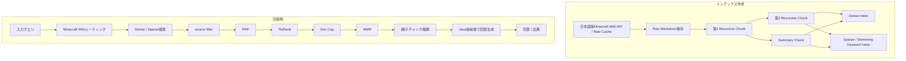

# Minecraft Wiki RAG 詳細設計

## 1. 目的
Minecraft Wiki RAGは、ユーザーの入力クエリをもとに、日本語版Minecraft Wikiの記事だけから根拠付き回答を生成する機能である。

過去の同一チャンネル内チャット履歴やサークル基本情報は、Minecraft Wiki RAGの回答根拠として使わない。入口やルーティングの補助情報として存在する場合でも、検索クエリ生成、回答生成コンテキスト、出典には混入させない。

本設計は `docs/design/kumc-agent.md` の「2. Minecraft Wiki RAG」を上位仕様とし、詳細部分は現行実装の `infra/connectors/minecraft_wiki.py`、`features/ingestion`、`features/rag`、`infra/retrieval` 周辺を参照して定義する。現行実装と `kumc-agent.md` が矛盾する場合は `kumc-agent.md` を優先するが、本設計ではMinecraft Version / Minecraft Edition判定と属性フィルタリングは扱わない。

## 2. 対象範囲
対象機能は次の通り。

- 日本語版Minecraft Wiki記事の取得
- 記事メタデータの抽出
- Minecraft Wiki専用設定によるチャンク分割、要約チャンク生成、埋め込み、Sparse用転置インデックスの作成
- Minecraft Wiki向けルーティング
- ハイブリッド検索
- 親/子チャンクを使った回答生成
- Java版前提の回答生成指示
- 引用・出典出力
- CLIや外部連携向けpayload整形

対象外は、サークル情報RAG、メンバー検索、Minecraftサーバー操作支援、Minecraft Wiki以外の攻略サイト検索、Minecraft Wikiの日本語版以外の記事取得、Minecraft Version / Minecraft Edition判定、属性フィルタリング、Wiki記事の編集である。

## 3. 全体構成
Minecraft Wiki RAGは、オフラインのインデックス作成系とオンラインの回答系に分かれる。



### 3.1 正式入口
Minecraft Wiki RAGの正式入口は、サークル情報RAGと同じく `ChatAnswerUsecase` / `RagService` である。

次の入口はすべて同じMinecraft Wiki RAG経路へ接続する。

- Discord `/ask source=minecraft_wiki`
- HTTP / 統合入力受付の `minecraft_wiki_rag`
- CLI `chat`
- CLI `tool rag --scope minecraft_wiki`
- 評価用 `EvaluateRagasUsecase`

統合入力受付は `AskService` ではなく `ChatAnswerUsecase` に委譲し、`route_override=minecraft_wiki` を指定する。これにより、専用prompt、回答filter無効化、親/子chunk展開、Minecraft Wiki専用検索設定が入口によらず一貫して適用される。

## 4. データ取得
### 4.1 取得元
取得元は日本語版Minecraft Wikiのみである。英語版、その他言語版、外部攻略サイトは取得対象にしない。

現行実装では `MinecraftWikiConnector` がMediaWiki APIの `action=parse` を使用し、`wikitext`、`revid`、`displaytitle` を取得する。設定上は `integrations.minecraft_wiki.api_url` を日本語版Minecraft WikiのAPI URLに向け、`page_url_base` も日本語版記事URLにする。

設計上は日本語版Minecraft Wiki内の全記事を対象にする。現行設定の `integrations.minecraft_wiki.page_titles` と `max_pages` は、開発・検証・段階移行向けの取得範囲制限として扱う。全記事取得では、MediaWiki APIのカテゴリ・全ページ一覧・名前空間指定を使って対象ページタイトルを列挙する。

### 4.2 速度制限
取得時は指定の取得速度制限を設ける。

- リクエスト間隔、1分あたり上限、同時接続数を設定化する。
- APIエラー、HTTP 429、5xxは指数バックオフで再試行する。
- `max_pages` は安全弁として維持する。
- Rawキャッシュが存在し、checksumまたはrevision idが変わらない場合は再取得を省略する。

### 4.3 Raw保存
Raw記事は `data/raw/minecraft_wiki` 配下にMarkdownまたはWiki Markdownとして保存する。

| ファイル | 内容 |
| --- | --- |
| `{safe_title}.md` | 記事本文 |
| `{safe_title}.md.meta.json` | ページID、revision id、canonical URLなど |

保存時のファイル名は、記事タイトルを安全なファイル名へ正規化する。記事タイトルとファイル名の対応はmetadataに保持し、タイトル変更時でも同一ページを追跡できるよう `minecraft_wiki_page_id` を主識別子にする。

### 4.4 metadata
Raw、NormalizedDocument、Chunkには次のmetadataを保持する。

| 項目 | 必須 | 用途 |
| --- | --- | --- |
| `source_type` | yes | `minecraft_wiki` 固定 |
| `source_kind` | yes | `minecraft_wiki` 固定 |
| `minecraft_wiki_title` | yes | 表示、埋め込み前置、引用 |
| `minecraft_wiki_page_id` | yes | ページの安定識別子 |
| `minecraft_wiki_revision_id` | yes | 差分取得、再取得判定 |
| `canonical_url` | yes | 引用URL |
| `heading_path` | no | セクション引用、チャンク説明 |
| `access_scope` | yes | public固定 |
| `visibility` | yes | public固定 |
| `checksum` | yes | 差分検知 |
| `updated_at` | no | revision timestampを取得できる場合に保持 |

Minecraft Version、Minecraft Edition、Java版/統合版の判定結果はmetadataとして持たない。

### 4.5 正規化
`MinecraftWikiConnector.normalize()` は `NormalizedDocument` を生成する。

- `source_kind`: `minecraft_wiki`
- `normalized_format`: `wiki_markdown`
- `language`: `ja`
- `access_scope`: `AccessScope(visibility="public")`
- `title`: 記事タイトル
- `normalized_text`: 記事本文

MediaWikiのテンプレート・カテゴリ・表は、検索品質を損ねない範囲でMarkdown相当へ正規化する。完全なレンダリングよりも、見出し、箇条書き、表のキー情報が検索可能であることを優先する。

## 5. インデックス作成
Minecraft Wiki RAGのindex正本は、`data/chunks/*/minecraft_wiki` に出力されるraw chunk pipeline成果物である。

ingestion repositoryは取得、変更検知、Raw snapshot、監査のために使うが、Minecraft Wiki RAGのDense/BM25/keyword indexへ投入する正本chunkにはしない。auto-indexでingestion repositoryを優先する場合も、Minecraft Wikiだけは専用raw chunk pipelineを再実行し、その第2 Recursive ChunkとSummary ChunkをDense/keyword indexへ投入する。

### 5.1 保存先
インデックス成果物は次の場所に置く。

| 成果物 | 保存先 |
| --- | --- |
| Raw | `data/raw/minecraft_wiki` |
| 第1 Recursive Chunk | `data/chunks/first_rec_chunk/minecraft_wiki` |
| 第2 Recursive Chunk | `data/chunks/second_rec_chunk/minecraft_wiki` |
| Sparse用第2 Recursive Chunk | `data/chunks/sparse_second_rec_chunk/minecraft_wiki` |
| Summary Chunk | `data/chunks/summary_chunk/minecraft_wiki` |
| Dense Index | `data/index` |
| Keyword Index | `data/index/keyword/*.json` |

### 5.2 Minecraft Wiki専用設定
チャンク・検索設定はサークル情報RAGとは別に設定できるようにする。Minecraft Wiki RAGは、サークル情報RAGの `features.retrieval.*` や `indexing.chunking.*` を直接流用せず、専用設定を優先する。

設定名の例:

| 設定 | 用途 |
| --- | --- |
| `minecraft_wiki_rag.chunking.first_recursive_chunk_size` | 第1 Recursive Chunkの文字数 |
| `minecraft_wiki_rag.chunking.first_recursive_chunk_overlap` | 第1 Recursive Chunkのoverlap |
| `minecraft_wiki_rag.chunking.second_recursive_chunk_size` | 第2 Recursive Chunkの文字数 |
| `minecraft_wiki_rag.chunking.second_recursive_chunk_overlap` | 第2 Recursive Chunkのoverlap |
| `minecraft_wiki_rag.chunking.summary_characters` | Summary Chunkの目標文字数 |
| `minecraft_wiki_rag.chunking.summary_batch_size` | Summary Chunk生成batch |
| `minecraft_wiki_rag.retrieval.top_k` | 最終採用チャンク数 |
| `minecraft_wiki_rag.retrieval.dense_top_k` | Dense検索候補数 |
| `minecraft_wiki_rag.retrieval.sparse_top_k` | Sparse検索候補数 |
| `minecraft_wiki_rag.retrieval.sparse_initial_sparse_top_k` | 通常Sparse候補数 |
| `minecraft_wiki_rag.retrieval.sparse_normalized_ratio` | 通常SparseとステミングSparseの比率 |
| `minecraft_wiki_rag.retrieval.rrf_k` | RRF定数 |
| `minecraft_wiki_rag.retrieval.rerank_pool_size` | ReRank対象候補数 |
| `minecraft_wiki_rag.retrieval.parent_chunk_cap` | 同一親チャンク上限 |
| `minecraft_wiki_rag.retrieval.mmr_lambda` | MMR係数 |
| `minecraft_wiki_rag.retrieval.sudachi_mode` | Sudachi mode |
| `minecraft_wiki_rag.retrieval.sparse_bm25_k1` | BM25 k1 |
| `minecraft_wiki_rag.retrieval.sparse_bm25_b` | BM25 b |

専用設定が未指定の場合だけ、互換性のためサークル情報RAGの既存設定をfallbackとして参照できる。

### 5.3 第1 Recursive Chunking
Raw記事をMinecraft Wiki専用設定の文字数で再帰分割する。

- 既定サイズ: `minecraft_wiki_rag.chunking.first_recursive_chunk_size`
- 既定overlap: `minecraft_wiki_rag.chunking.first_recursive_chunk_overlap`
- stage: `first_recursive`
- 親単位として扱う。

分割ではMarkdown見出し、空行、箇条書き、表の行境界を優先する。見出し単位のsectionを保持できる場合は、`heading_path` に記事名と見出し階層を入れる。

### 5.4 第2 Recursive Chunking
第1 Recursive Chunkをさらに小さく分割する。

- 既定サイズ: `minecraft_wiki_rag.chunking.second_recursive_chunk_size`
- 既定overlap: `minecraft_wiki_rag.chunking.second_recursive_chunk_overlap`
- stage: `second_recursive`
- 回答時の子チャンクとして使う。
- metadataに `parent_chunk_id` を保持する。

分割結果が第1チャンクと同一の場合は、回答時の親チャンク重複を避けるため `skip_parent_context=true` を付与する。

### 5.5 Summary Chunking
第1 Recursive Chunkを専用LLMで要約する。

- stage: `summary`
- 既定文字数: `minecraft_wiki_rag.chunking.summary_characters`
- 使用LLM: `minecraft_wiki_rag.chunking.summary_llm_provider` と `summary_gemini_model`
- LLM利用不可または失敗時は第1チャンク先頭をfallback要約にする。
- 回答時の親チャンクとして使う。
- metadataに `parent_chunk_id` を保持する。

Minecraft Wikiでは、要約に記事名、見出し、重要な仕様・数値・条件を残す。

### 5.6 Dense Index
第2 Recursive ChunkとSummary Chunkを埋め込み、FaissLikeIndexへ保存する。

埋め込みテキストは本文単体ではなく、次の情報を前置する。

```text
記事名: {minecraft_wiki_title}
見出し: {heading_path}

{chunk_text}
```

記事名を含めることは `kumc-agent.md` の仕様であり、現行の汎用チャンク埋め込み処理が記事名を含めない場合はMinecraft Wiki向けに補正する。

### 5.7 転置インデックス
キーワード検索用に転置インデックスを作成する。

- クエリとチャンク本文をSudachiで正規化・ステミングする。
- `minecraft_wiki_rag.retrieval.sudachi_mode`、`sparse_use_normalized_form`、`sparse_remove_symbols` に従う。
- BM25パラメータは `minecraft_wiki_rag.retrieval.sparse_bm25_k1`、`sparse_bm25_b` を使う。
- 少なくとも次のcorpusを保存する。
  - `sparse`
  - `sparse_second_rec`
  - `second_rec_sparse`
- Minecraft Wiki routeでは、共通corpusとは別にMinecraft Wiki専用BM25パラメータで作成した次のcorpusを検索する。
  - `minecraft_wiki_sparse`
  - `minecraft_wiki_sparse_second_rec`
  - `minecraft_wiki_second_rec_sparse`

通常Sparse検索とステミングSparse検索は別系統として扱い、検索時にMinecraft Wiki専用設定で定めた比率で混合する。Minecraft固有語、英語表記、日本語表記、アイテム名、エンティティ名、数値は落とさない。

## 6. ルーティング
### 6.1 入力
Minecraft Wiki RAGのルーティングは、次を入力として専用LLMまたは決定的ルールが判定する。

- 入力クエリ
- 現在日付
- 質問者情報

過去の同一チャンネル内チャット履歴やサークル基本情報をルーティング補助に使う実装は許容するが、Minecraft Wiki RAG経路へ入った後は `use_additional_memory=false` として扱い、検索・回答根拠には使わない。

### 6.2 出力
ルーティング結果は次のフィールドを持つ。

| フィールド | 型 | 説明 |
| --- | --- | --- |
| `target_model` | `string` | `minecraft_wiki` を選択できるようにする |
| `use_additional_memory` | `bool` | Minecraft Wiki RAGでは常に `false` として扱う |
| `fast_mode` | `bool` | 低遅延・低負荷モード |

Minecraft Wiki RAGでは `additional_queries` を使わない。検索クエリは入力クエリそのものを使う。追加クエリ生成、合成クエリ生成、履歴由来の検索拡張は行わない。

CLIや外部連携payloadでは、主結果に必要な安定フィールドのみをトップレベルに置き、診断情報、ルーティング判断、実行モード、trace idは `metadata` 配下に入れる。

### 6.3 ファストモード
ファストモードは低遅延・低負荷で回答したい場合に有効化する。

- ReRankをスキップする。
- MMRをスキップする。
- Dense/Sparse検索件数を通常より小さくできる。
- 追加クエリ生成や合成クエリ生成は通常モードでも存在しない。

## 7. 検索
### 7.1 Dense検索
入力クエリを埋め込み、FaissLikeIndexから上位 `minecraft_wiki_rag.retrieval.dense_top_k` 件を取得する。

検索対象は `source_type=minecraft_wiki` のチャンクに限定する。共通RAGインデックスに混在させる場合でも、Minecraft Wiki RAG経路ではsource filterを必ず適用する。

### 7.2 通常Sparse検索
入力クエリを正規化し、BM25系Sparse検索で上位 `minecraft_wiki_rag.retrieval.sparse_top_k` 件を取得する。

### 7.3 ステミングSparse検索
入力クエリをSudachiでステミングし、転置インデックスから上位候補を取得する。通常Sparse検索とステミングSparse検索の混合比率はMinecraft Wiki専用設定で制御する。

### 7.4 RRF
Dense検索とSparse検索をRRFによってランキングする。

- RRF定数は `minecraft_wiki_rag.retrieval.rrf_k` を使う。
- Dense、通常Sparse、ステミングSparseの候補を統合する。
- source filterはRRF前に適用する。

### 7.5 ReRank
Cross Encoder rerankerが有効で、ファストモードでない場合は、RRF後の候補チャンクを再ランキングする。

- pool sizeは `minecraft_wiki_rag.retrieval.rerank_pool_size` を使う。
- ReRankはDoc Capより前に行う。

### 7.6 Doc Cap
ReRank後に、同一親チャンクのチャンク数を制限する。

- 設定値: `minecraft_wiki_rag.retrieval.parent_chunk_cap`
- keyは `source_type`, `minecraft_wiki_page_id`, `parent_chunk_id` を基本にする。
- ReRankをスキップするファストモードでは、RRF後にDoc Capを行う。

### 7.7 MMR
ファストモードでない場合は、Doc Cap後の候補にMMRを適用して多様性を確保する。

- `minecraft_wiki_rag.retrieval.mmr_lambda` を使う。
- 同一記事内の類似セクションだけに偏らないよう、記事単位・見出し単位の重複を抑制する。

### 7.8 最終選択
MMR後、またはファストモードではDoc Cap後に、上位 `minecraft_wiki_rag.retrieval.top_k` 件を最終チャンクとして採用する。

## 8. 回答生成
### 8.1 親/子チャンク
子チャンクのうち、親チャンクが存在するものは、子チャンクと同じく親チャンクもコンテキストに含める。親チャンクはSummary Chunkを優先し、存在しない場合は第1 Recursive Chunkを使う。

`skip_parent_context=true` の場合は親チャンクを追加しない。

### 8.2 履歴搭載
Minecraft Wiki RAGでは、過去のチャット履歴を回答生成コンテキストに含めない。

入口側で履歴が渡されても、Minecraft Wiki RAG経路では `use_additional_memory=false` に正規化する。検索クエリはユーザーの入力クエリそのものを使い、回答根拠は日本語版Minecraft Wikiの取得コンテキストだけに限定する。

### 8.3 プロンプト方針
回答生成では次を明示する。

- 日本語版Minecraft Wikiの取得コンテキストだけを根拠にする。
- 回答はJava版前提で作成する。
- 統合版やEdition差分の判定は行わない。
- 根拠が不足する場合は不足していると述べる。
- サークル固有事情はMinecraft Wikiの事実と混同しない。

### 8.4 引用
回答には出典を含める。

- 表示名は記事タイトルと見出しを優先する。
- URLは `canonical_url` を使う。
- 日本語MediaWiki見出しのsection anchorを安定生成できない場合は記事URLのみを使う。現行実装では記事URLのみを出力し、見出しは `Source.label` に保持する。
- 同一記事から複数チャンクを引用する場合は重複を抑制する。

## 9. 回答出力
Minecraft Wiki RAGでは回答フィルタリングを行わず、そのまま回答を出力する。これは `kumc-agent.md` の仕様である。

ただし、secret検出やindex statusによって `quarantined`、`deleted`、`permission_lost` とされたチャンクは、検索・回答生成前に除外する。これは回答フィルタリングではなく、インデックス安全性のための入力除外である。

## 10. 外部連携payload
CLIや外部連携向けpayloadのトップレベルには、利用者・連携先が主結果として扱う安定フィールドのみを置く。

トップレベル例:

| 項目 | 説明 |
| --- | --- |
| `answer` | 回答本文 |
| `route` | `minecraft_wiki_rag` |
| `sources` | 出典一覧 |

`routing_decision`、`fast_mode`、`selected_handler`、`trace_id`、検索スコア、候補数などは `metadata` 配下に保持する。大きな本文断片、検索context、secretを含む可能性がある値は、CLI出力や外部連携前に除外またはマスクする。

## 11. 設定
既存設定は次の通り。

| 設定 | 用途 |
| --- | --- |
| `features.sources.minecraft_wiki` | Minecraft Wiki source connectorの有効化 |
| `integrations.minecraft_wiki.page_titles` | 検証・限定取得用ページタイトル |
| `integrations.minecraft_wiki.api_url` | 日本語版MediaWiki API URL |
| `integrations.minecraft_wiki.page_url_base` | 日本語版canonical URL生成 |
| `integrations.minecraft_wiki.max_pages` | 最大取得ページ数 |

追加が必要な設定候補は次の通り。

| 設定 | 用途 |
| --- | --- |
| `integrations.minecraft_wiki.rate_limit_per_minute` | 取得速度制限 |
| `integrations.minecraft_wiki.request_interval_seconds` | リクエスト間隔 |
| `integrations.minecraft_wiki.namespaces` | 取得対象namespace |
| `integrations.minecraft_wiki.full_backfill_enabled` | 全記事取得を許可する安全弁 |
| `minecraft_wiki_rag.chunking.*` | Minecraft Wiki専用チャンク設定 |
| `minecraft_wiki_rag.retrieval.*` | Minecraft Wiki専用検索設定 |

パラメータは `configs` 配下で管理する。`.env` / `.env.example` にはAPIキーやトークンなどのsecretだけを置き、Minecraft Wiki RAGのchunking/retrievalパラメータやpromptは保存しない。`.env` または `.env.example` にsecret項目を追加・削除する場合は、必ず他方にも同じ項目を反映する。

## 12. 実装状態
現行実装は、本設計のMinecraft Wiki RAG完全実装を満たす。

- `MinecraftWikiConnector` は日本語版URL検証、rate limit、429/5xx backoff、revision id比較、Raw cache、metadata sidecar、NormalizedDocument化を行う。
- 手動 `index build` はMinecraft Wiki connector ingestionを呼び、Raw取得からindex作成まで完結できる。
- auto-indexでingestion repositoryを使う場合も、Minecraft Wikiは専用raw chunk pipeline成果物をDense/keyword indexの正本にする。
- Minecraft Wiki専用の第1/第2/sparse/Summary Chunk成果物を作成し、Summary Chunkは専用LLMを使い、失敗時だけfallback要約にする。
- 検索時にはMinecraft Wiki専用のSudachi mode、normalized form、symbol処理、RRF k、sparse混合比率を適用する。
- keyword index構築時にはMinecraft Wiki専用BM25 k1/bとSudachi設定で専用corpusを作る。
- すべての正式入口は `ChatAnswerUsecase` / `RagService` 経路を通る。
- Minecraft Wiki RAGではQuerySynthesizer、additional_queries、AnswerFilter、チャット履歴、サークル基本情報を使わない。
- ReRank pool外候補はDoc Cap前に保持し、Doc Cap後にMMRと記事/見出し重複抑制を行う。
- `Source.label` は記事名・見出し、`Source.uri` は記事URLとして分離する。
- CLIや外部連携payloadは共通sanitizerで再帰的にmetadataを除外・マスクする。

## 13. テスト方針
pytestは未導入の環境であることに留意し、既存の `unittest` スタイルに合わせる。

主なテストは次の通り。

- `MinecraftWikiConnector` が日本語版API URLと日本語版canonical URLを使用する。
- `MinecraftWikiConnector` がRaw cache、metadata、canonical URLを生成する。
- page_titles、BackfillScope、max_pagesで取得範囲が制限される。
- Minecraft Version / Minecraft Edition判定用metadataが生成されない。
- Dense/Sparse検索結果が `source_type=minecraft_wiki` に限定される。
- Minecraft Wiki専用チャンク・検索設定がサークル情報RAG設定とは独立して使われる。
- Minecraft Wiki専用keyword corpusが検索時に使われる。
- ReRank後にDoc Capが適用される。
- ReRank pool外候補がDoc Cap前に保持される。
- ファストモードでReRank/MMRがスキップされ、RRF後にDoc Capが適用される。
- 親/子チャンク展開でSummary Chunkが優先される。
- 回答生成プロンプトにJava版前提が含まれる。
- Minecraft Wiki RAGでは回答フィルタリングが呼ばれない。
- CLI payloadで診断情報が `metadata` 配下に入る。
- `sources[].uri` が純粋な記事URLになる。
