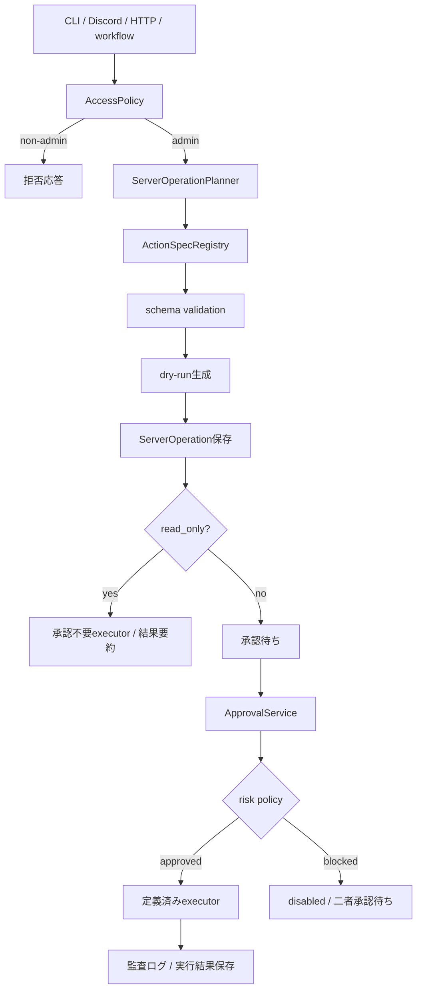
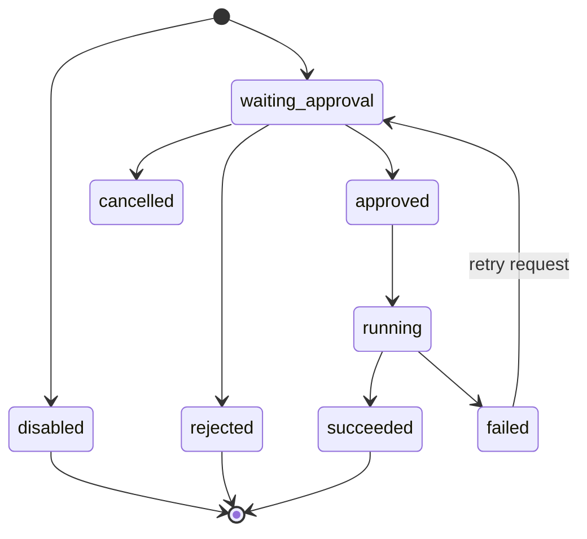

# サーバー管理 詳細設計

## 1. 目的
サーバー管理は、自然言語の管理依頼を受け取り、定義済みの安全な `ActionSpec` から実行候補を作成し、承認後にのみ副作用のある操作を実行する機能である。

本機能では、LLMまたはユーザー入力から任意shell commandを生成して実行しない。操作は事前登録されたActionSpec、schema validation、risk、承認ポリシー、監査ログに必ず紐づける。

本設計は `docs/design/kumc-agent.md` の「9. サーバー管理」を上位仕様とする。詳細部分は現行実装の `domain.models.minecraft.ActionSpec`、`MinecraftDryRun`、`ServerOperation`、`features.minecraft.service.MinecraftSupportService`、`features.minecraft.actions.MinecraftActionSpecRegistry`、`infra.minecraft.repository`、`features.workflow.service.WorkflowService.mc_status/mc_request`、`infrastructure/migrations/006_minecraft_server_operations.sql` を参照して定義する。現行実装と `kumc-agent.md` が矛盾する場合は `kumc-agent.md` を優先する。

## 2. 対象範囲
対象機能は次の通り。

- adminユーザー限定のサーバー管理受付
- 自然言語依頼からの操作計画抽出
- 複数操作依頼の抽出
- 定義済みActionSpecによる操作制限
- docker container一覧確認
- docker compose起動、停止、再起動のdry-runと承認後実行
- バックアップ作成、ファイル検索、whitelist更新などの拡張ActionSpec
- risk別承認ポリシー
- dry-run、影響範囲、想定停止時間、rollback方針の提示
- 実行前承認、二者承認、disabled制御
- stdout / stderr、server state、container state、実行者、承認者の監査ログ保存
- CLI、Discord、HTTP、workflow向けpayload整形
- 秘密情報、内部IP、ネットワークキー、PIN、解錠手順の出力抑止

対象外は、Minecraft Wiki RAG、通常RAG、サーバー内アプリケーション固有ロジックの詳細である。ただし現行実装ではMinecraftサーバー運用を主対象にしているため、初期実装ではMinecraft向けActionSpecを中心に扱う。

## 3. 現行実装の基準
現行実装は、Minecraftサーバー管理候補の作成、承認、固定executorによる実行、監査ログ保存、payload sanitizationまでを持つ。汎用サーバー管理へ拡張できる構成だが、初期ActionSpecはMinecraft運用向けに固定する。

| 項目 | 実装基準 | 本設計で必要な状態 |
| --- | --- | --- |
| 操作対象 | Minecraft supportとして実装 | 汎用サーバー管理として設計し、初期ActionSpecはMinecraft向けにする |
| 権限 | `AccessContext` とserver management access policyでadmin限定 | サーバー管理はadminのみ受付し、非adminには拒否文だけを返す |
| 計画抽出 | 自然言語は専用LLM Planner、ラベル付き入力はdeterministic parserで抽出 | 専用LLMで複数操作を抽出し、ActionSpecに正規化する。deterministic parserはラベル付き入力とテスト補助に限定する |
| 任意shell拒否 | registry外operationを拒否 | 入力中のshell断片も候補として直接採用せず、ActionSpecに対応しないものは拒否する |
| docker ps | `docker_ps` executorが `docker ps -a` 相当を固定argvで実行 | admin限定で事前承認なしに安全なexecutorが実行し、結果を要約できる |
| 副作用操作 | compose、whitelist、backup executorを承認後に実行 | 承認後に定義済みexecutorが起動・停止・再起動などを実行する |
| dry-run | impact、downtime、rollback、command preview、schema validationを生成前に適用 | 対象ディレクトリ、service name、server_name、pathをschema validationし、実行前確認として提示する |
| 承認 | server_operation専用approval handlerでServerOperation状態を更新 | `ServerOperation` の承認者、status、action_run_idを更新し、risk policyを強制する |
| high/critical | highはadmin承認、criticalは二者承認またはdisabled | high以上はadmin承認必須、criticalは二者承認またはdisabled |
| 実行ログ | `server_operations` と `AuditEvent.metadata` に実行結果と状態を保存 | stdout/stderr、server state、container state、実行者、承認者を監査ログとoperation metadataに保存 |
| feature flag | `minecraft_server_ops` のmodeを参照 | `disabled` は候補保存のみ、`approval_required` は承認後実行可、`enabled` でもhigh以上は承認必須 |
| 秘密情報抑止 | executor出力、repository保存、payload出力でマスク・除外 | executor出力とLLM要約前に秘密情報・内部接続情報を除外・マスクする |

実装では `src/kumc_agent/infra/legacy` を参照・依存しない。

## 4. 全体構成
サーバー管理は、受付、権限確認、計画抽出、dry-run保存、承認、実行、監査の7段階で構成する。



主要コンポーネントは次の通り。

| 層 | 責務 | 現行の主なファイル |
| --- | --- | --- |
| domain | `ActionSpec`, `MinecraftDryRun`, `ServerOperation` | `src/kumc_agent/domain/models/minecraft.py` |
| feature | 計画受付、dry-run生成、status表示 | `src/kumc_agent/features/minecraft/service.py` |
| action registry | 許可済み操作の定義 | `src/kumc_agent/features/minecraft/actions.py` |
| workflow | `mc_status`, `mc_request`, approval連携 | `src/kumc_agent/features/workflow/service.py` |
| repository | JSONL/Postgres保存 | `src/kumc_agent/infra/minecraft/repository.py` |
| DB migration | `server_operations` table | `infrastructure/migrations/006_minecraft_server_operations.sql` |
| CLI | `work --type mc_status/mc_request`, `approval --type server_operation` | `src/kumc_agent/cli.py` |
| frontend | Discord/HTTPのworkflow payload | `src/kumc_agent/frontends/discord/app.py`, `src/kumc_agent/frontends/http/app.py` |

## 5. 権限管理
### 5.1 基本方針
サーバー管理はadminに設定されているユーザーに限定する。

admin判定は `AccessContext` の次の情報を使う。

| 入力 | 説明 |
| --- | --- |
| `is_admin` | CLIや上位frontendが明示するadmin判定 |
| `user_id` | `security.maintenance_command_author_ids` と照合する |
| `guild_id` | `security.discord_guild_allow_list` と照合する |
| `role_ids` | Discord roleに基づくadmin権限拡張に使う |

初期実装では `is_admin=True` または `user_id` が `security.maintenance_command_author_ids` に含まれる場合をadminとする。role_idによるadmin判定を入れる場合は、role allow listを `configs/main/security.yaml` 配下に追加する。

### 5.2 拒否応答
非adminが操作しようとした場合は、候補作成も一覧表示も行わない。

拒否応答には次を含めない。

- 登録済みserver name
- container名
- service名
- pending operation件数
- operation id
- 内部path
- 内部IPやネットワーク情報

### 5.3 操作別権限
adminであっても、操作別risk policyを満たすまでは副作用を実行しない。

| 操作種別 | 受付 | dry-run保存 | 実行 |
| --- | --- | --- | --- |
| read-only | admin | 必要に応じて保存 | 事前承認不要 |
| low | admin | 必須 | self/admin policyに従う |
| medium | admin | 必須 | admin承認後 |
| high | admin | 必須 | admin承認後 |
| critical | admin | 必須 | 二者承認またはdisabled |

## 6. 計画抽出
### 6.1 Planner
`ServerOperationPlanner` を追加し、自然言語入力から `ServerOperationPlan` を1件以上抽出する。

抽出する主なフィールドは次の通り。

| フィールド | 説明 |
| --- | --- |
| `operation` | ActionSpecのoperation名 |
| `server_name` | 対象サーバー名 |
| `service_name` | docker compose service名 |
| `server_dir` | 許可済みサーバーディレクトリの識別子 |
| `path` | ファイル検索などで使う許可済みroot配下の相対pathまたは絶対path |
| `query` | ファイル検索query |
| `player_name` | whitelist更新対象 |
| `reason` | 操作理由 |
| `confidence` | 抽出信頼度 |

Plannerは専用LLMを前提とする。ラベル付き入力のdeterministic parserは、CLI互換とテスト補助のためだけに残す。通常の自然言語依頼では、LLM出力を必ずJSON schema validationに通し、ActionSpecに正規化する。LLMがshell commandを返した場合も、その文字列を実行候補にはしない。ActionSpecに対応しない操作は `unsupported` として扱い、候補を保存せず `対応操作を確認してください。` と返す。

### 6.2 複数操作
入力クエリに複数のサーバー管理依頼がある場合は、複数件の抽出を許容する。

例:

- 「survivalを再起動して、その後whitelistにSteveを追加」
- 「docker一覧を見て、止まっていたらlobbyを起動」

依存関係がある複数操作は、各候補に `metadata.sequence_index`、`metadata.depends_on` を保持する。条件付き操作は自動実行せず、条件と確認事項をdry-runに含める。

### 6.3 不足情報
ActionSpecの `required_args` が不足している場合は候補を作らず、必要情報を質問する。

ただし、現行互換としてCLIの `mc_request` では `ValueError` を返す経路がある。frontendではこれをユーザー向け質問文に変換する。

未知または曖昧な自然文は、`docker_ps` などの安全操作へfallbackしない。候補を保存せず、固定文 `対応操作を確認してください。` を返す。

## 7. ActionSpec
### 7.1 データモデル
現行の `ActionSpec` を基礎とする。

| フィールド | 型 | 説明 |
| --- | --- | --- |
| `operation` | `str` | 一意な操作名 |
| `description` | `str` | 操作説明 |
| `risk_level` | `str` | `low`, `medium`, `high`, `critical` |
| `approval_policy` | `str` | `self`, `admin`, `admin_dry_run`, `admin_approval`, `two_person_or_disabled` |
| `required_args` | `tuple[str, ...]` | 必須引数 |
| `optional_args` | `tuple[str, ...]` | 任意引数 |
| `read_only` | `bool` | 副作用がない操作か |

将来的には次のフィールドを追加する。

| フィールド | 説明 |
| --- | --- |
| `executor_name` | 実行する定義済みexecutor |
| `allowed_server_names` | 対象サーバー制限 |
| `allowed_service_names` | docker compose service名のallow list |
| `allowed_paths` | ファイル操作のallow list |
| `timeout_seconds` | executor timeout |
| `output_policy` | stdout/stderrの保存・マスク方針 |

### 7.2 初期ActionSpec
現行registryを基礎に、次の操作を初期ActionSpecとする。

| operation | risk | approval | read_only | 説明 |
| --- | --- | --- | --- | --- |
| `status` | low | self | true | サーバー管理機能の安全状態を表示 |
| `docker_ps` | low | admin | true | Minecraft関連container一覧確認 |
| `file_search` | medium | admin_dry_run | true | 許可済みpath内のファイル検索 |
| `compose_up` | high | admin_approval | false | 許可済みserviceを起動 |
| `compose_restart` | high | admin_approval | false | 許可済みserviceを再起動 |
| `restart` | high | admin_approval | false | Minecraftサーバー再起動 |
| `whitelist_update` | high | admin_approval | false | whitelistの追加・削除 |
| `backup_create` | high | admin_approval | false | 設定済みサーバーディレクトリのbackup archiveを作成 |
| `compose_down` | critical | two_person_or_disabled | false | 設定済みcompose projectで `docker compose down` を実行 |

`kumc-agent.md` では `docker ps -a` は事前承認不要とされているため、詳細設計ではread-only executorとして扱う。ただしadmin限定は維持する。

### 7.3 拡張ActionSpec
初期ActionSpec以外の操作を追加できる。

追加時の必須条件は次の通り。

- ActionSpecにoperation、risk、approval_policy、required_argsを定義する
- executorは固定実装として登録する
- shell文字列の直接入力を受け付けない
- 対象server、service、pathをallow listで検証する
- dry-runでimpact、downtime、rollbackを提示する
- stdout/stderrのsecret maskを定義する
- testsとrunbookを追加または更新する

## 8. Dry-run
### 8.1 MinecraftDryRun
現行の `MinecraftDryRun` を基礎とする。

| フィールド | 説明 |
| --- | --- |
| `operation` | 操作名 |
| `server_name` | 対象サーバー |
| `args` | validated args |
| `risk_level` | risk |
| `approval_policy` | 承認ポリシー |
| `impact` | 影響範囲 |
| `expected_downtime` | 想定停止時間 |
| `rollback` | rollback方針 |
| `command_preview` | 実行予定の安全な説明。secretや内部pathを含めない |
| `warnings` | 注意事項 |
| `execution_allowed` | dry-run時は常にfalse |

`command_preview` は利用者確認のための表示であり、executorがこの文字列をshellに渡してはいけない。

### 8.2 schema validation
副作用操作では、実行前に次を検証する。

- `server_name` が設定済みサーバーに含まれる
- `server_dir` が許可済みディレクトリに対応する
- `service_name` が許可済みserviceに含まれる
- `path` が許可済みroot配下の相対pathまたは絶対pathである
- `player_name` がMinecraft IDとして妥当である
- operationに不要な引数があってもexecutorに渡さない

`status` と `docker_ps` 以外の操作は設定済みserverを必須とする。副作用操作は設定済み `compose_dir` を必須とし、server allow listが空または対象serverが未登録の場合はdry-run候補も作成しない。

設定は `.env` ではなく `configs/main/server_management.yaml` などconfigs配下に置く。APIキーやtokenを追加する場合のみ `.env` と `.env.example` の両方に反映する。

## 9. ServerOperation
### 9.1 データモデル
現行の `ServerOperation` を基礎とする。

| フィールド | 型 | 説明 |
| --- | --- | --- |
| `id` | `str` | operation id |
| `server_name` | `str` | 対象サーバー |
| `operation` | `str` | ActionSpec operation |
| `requested_by_user_id` | `str` | 依頼者 |
| `approved_by_user_ids` | `tuple[str, ...]` | 承認者 |
| `status` | `str` | `draft`, `waiting_approval`, `approved`, `running`, `succeeded`, `failed`, `rejected`, `disabled`, `cancelled` |
| `risk_level` | `str` | risk |
| `action_run_id` | `str | None` | executor run id |
| `dry_run` | `MinecraftDryRun | None` | dry-run内容 |
| `metadata` | `dict` | 診断情報、実行結果、状態snapshot |
| `created_at` | `datetime | None` | 作成時刻 |
| `updated_at` | `datetime | None` | 更新時刻 |

### 9.2 status遷移
status遷移は次の通り。



read-onlyかつ事前承認不要の操作は、`waiting_approval` を経由せず `running` から `succeeded` へ遷移してよい。ただし監査ログは必須である。

### 9.3 metadata
`metadata` に保存する主なkeyは次の通り。

| key | 説明 |
| --- | --- |
| `feature_mode` | `minecraft_server_ops` のmode |
| `planner` | planner種別、confidence、unsupported理由 |
| `sequence_index` | 複数操作時の順序 |
| `depends_on` | 依存するoperation id |
| `approval_policy_result` | 承認判定結果 |
| `executor_name` | 実行executor |
| `executor_args` | マスク済み引数 |
| `stdout_excerpt` | マスク済みstdout短縮版 |
| `stderr_excerpt` | マスク済みstderr短縮版 |
| `server_state_before` | 実行前状態snapshot |
| `server_state_after` | 実行後状態snapshot |
| `container_state_before` | 実行前container状態 |
| `container_state_after` | 実行後container状態 |
| `rollback_operation_id` | rollback候補id |
| `trace_id` | 追跡ID |

CLIや外部連携payloadでは、大きなstdout/stderr、secretを含む可能性がある値、内部pathの詳細は除外またはマスクする。

## 10. Repository
### 10.1 保存先
現行通り、Postgresが設定されている場合は `PostgresServerOperationRepository`、未設定の場合は `FileServerOperationRepository` を使う。

| 実装 | 保存先 |
| --- | --- |
| File | `data/minecraft/server_operations.jsonl` |
| Postgres | `server_operations` table |

production正本はPostgresを推奨し、JSONLはローカル・テスト用とする。

### 10.2 DB schema
`infrastructure/migrations/006_minecraft_server_operations.sql` の `server_operations` tableを使う。

| column | 説明 |
| --- | --- |
| `id` | primary key |
| `server_name` | 対象サーバー |
| `operation` | operation |
| `requested_by_user_id` | 依頼者 |
| `approved_by_user_ids` | JSONB承認者配列 |
| `status` | 状態 |
| `risk_level` | risk |
| `action_run_id` | executor run id |
| `dry_run` | JSONB dry-run |
| `metadata` | JSONB metadata |
| `created_at` | 作成時刻 |
| `updated_at` | 更新時刻 |

indexは `status, created_at desc` と `operation, risk_level` を使う。

### 10.3 必要なRepository拡張
承認後実行には次のメソッドを追加する。

| メソッド | 説明 |
| --- | --- |
| `update_status(operation_id, status, metadata_patch)` | 状態更新 |
| `add_approval(operation_id, approver_user_id)` | 承認者追加 |
| `list_by_requester(user_id, status=None)` | 依頼者別一覧 |
| `list_pending_for_approval(risk_level=None)` | 承認待ち一覧 |
| `save_execution_result(operation_id, result)` | 実行結果保存 |

## 11. 承認
### 11.1 risk policy
承認ポリシーはActionSpecとfeature flagの両方で判定する。

| 条件 | 動作 |
| --- | --- |
| feature flag `disabled` | 実行不可。dry-run保存のみ |
| read-onlyかつ `approval_policy=self/admin` | adminであれば事前承認不要 |
| `approval_policy=self` | admin本人の明示実行で可 |
| `approval_policy=admin` | admin確認で可 |
| `approval_policy=admin_dry_run` | dry-run保存とadmin確認を必須 |
| `approval_policy=admin_approval` | 別操作として承認を必須 |
| `approval_policy=two_person_or_disabled` | 二者承認が揃うまで実行不可。設定でdisabledも可 |

`kumc-agent.md` に従い、high risk以上はadmin承認を必須にする。critical操作は二者承認またはdisabledにする。
`file_search` は `read_only=True` だが `approval_policy=admin_dry_run` のため、実行にはadmin approvalを必須とする。

### 11.2 ApprovalRecord
既存の `WorkflowService._generic_approval()` は `ApprovalRecord` だけを保存し、外部副作用を実行しない。サーバー管理では、承認操作時に `ServerOperation` も更新する専用approval handlerを追加する。

必要な処理は次の通り。

1. `ServerOperation` を取得する。
2. access policyを確認する。
3. risk policyを確認する。
4. `ApprovalRecord` を保存する。
5. `approved_by_user_ids` を更新する。
6. 承認条件が揃えば `status=approved` にする。
7. 実行要求がある場合だけexecutorへ渡す。

## 12. Executor
### 12.1 基本方針
executorはoperationごとに固定実装とし、shell文字列を外部入力から組み立てて実行しない。

実装上やむを得ずsubprocessを使う場合も、次を満たす。

- `shell=False`
- 実行ファイルと引数を配列で渡す
- cwdは許可済みserver_dirに限定する
- timeoutを設定する
- stdout/stderrの最大保存量を制限する
- secret maskを通す
- 実行前後の状態snapshotを取得する

### 12.2 docker ps
`docker_ps` はread-only executorとして、admin限定で事前承認なしに実行できる。

実行内容は `docker ps -a` 相当とするが、出力は次の情報に制限する。

- container id短縮形
- name
- image名の公開可能部分
- status
- portsの公開可能部分
- service label

内部IP、network名、mount path、env、secretは出力しない。

### 12.3 compose操作
`compose_up`、`compose_restart`、`restart`、`compose_down` は、対象ディレクトリとservice nameをschema validationしたうえで、承認後に実行する。
`compose_down` は設定済み `compose_dir` で `docker compose down` を実行する操作と定義する。project全体を停止し得るため、service nameは実行argvには渡さず、criticalとして二者承認またはdisabledを必須にする。

実行前に次を保存する。

- 対象server/service
- impact
- expected downtime
- rollback
- container state before
- approval record

実行後に次を保存する。

- status
- stdout/stderrのマスク済み抜粋
- container state after
- server health check結果
- rollback候補

### 12.4 whitelist更新
`whitelist_update` はhigh riskとして扱う。

計画時に次を確認する。

- 追加か削除か
- player_name
- 対象server
- 影響範囲
- rollbackとして逆操作を提示できるか

### 12.5 ファイル検索
`file_search` はread-onlyだが、内部ファイル名や設定内容を漏らす危険があるためmedium riskとする。

許可済みpath配下のみ検索し、出力はファイル名、行番号、短い抜粋に制限する。`allow_file_search_paths` はconfigsのbase dir基準で解決したpath、または絶対pathを許可する。依頼時の `path` も、許可済みroot配下であれば相対pathと絶対pathの両方を許可する。secretらしき値を含む行は全文を返さない。

## 13. 監査ログ
### 13.1 保存対象
`kumc-agent.md` に従い、次を監査ログへ保存する。

- stdout / stderr
- server state
- container state
- 実行者
- 承認者
- operation id
- risk level
- approval policy
- feature flag mode
- executor result

ただし、一般回答や外部payloadには秘密情報を含めない。

### 13.2 AuditLog
既存の `WorkflowService._audit()` と `infra.audit` を使う。
監査ログ保存は `WorkflowService` の公開受付経路で必ず行う。`MinecraftSupportService` はサーバー操作の低レベルfeature serviceであり、CLI、Discord、HTTP、agent toolなど外部から呼ばれる経路は `WorkflowService` を経由してaudit metadataを付与する。

event名は次の形式にする。

| event | 説明 |
| --- | --- |
| `workflow.mc_status` | 状態確認 |
| `workflow.mc_request` | dry-run候補作成 |
| `workflow.server_operation.approve` | 承認 |
| `workflow.server_operation.reject` | 却下 |
| `workflow.server_operation.execute` | 実行 |
| `workflow.server_operation.rollback` | rollback |

## 14. 出力
### 14.1 WorkResponse
`WorkResponse.server_operations` に `ServerOperation` を入れる。

トップレベルpayloadは利用者・連携先が主結果として扱う安定フィールドだけにする。診断情報、policy判定、executor詳細、trace idなどは `metadata` 配下に入れる。

### 14.2 detail_markdown
admin向けdetailには次を表示する。

- operation id
- status
- server
- operation
- risk
- approval policy
- execution_allowed
- args
- impact
- expected downtime
- rollback
- command preview
- warnings

非adminにはdetailを返さない。

## 15. 設定
### 15.1 feature flag
現行の `configs/main/features.yaml` を使う。

```yaml
features:
  risk_flags:
    minecraft_server_ops: "approval_required"
```

modeの意味は次の通り。

| mode | 説明 |
| --- | --- |
| `disabled` | dry-run保存のみ。実行不可 |
| `approval_required` | 承認後に実行可能 |
| `enabled` | read-only/lowは即時実行可。ただしhigh以上は承認必須 |

### 15.2 server management設定
サーバー名、service名、ディレクトリ、timeout、出力制限などはconfigs配下に保存する。

新規設定例:

```yaml
server_management:
  default_server_name: "survival"
  docker_ps:
    container_name_prefixes: ["minecraft", "mc-"]
  servers:
    - name: "survival"
      compose_dir: "ops/minecraft/survival"
      services: ["minecraft"]
      allow_file_search_paths: ["logs", "config"]
      critical_operations_enabled: false
  execution:
    timeout_seconds: 120
    stdout_char_limit: 4000
    stderr_char_limit: 4000
  backup:
    backup_dir: "data/minecraft/backups"
    max_backups: 10
```

トークンやAPIキー以外のパラメータを `.env` / `.env.example` へ置かない。

## 16. エラーハンドリング
主なエラーと応答は次の通り。

| エラー | 応答 |
| --- | --- |
| 非admin | 拒否文。内部情報は出さない |
| unsupported operation | 候補を保存せず `対応操作を確認してください。` と返す |
| required arg不足 | 不足項目を質問 |
| schema validation失敗 | 候補を保存せず、修正可能な入力項目を提示 |
| feature disabled | dry-run保存のみ。実行不可 |
| 承認不足 | `waiting_approval` を維持 |
| executor timeout | `failed` にし、rollback方針を提示 |
| executor失敗 | stdout/stderr抜粋をマスク保存し、adminに通知 |
| secret検出 | 出力を抑止し、監査ログに検出結果だけ保存 |

## 17. テスト観点
最低限、次を検証する。

- registry外operationを拒否する
- shell断片を直接実行しない
- 非adminは `mc_status` / `mc_request` / approval / executionを拒否される
- adminはdry-runを作成できる
- required args不足では候補を保存しない
- `docker_ps` はread-onlyとして事前承認不要だがadmin限定である
- high risk操作は承認前に実行されない
- critical操作は二者承認またはdisabledになる
- approval後に `ServerOperation.status` と `approved_by_user_ids` が更新される
- executorはallow list外server/service/pathを拒否する
- stdout/stderrとmetadataがマスクされる
- CLI payloadの診断情報が `metadata` 配下に入る
- JSONL repositoryとPostgres repositoryで同じstatus遷移になる
