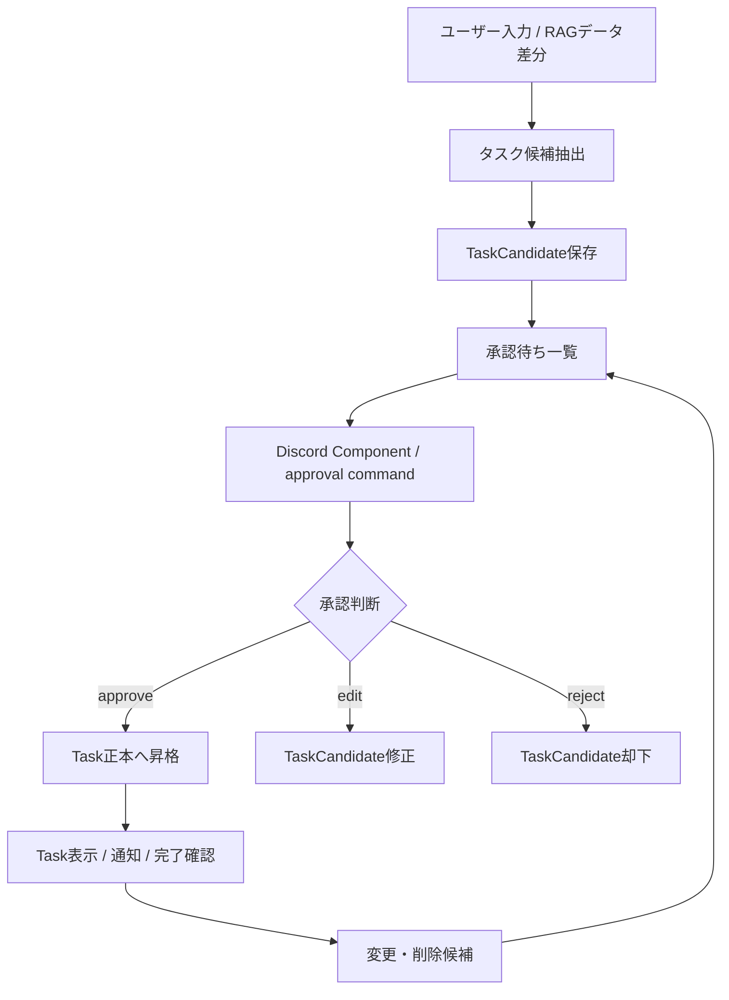

# タスク管理 詳細設計

## 1. 目的
タスク管理は、ユーザー入力またはRAGデータ差分からタスク候補を抽出し、承認後にタスク正本へ登録する機能である。

本機能では、タスクらしい記述をすぐに正本化せず、`TaskCandidate` として保存する。正本である `Task` は、adminまたは承認権限を持つユーザーの承認後にのみ作成・更新・削除される。

本設計は `docs/design/kumc-agent.md` の「6. タスク管理」を上位仕様とする。詳細部分は現行実装の `domain.models.workflow.TaskCandidate`、`Task`、`ApprovalRecord`、`features.workflow.service.WorkflowService`、`infra.workflow.repository`、`infrastructure/migrations/004_workflow_events_tasks_approvals.sql` を参照する。現行実装と `kumc-agent.md` が矛盾する場合は `kumc-agent.md` を優先する。

## 2. 対象範囲
対象機能は次の通り。

- タスク候補の自動抽出
- タスク候補の手動登録
- タスク候補の承認、修正、却下
- 承認後のタスク正本登録
- タスク正本の表示、絞り込み
- タスク正本の変更、削除の承認フロー
- 期限通知と完了確認
- Discord Componentによるまとめ承認
- CLI、Discord、HTTP、workflow向けpayload整形
- 監査ログ、承認履歴、workflow run記録

対象外は、イベント正本、スケジュール正本、外部カレンダー連携そのものの詳細である。ただし、タスクは `related_event_id` によりイベントと関連付けられる。

## 3. 現行実装との差分
現行実装は、タスク候補作成と承認後の正本登録の最小経路を持つ。

| 項目 | 現行実装 | 本設計で必要な状態 |
| --- | --- | --- |
| 候補抽出 | `task_extract` がルールベースで `TaskCandidate` を作成する | RAGデータ差分・自動登録の抽出は専用LLMが行い、重複検出も行う |
| 手動登録 | `task_add` が `TaskCandidate` を作成する | 必要情報を抽出できない場合はユーザーへ質問し、正本登録前に承認を必須にする |
| 正本登録 | `/approval approve` で `TaskCandidate` を `Task` に昇格する | Discord Componentを含む承認UIから昇格できる |
| 候補修正 | `/approval edit` で候補のtitle、担当、期限、説明を修正できる | 自然言語修正をComponentから受け付け、差分を明示する |
| 却下 | `/approval reject` で `status=rejected` にする | まとめ承認時も却下理由を保存する |
| 表示 | `task_list` はstatusのみ抽出し、Taskとproposed候補を表示する | 期限、担当者、状態、関連イベントで絞り込める |
| 完了 | `task_done` は対象Taskを即時 `done` にする | 完了確認後に `done` に変更し、必要に応じて承認・監査を通す |
| 変更・削除 | 正本の変更・削除候補は未実装 | 正本変更前に候補作成と承認を通す |
| 通知 | 未実装 | 期限通知、期限超過通知、完了確認通知を送る |
| 権限 | workflow側のadmin限定チェックは未徹底 | 初期実装から候補作成者、担当者、adminの承認操作範囲を分ける |
| 保存先 | JSONL repositoryとPostgres repositoryがある | production正本は内部DBとし、JSONLはローカル・テスト用に限定する |
| 承認UI | slash command中心 | Discord Componentで承認、修正、却下を選択できる |

`src/kumc_agent/infra/legacy` は参照・依存しない。

## 4. 全体構成
タスク管理は、候補作成、承認、正本操作、通知に分かれる。



主要コンポーネントは次の通り。

| 層 | 責務 | 現行の主なファイル |
| --- | --- | --- |
| domain | `TaskCandidate`, `Task`, `ApprovalRecord`, `WorkRequest`, `WorkResponse` | `src/kumc_agent/domain/models/workflow.py` |
| feature | work type dispatch、候補抽出、承認、正本化、整形 | `src/kumc_agent/features/workflow/service.py` |
| repository | TaskCandidate、Task、ApprovalRecordの保存・取得 | `src/kumc_agent/infra/workflow/repository.py` |
| DB migration | 正本・候補・承認履歴テーブル定義 | `infrastructure/migrations/004_workflow_events_tasks_approvals.sql` |
| CLI | `work`、`approval` command | `src/kumc_agent/cli.py` |
| Discord | `/work`、`/approval` slash command | `src/kumc_agent/frontends/discord/app.py` |

## 5. データモデル
### 5.1 TaskCandidate
`TaskCandidate` は、正本登録前の候補である。

| フィールド | 型 | 説明 |
| --- | --- | --- |
| `id` | `str` | 安定ID。抽出元、title、担当、期限などからhash生成する |
| `title` | `str` | タスク名 |
| `description` | `str | None` | 元記述または補足 |
| `proposed_assignee_user_id` | `str | None` | 候補担当者 |
| `proposed_due_at` | `datetime | None` | 候補期限 |
| `related_event_id` | `str | None` | 関連イベントID |
| `evidence` | `tuple[Citation, ...]` | RAGや議事録由来の根拠 |
| `confidence` | `str` | `low` / `medium` / `high` |
| `status` | `str` | `proposed` / `approved` / `merged` / `rejected` |
| `created_by` | `str` | `agent` または `user` |
| `metadata` | `dict` | 抽出器、承認batch、重複候補、trace idなど |
| `created_at` / `updated_at` | `datetime | None` | 作成・更新日時 |

候補の `status=merged` は、承認済みで `Task` 正本へ昇格済みであることを表す。`kumc-agent.md` ではタスク状態として `proposed` が定義されているが、正本登録前の `proposed` は `TaskCandidate.status` で表現する。

### 5.2 Task
`Task` は内部DBを正本とする。

| フィールド | 型 | 説明 |
| --- | --- | --- |
| `id` | `str` | 正本ID。原則 `task:{candidate_id}` のhash |
| `title` | `str` | タスク名 |
| `description` | `str | None` | 備考 |
| `assignee_user_id` | `str | None` | 担当者 |
| `due_at` | `datetime | None` | 期限 |
| `related_event_id` | `str | None` | 関連イベントID |
| `source_candidate_id` | `str | None` | 昇格元 `TaskCandidate.id` |
| `status` | `str` | `todo` / `doing` / `blocked` / `done` を基本とする |
| `priority` | `str` | `low` / `normal` / `high` / `urgent` など |
| `evidence` | `tuple[Citation, ...]` | 正本化の根拠 |
| `metadata` | `dict` | 承認者、変更理由、通知状態、外部連携IDなど |
| `created_at` / `updated_at` | `datetime | None` | 作成・更新日時 |

`kumc-agent.md` の基本状態は `proposed / todo / doing / blocked / done` である。正本 `Task` は承認後に作成されるため、`proposed` は原則 `TaskCandidate` の状態として扱う。将来、正本テーブルに `proposed` を持たせる必要がある場合も、承認前候補と正本の境界を崩してはならない。

### 5.3 ApprovalRecord
`ApprovalRecord` は、候補や正本変更に対する承認履歴である。

| フィールド | 型 | 説明 |
| --- | --- | --- |
| `id` | `str` | 承認履歴ID |
| `target_type` | `str` | `task` |
| `target_id` | `str` | 候補IDまたは正本変更候補ID |
| `action` | `str` | `list`以外の `show` / `edit` / `approve` / `reject` など |
| `actor_id` | `str` | 操作者user id |
| `comment` | `str` | 承認・修正・却下コメント |
| `before` | `dict` | 操作前payload |
| `after` | `dict` | 操作後payload |
| `evidence` | `tuple[Citation, ...]` | 操作根拠 |
| `created_at` | `datetime | None` | 記録日時 |

### 5.4 payload方針
CLIや外部連携向けpayloadのトップレベルには、利用者・連携先が主結果として扱う安定フィールドのみを置く。診断情報、内部判断、ルーティング判断、実行モード、trace id、重複検出スコア、承認batch情報は `metadata` 配下に入れる。

大きな本文断片、検索context、secretを含む可能性があるmetadataは、出力前に除外またはマスクする。

## 6. 保存先
### 6.1 production
productionでは内部DBを正本とする。現行DDLでは次のテーブルを使う。

- `task_candidates`
- `tasks`
- `approval_records`
- `events`

主なindexは次の通り。

- `idx_task_candidates_status(status, created_at desc)`
- `idx_tasks_status_due(status, due_at)`
- `idx_approval_records_target(target_type, target_id, created_at desc)`

### 6.2 ローカル・テスト
Postgres未設定時や単体テストでは `FileWorkflowRepository` を利用する。保存先は `task_candidates.jsonl`、`tasks.jsonl`、`approval_records.jsonl` などのJSONLである。

JSONL repositoryは最新レコードをID単位で復元するappend-only方式で、監査やテスト再現性を優先する。production正本としては扱わない。

## 7. タスク自動登録
### 7.1 入力
自動登録は、次の入力を対象にする。

- Discordメッセージ差分
- Google Drive / NotionなどRAGデータ差分
- 議事録下書き
- 統合入力受付または自律エージェントの出力

現行実装では `task_extract` と `meeting_minutes_draft` が候補抽出を行う。`task_extract` は `instruction`、`target`、RAG検索結果を結合し、タスク候補を作成する。

### 7.2 抽出
タスク自動登録の抽出は専用LLMが行う。差分を専用LLMに渡し、タスクらしい記述を `TaskCandidate` として抽出する。

抽出時に最低限行う処理は次の通り。

- タスク名の抽出
- 担当者の抽出
- 期限の抽出
- 関連イベントの推定
- 優先度の推定
- 根拠 `Citation` の付与
- 既存候補・既存Taskとの重複検出
- confidence算出

現行実装は、キーワード、`担当:`、`期限:`、日付表記を使うルールベース抽出である。実装時は自動登録経路を専用LLM抽出へ置き換える。専用LLMが利用できない、schema検証に失敗する、または根拠不足の場合は、自動登録候補を作成せず、`metadata.degraded=true` と理由を記録して承認依頼には載せない。

### 7.3 候補保存
抽出した候補は `TaskCandidate(status="proposed", created_by="agent")` として保存する。承認されるまで `tasks` には登録しない。

重複が疑われる場合は候補を捨てず、`metadata.duplicate_candidates` に類似候補ID、類似Task ID、理由、スコアを保存する。承認UIでは重複警告を表示する。

### 7.4 まとめ承認
自動抽出された候補は、正本に登録する前に、設定された `n` 日ごとにDiscord上でまとめて承認を求める。

まとめ承認batchには次を含める。

- batch id
- 対象期間
- 候補一覧
- 候補ごとの根拠
- 重複警告
- 期限が近い候補の警告
- approve / edit / reject の操作

`n` 日の値や通知先チャンネルは `.env` ではなく `configs` 配下に保存する。トークンやAPIキーを追加する場合だけ `.env` / `.env.example` を更新する。

## 8. タスク手動登録
手動登録は `task_add` で受け付ける。

入力例:

```text
タスク: 会場予約 担当: alice 期限: 2026-05-01
```

手動登録では、入力からtitle、担当、期限、関連イベント、優先度、備考を抽出する。登録に必要な情報を抽出できなかった場合は、候補を保存する前にユーザーへ質問し、不足情報を補完してから `TaskCandidate` を作成する。

必須情報は、少なくとも `title` とする。担当者、期限、関連イベント、優先度は任意にできるが、ユーザーの入力が登録意図を示しているにもかかわらずtitleが曖昧な場合、または担当者・期限を指定しているように見えるが解釈できない場合は質問する。

現行実装では、入力からtitle、担当、期限を抽出し、`TaskCandidate(status="proposed", created_by="user", confidence="high")` を作成する。`kumc-agent.md` に従い、手動登録でも正本登録前に承認を必須にする。

手動登録の候補は、即時承認UIを返してもよいが、承認前に `Task` を作成してはならない。

## 9. 承認フロー
### 9.1 操作
タスク候補の承認操作は次の通り。

| 操作 | 説明 |
| --- | --- |
| `list` | `status=proposed` の候補一覧を表示する |
| `show` | 候補または正本と承認履歴を表示する |
| `edit` | 自然言語コメントから候補を修正する |
| `approve` | 候補を正本 `Task` へ昇格する |
| `reject` | 候補を却下する |

現行CLIでは `kumc-agent approval --type task --action ...`、Discordでは `/approval type:task action:...` で操作する。

### 9.2 承認
`approve` は次を行う。

1. `TaskCandidate` を取得する。
2. `status` が `proposed` または `approved` であることを確認する。
3. `Task` を作成する。
4. `Task.status` は `todo` にする。
5. `Task.source_candidate_id` に候補IDを入れる。
6. `Task.metadata.approved_by` に承認者を入れる。
7. `TaskCandidate.status` を `merged` にする。
8. `ApprovalRecord(action="approve")` を保存する。
9. audit logへ記録する。

### 9.3 修正
`edit` は承認前候補のみを対象にする。現行実装では、title、description、担当者、期限の修正に対応している。

Discord Componentで「修正」を選んだ場合は、自然言語で修正内容を受け付け、修正後の候補を再表示する。修正差分は `ApprovalRecord(before, after)` に保存する。

### 9.4 却下
`reject` は候補の `status` を `rejected` にし、`metadata.rejected_by`、`metadata.rejection_comment` を保存する。却下された候補は正本登録対象から除外するが、監査・重複検出のため履歴は保持する。

## 10. タスク変更・削除
### 10.1 自動変更・削除
RAGデータ差分や自律エージェントが既存Taskの変更・削除を提案する場合、直接正本を書き換えない。変更候補を作成し、`n` 日ごとのDiscordまとめ承認に含める。

変更候補には次を含める。

- 対象 `task_id`
- 操作種別 `update` / `delete`
- 変更前payload
- 変更後payload
- 変更理由
- 根拠
- 重複・競合情報

現行実装に正本変更候補モデルはないため、実装時は `TaskChangeCandidate` を追加するか、汎用 `WorkflowCandidate(candidate_type="task")` を明確なschemaで利用する。

### 10.2 手動変更・削除
手動変更・削除も、正本を変更する前に承認を得る。

例:

- 担当者変更
- 期限変更
- 状態変更
- 優先度変更
- 関連イベント変更
- タスク削除

ただし、`task_done` は完了確認フローの一部として扱う。admin本人の明示操作であっても、監査ログと `ApprovalRecord` または同等の操作履歴を残す。

### 10.3 削除方針
正本Taskの物理削除は原則行わない。削除は `status` または `metadata.deleted_at` / `metadata.deleted_by` / `metadata.delete_reason` による論理削除を基本とする。表示時は既定で削除済みを除外する。

## 11. タスク表示
### 11.1 入力
タスク表示は `task_list` で受け付ける。表示時は次の条件で絞り込めるようにする。

- 期限
- 担当者
- 状態
- 関連イベント
- 優先度
- 承認待ち候補を含めるか

現行実装では `status` のみをラベル抽出し、正本Taskと `status=proposed` の候補を表示する。今後は担当者、期限範囲、関連イベント、優先度をrepository queryに追加する。

### 11.2 出力
表示出力は、正本Taskと承認待ち候補を分ける。

正本Taskの基本表示:

```text
Task ID / title / 担当 / 期限 / status / priority / related_event
```

承認待ち候補の基本表示:

```text
TaskCandidate ID / title / 候補担当 / 候補期限 / status / confidence / 重複警告
```

大量結果はDiscord attachmentまたはページングで返す。

## 12. タスク通知
### 12.1 通知種別
通知は次を対象にする。

- 期限前通知
- 期限超過通知
- 担当者未設定通知
- blocked状態の確認
- 完了確認
- まとめ承認通知

### 12.2 期限通知
期限前通知は、`Task.status` が `todo` / `doing` / `blocked` で、`due_at` が通知対象範囲に入ったものを対象にする。

通知済み情報は `Task.metadata.notifications` に保持する。再送制御には、`task_id`、`due_at`、通知種別、通知タイミングを含むidempotency keyを使う。

### 12.3 完了確認
期限到来または期限超過時に担当者またはadminへ完了確認を送る。完了確認後、状態を `done` に変更する。

状態変更時は次を保存する。

- `metadata.done_by`
- `metadata.done_comment`
- `updated_at`
- audit log
- 操作履歴

現行 `task_done` は即時 `done` にするため、Discord Componentによる確認UIと権限確認を追加する。

## 13. 権限管理
タスク管理の権限は、初期実装から候補作成者、担当者、adminの扱いを分ける。

権限確認は次の入口で必ず行う。

- CLI `work --type task_*`
- CLI `approval --type task`
- Discord `/work type:task_*`
- Discord `/approval type:task`
- HTTP endpoint
- 自律エージェントからの候補作成・通知

基本方針は次の通り。

| 操作者 | 許可する操作 |
| --- | --- |
| 候補作成者 | 自分が作成した `TaskCandidate` の表示、修正、取り下げ。正本昇格は承認権限がある場合のみ |
| 担当者 | 自分が担当候補または担当者になっている候補・Taskの表示、完了確認、状態更新申請。正本変更は承認権限がある場合のみ |
| admin | 候補作成、表示、修正、承認、却下、正本変更、削除、通知設定を実行できる |
| その他 | 存在有無を漏らさない拒否応答を返す |

承認操作のうち `approve`、正本変更、削除、まとめ承認batch操作はadminを基本とする。候補作成者や担当者に一部承認を許可する場合は、操作種別ごとのpolicyで明示し、audit logにその判断を残す。

権限外ユーザーには、候補数やTaskの存在有無を漏らさない拒否応答を返す。

## 14. Discord Component
承認申請をDiscordに送信する際はComponentを用いる。

候補ごとのComponentは次を提供する。

- approve button
- reject button
- edit button
- show evidence button
- duplicate details button

修正を選んだ場合はmodalまたはfollow-up入力で自然言語コメントを受け付ける。修正後は候補を再表示し、再度 approve / reject / edit を選べるようにする。

Component custom idには、`target_type`、`target_id`、`action`、`batch_id`、nonceを含める。長い情報やsecretをcustom idに含めない。nonceとbatch情報はDBまたはrepositoryに保存する。

## 15. 監査・可観測性
副作用のある操作はaudit logに保存する。

対象操作:

- `workflow.task_extract`
- `workflow.task_add`
- `workflow.task_done`
- `workflow.approval.task.edit`
- `workflow.approval.task.approve`
- `workflow.approval.task.reject`
- `workflow.task_change.propose`
- `workflow.task_change.approve`
- `workflow.task_delete.approve`
- `workflow.task_notify`

`WorkflowRun` を利用できる場合は、workflow id、trigger、actor、入力、status、error、候補件数、正本件数を保存する。候補数や選択handlerなどの診断情報は `metadata` 配下に入れる。

## 16. エラーハンドリング
主なエラーと応答方針は次の通り。

| エラー | 応答 |
| --- | --- |
| 権限なし | 存在有無を漏らさず拒否する |
| 手動登録でtitleなし | 候補を保存せず、登録したいタスク名をユーザーへ質問する |
| 手動登録で担当者・期限が曖昧 | 候補を保存せず、曖昧な項目を明示してユーザーへ質問する |
| target_idなし | `target_id` が必要であることを返す |
| 候補なし | `KeyError` を利用者向け文言へ変換する |
| 承認不能状態 | `merged` / `rejected` など状態を説明し、再承認しない |
| DB失敗 | 正本更新を中断し、候補状態を壊さない |
| Discord Component期限切れ | 最新状態の表示から再操作を促す |

承認と正本登録は可能な限りtransactionで扱う。Postgresでは `Task` 作成、`TaskCandidate.status` 更新、`ApprovalRecord` 保存を同一transactionにまとめる。

## 17. 今後の変更可能性
将来的に、タスク自動登録・変更・削除を承認なしで実行できるようにする。ただし、productionでは `enabled` と `mode` を分離し、いつでも承認必須へ戻せるようにする。

想定mode:

- `disabled`
- `dry_run`
- `approval_required`
- `auto_run`

`auto_run` でも、重複疑い、権限不明、期限不明、担当者不明、根拠不足、削除操作は承認必須へフォールバックする。

## 18. 確定仕様と受入基準
### 18.1 リリース優先度
タスク管理の完了条件は次の優先度で扱う。

| 優先度 | 必須範囲 |
| --- | --- |
| P0 | 候補作成、承認前正本化禁止、admin承認、Task昇格、変更・削除候補、承認履歴、監査、payload metadata方針 |
| P1 | RAG差分連携、Discord Component、期限通知、完了確認、config接続、HTTP/CLI/Discord共通エラー |
| P2 | 抽出品質評価拡充、通知UX改善、将来のauto_run mode |

「完全実装」はP0/P1が満たされ、P2の評価セットがCIで最低限実行できる状態を指す。

### 18.2 権限モデル
承認による正本反映、変更反映、削除反映、まとめ承認、通知設定はadminのみが実行できる。adminは `AccessContext.is_admin`、`configs/main/task_management.yaml` の `admin_user_ids` / `admin_role_ids`、または保守管理者設定で判定する。

候補作成者は自分の候補の表示、修正、取り下げを行える。担当者は自分が担当候補または担当者である候補・Taskの表示、完了確認、状態更新申請を行える。正本反映はadmin承認を必須とする。

### 18.3 設定schema
タスク管理の運用パラメータは `.env` ではなく `configs/main/task_management.yaml` に置く。

```yaml
task_management:
  approval_batch_interval_days: 7
  due_soon_notice_days: 1
  notification_channel_id: ""
  admin_user_ids: []
  admin_role_ids: []
  prompt_name: task_extraction.md
  auto_extract_after_index_update: true
```

`.env` / `.env.example` に置くのはDiscord bot tokenやLLM API keyなどのsecretだけである。

### 18.4 evidence方針
自動抽出ではRAG citationを優先して `TaskCandidate.evidence` に保存する。RAG citationがないがLLMが短い根拠labelを返した場合は、入力断片をsecret maskした合成 `Citation` を作る。手動登録では、ユーザー入力をsecret maskした `manual input` citationを保存する。

大きな本文断片やsecretの可能性がある値は、外部payloadに出す前にマスクまたは短縮する。

### 18.5 Task状態と削除
正本Taskの状態は `todo` / `doing` / `blocked` / `done` / `deleted` とする。`proposed` は正本前の `TaskCandidate.status` として扱う。

削除は物理削除ではなく `status="deleted"` と `metadata.deleted_by` / `metadata.delete_reason` による論理削除を基本とする。通常の一覧は `deleted` を除外する。

### 18.6 承認transaction
production repositoryは、Task候補承認時に次を同一transactionで行う。

1. Task upsert
2. `TaskCandidate.status=merged` または `TaskChangeCandidate.status=merged`
3. `ApprovalRecord` insert

transaction内では対象candidateが `proposed` / `approved` のままであることを再確認し、二重承認を拒否する。File repositoryはappend-onlyのまま、同じ状態確認を行う。

### 18.7 Discord Component custom id
Task Componentのcustom idは次の形式にする。

```text
task:{target_id}:{action}:{batch_id}:{nonce}
```

`action` は `approve` / `edit` / `reject` / `show` / `evidence` / `duplicates` / `done` を使う。custom idには本文、secret、根拠本文を含めない。batch通知ではbatch metadataにnonceを保存する。

### 18.8 通知状態
通知は「送信」と「通知済み記録」を分ける。Discord送信結果は `Task.metadata.notifications.<kind>.delivery` に保存する。

通知種別は `due_soon`、`overdue`、`unassigned`、`blocked_check` とし、完了確認Componentは `task_done` を実行する。送信失敗時もdelivery errorを保存し、同じkindの二重送信を防ぐ。

### 18.9 自然言語抽出の責務
自動抽出は専用LLMを必須経路とし、LLM利用不可・schema不正・根拠不足ではcandidateを作らず `metadata.degraded=true` を返す。

手動登録、変更・削除、一覧filterはLLM primary、決定的parser fallbackで扱ってよい。ただし、fallback利用時も承認前正本化禁止、secret mask、承認履歴保存を満たす。

### 18.10 エラーpayload
CLI、HTTP、Discordでは、権限なし、not found、入力不足、承認不能状態を利用者向け文言と `metadata.error` で返す。権限なしとnot foundでは、候補数やTask存在有無を漏らさない。

### 18.11 worker/automation payload
workerやautomationの実行判断、side effect種別、routing判断、診断情報は `metadata` 配下に置く。トップレベルには主結果として利用される安定フィールドだけを置く。

### 18.12 評価受入条件
最低限のCI評価は次を含める。

- positive: 担当、期限、優先度、関連イベントの抽出
- negative: 未決事項、質問、イベント告知、雑談を候補化しない
- duplicate: 既存候補・既存Taskとの重複metadata
- safety: secret mask、prompt injection、権限外操作
- lifecycle: 承認前にTask正本へ入らず、承認後にのみ `merged` / Task作成される
